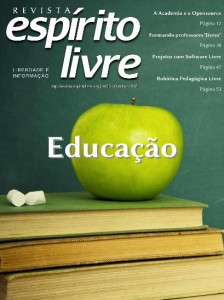

Muito se fala do uso do software livre, do opensource e dos padrões abertos em ambientes educacionais e na academia. Muitos casos de sucesso são relatados aos quatro cantos. Até parece fácil implementar uma política de uso de software livre nestes espaços. Mas não é bem assim. E é por esta razão que a edição especial sobre o tema Educação foi lançada. Ao longo de nossos vários anos de caminhada percebemos que ainda existe muito a ser feito. Vários alunos sequer sabem o que é software livre e para que serve. Muitos confundem e associam o acesso ao código fonte com insegurança ou ainda o fato do termo “livre” representar algo como gratuidade. Alguns acham que o fato do software livre ser quase sempre acessado de forma gratuita e construído em grande parte por comunidades e voluntários o torna inferior ou pior que soluções proprietárias.

Várias matérias vêm apresentar exatamente o contrário do que muitos pensam ou acham sobre o uso do software livre na educação. Existem desafios sim. Existem dificuldades. Muitos não entendem ou não querem entender. Alguns poucos guerreiros “compram briga”, “vestem a camisa” e erguem a bandeira do software livre nestes espaços de ensino e aprendizagem. Pode ser que para certas pessoas tal situação se assemelhe aos tempos de rebeldia e revoltas estudantis, mas aqui falamos de algo ainda mais complexo. Vivemos em um tempo de lobbies, subornos e pagamento de propinas por parte de grandes empresas para que seus produtos sejam “aceitos mais facilmente” por governos e órgãos. Vivemos em tempos polêmicos que a cada dia percebemos o quão importante é plantarmos uma sementinha de esperança na mente de crianças e jovens para que usufruam de um futuro melhor e livre. Vivemos em um tempo de mudança. Aproveite e faça a sua parte também nesse processo.

Fonte: [Revista Espirito Livre](http://www.revista.espiritolivre.org/lancada-edicao-n-43-da-revista-espirito-livre)

Click [AQUI](http://revista.espiritolivre.org/pdf/Revista_EspiritoLivre__043_outubro2012.pdf) para fazer o download!
