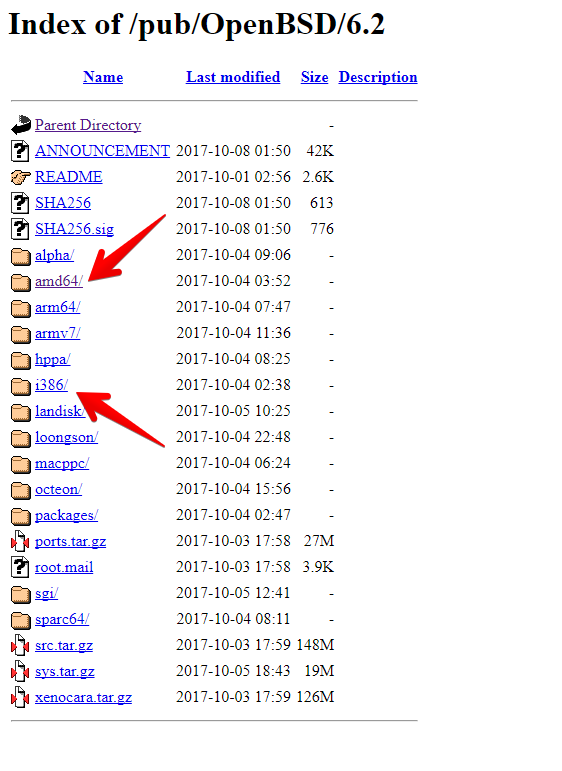
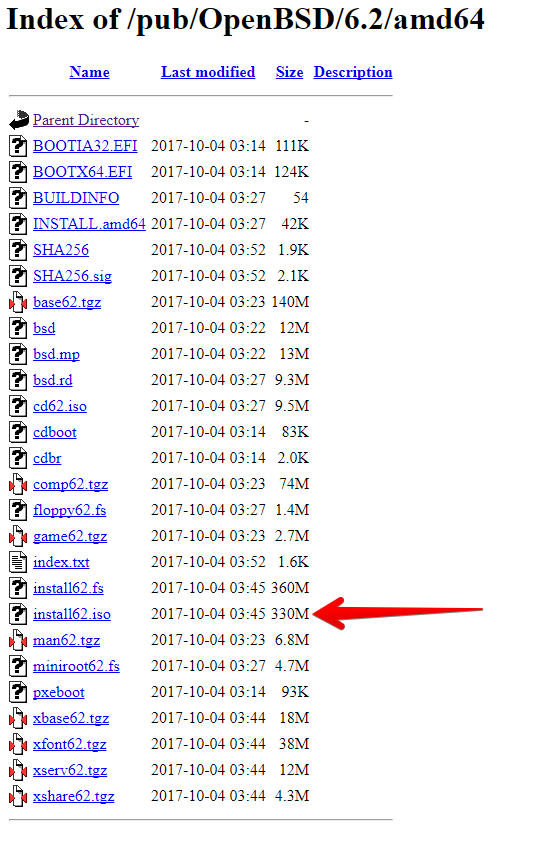
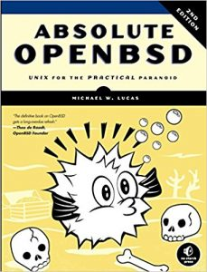
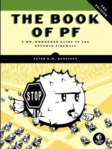

Salve Salve Pessoal!

Hoje foi lançado o OpenBSD 6.2.

O foco do OpenBSD é a segurança, ele é considerado por muitos o sistema operacional mais seguro que existe, porém já ouvi várias pessoas reclamando da usabilidade e da falta de material em português (acho que elas não sabem que existe o **man** :( )

Dessa forma resolvi fazer uma serie de posts falando sobre o OpenBSD, desde a instalação, até a configuração de serviços e uso como desktop.

Para iniciar, vamos fazer o download do OpenBSD 6.2.

Acesse o link abaixo:

[https://openbsd.c3sl.ufpr.br/pub/OpenBSD/6.2/](https://openbsd.c3sl.ufpr.br/pub/OpenBSD/6.2/)

Escolha a sua plataforma de hardware, normalmente é i386 ou amd64, no meu caso é amd64.

Faça o download da ISO.

Mas Rodrigo, o que é todos esses outros pacotes que aparecem pra download?

Vou explicar a maioria na hora da instalação, dessa forma não é necessário saber o que são eles nesse momento, apenas vamos fazer o download da ISO.

Feito o download é esperar o próximo post, estou pretendendo fazer pelo menos um post por semana.

Para quem for um pouco mais apressado e tiver uma boa leitura de inglês, segue link dos livros mais atuais sobre o OpenBSD e o PF.

**Absolute OpenBSD, 2nd Edition: Unix for the Practical Paranoid**

[https://www.amazon.com.br/Absolute-OpenBSD-2nd-Practical-Paranoid-ebook/dp/B00CH96VB4/ref=sr\_1\_4?ie=UTF8&qid=1507593579&sr=8-4&keywords=openbsd](https://www.amazon.com.br/Absolute-OpenBSD-2nd-Practical-Paranoid-ebook/dp/B00CH96VB4/ref=sr_1_4?ie=UTF8&qid=1507593579&sr=8-4&keywords=openbsd)

**The Book of PF, 3rd Edition: A No-Nonsense Guide to the OpenBSD Firewall**

[https://www.amazon.com.br/Book-PF-3rd-No-Nonsense-Firewall-ebook/dp/B00O9A7E88/ref=sr\_1\_10?ie=UTF8&qid=1507593579&sr=8-10&keywords=openbsd](https://www.amazon.com.br/Book-PF-3rd-No-Nonsense-Firewall-ebook/dp/B00O9A7E88/ref=sr_1_10?ie=UTF8&qid=1507593579&sr=8-10&keywords=openbsd)

Até o próximo post :D
