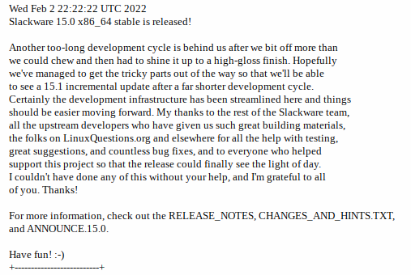

[](images/slackware.png)

Salve Salve Pessoal!

É com muita alegria que venho aqui informar que finalmente o **Slackware 15.0** foi lançado!<!--more-->

[](images/2022-02-03_18-48.png)

Foi um longo caminho até aqui e algumas pessoas chegaram até a pensar que o projeto havia morrido, mas estavam enganadas, o projeto continua mais vivo do que nunca.

Algumas informações do **README.txt** sobre os componentes principais:

```
Slackware 15.0 is a complete distribution of the Linux operating system.

Here are some versions of major components of Slackware 15.0:

- Linux kernel 5.15.19
- GCC compiler 11.2.0
- LLVM compiler 13.0.0
- Rust compiler 1.58.1
- Binutils 2.37
- GNU C Library 2.33
- KDE Plasma 5.23.5
- Xfce 4.16
```

Se você deseja ajudar o projeto, faça através de um dos links abaixo:

[https://www.patreon.com/slackwarelinux](https://www.patreon.com/slackwarelinux)

[https://paypal.me/volkerdi](https://paypal.me/volkerdi)

Acessem também o post do **Alien Bob** sobre o lançamento do **Slackware 15.0,** está muito bom e ele fala sobre o ciclo de desenvolvimento e diversos detalhes dessa nova versão.

https://alien.slackbook.org/blog/slackware-15-0-has-been-released-on-2022-02-02/

Agora é só baixar e se divertir, acessem e baixem o **Slackware 15.0**.

[http://www.slackware.com/](http://www.slackware.com/)

Até o próximo post!
