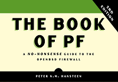

Dica rápida!

Foi lançado o The Book of PF, 3rd Edition, a maior referência quando se fala em firewall na família BSD, e é o firewall nativo do OpenBSD o qual estudo como hobby :)

O mesmo tem 248 páginas e contém os seguintes capítulos:

**Chapter 1:** Building the Network You Need **Chapter 2:** PF Configuration Basics **Chapter 3:** Into the Real World **Chapter 4:** Wireless Networks Made Easy **Chapter 5:** Bigger or Trickier Networks **Chapter 6:** Turning the Tables for Proactive Defense **Chapter 7:** Traffic Shaping with Queues and Priorities **Chapter 8:** Redundancy and Resource Availability **Chapter 9:** Logging, Monitoring, and Statistics **Chapter 10:** Getting Your Setup Just Right

Para maiores informações segue o link para a compra do mesmo:

[http://www.nostarch.com/pf3](http://www.nostarch.com/pf3)

Abaixo o site do autor do livro:

[http://bsdly.blogspot.com](http://bsdly.blogspot.com.br/)

Até a próxima :)
