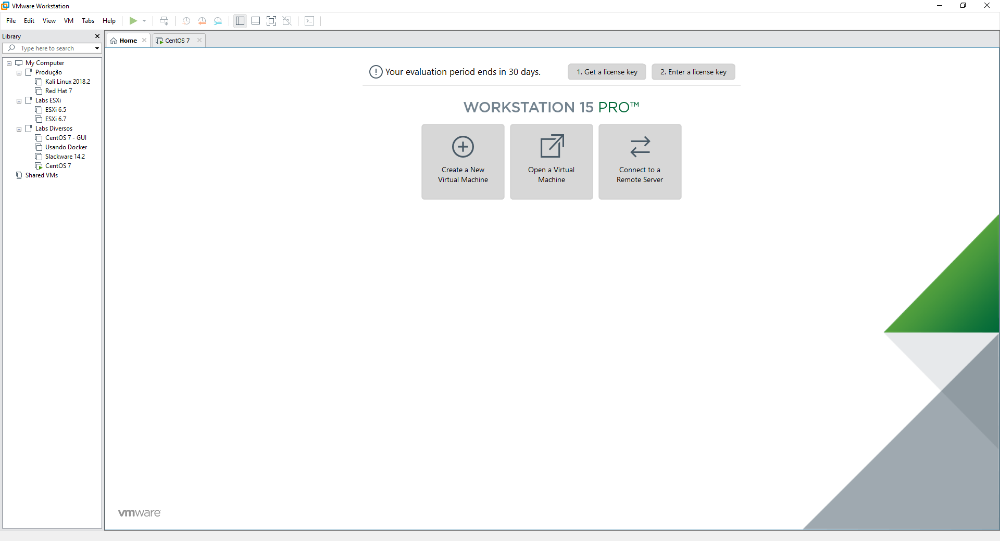

Salve Salve Pessoal!

A VMware lançou o VMware Workstation e Player 15, ele veio com uma interface diferente da versão anterior e com diversas novidades.

Entre as novidades podemos citar:

- Atualização da interface
- Nova Rest API
- Melhor ajustes de tela para monitores com resoluções mais altas
- Aprimoramento do Hardware 3D
- Suporte ao vSphere 6.7, podemos visualizar os hosts e o cluster
- Conexão SSH as VMs Linux (para mim a melhor de todas :D )

Entre outras atualizações.

Falando um pouco sobre essa nova feature do acesso SSH as VMs Linux, só irá funcionar estivermos usando o Windows 10 versão 1803 ou superior, o recurso também funciona para hosts do vSphere, ESXi e Workstation conectados remotamente via IP.

Fiz um vídeo fazendo uma pequena demostração dessa nova feature.

<iframe src="https://www.youtube.com/embed/BPZ3niGcdLk" width="600" height="400" frameborder="0" allowfullscreen="allowfullscreen">?</iframe>

Agora é só baixar e se divertir.

Para maiores detalhes sobre o lançamento e download, acessem o link abaixo:

[https://blogs.vmware.com/workstation/2018/09/workstation-15-is-here.html](https://blogs.vmware.com/workstation/2018/09/workstation-15-is-here.html)

Até a próxima :D
