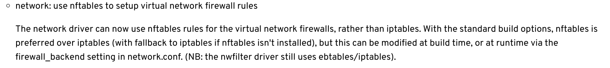

Salve pessoal!

Tive um problema interessante após a última atualização dos softwares que utilizo no meu **Slackware**. Um desses softwares é o libvirt, que utilizo para usar o **KVM** como solução de virtualização.

Após atualizá-lo para a versão 10.4 e reiniciar o sistema operacional, quando fui abrir uma máquina virtual, esta não estava com acesso à internet ou à minha rede local, assim como também não era possível acessá-la via SSH, por exemplo.

Investigando, descobri que as regras do IPtables não estavam sendo aplicadas.

Achei estranho e resolvi verificar o **changelog** do libvirt para ver se havia ocorrido alguma mudança.

Ao olhar as últimas mudanças no changelog do libvirt, vi que houve uma mudança nas configurações de rede. Veja a mensagem:

Em resumo, a partir da versão **10.4**, o libvirt passou a usar o **nftables** como backend do firewall, e não o **iptables**. Imagino que isso não deveria ser um problema para o Slackware, visto que ele já possui o nftables instalado.

No entanto, as regras só foram aplicadas quando fiz a alteração para iptables no arquivo de configuração **/etc/libvirt/network.conf** e reiniciei o sistema operacional.

Se alguém tiver o mesmo problema já sabe como resolver.

Até o próximo post!

:D
