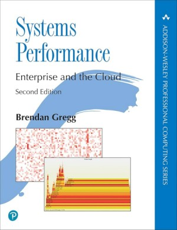
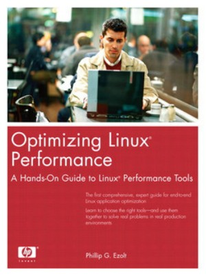
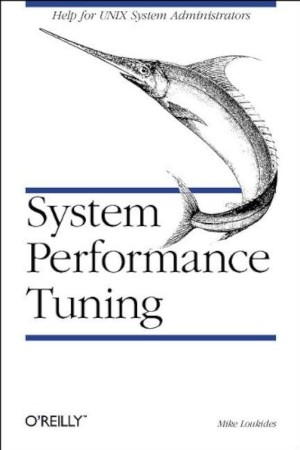
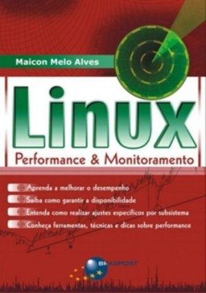

Salve Salve Pessoal!

Dando continuidade à nossa série de posts sobre **Performance Tuning no Linux**, hoje vou compartilhar alguns livros que tenho na minha estante e que também servirão como referência ao longo dos próximos posts.

## System Performance

Para começar, o indispensável **Systems Performance: Enterprise and the Cloud**, de **Brendan Gregg**.

Se eu tivesse que indicar apenas um livro sobre performance de sistemas atualmente, seria esse. Considero praticamente a “bíblia” moderna de quem quer entender profundamente como diagnosticar e resolver problemas de desempenho em sistemas.

Publicado em 2020, comprei meu exemplar impresso em 2021. 😁

Não é um livro barato, mas vale cada centavo investido. É extremamente técnico, detalhado e, ao mesmo tempo, muito prático.

Segue o link para quem tiver interesse em comprar.

[https://www.amazon.com.br/Systems-Performance-Brendan-Gregg/dp/0136820158](https://www.amazon.com.br/Systems-Performance-Brendan-Gregg/dp/0136820158)

## Optimizing Linux Performance

O **Optimizing Linux Performance** é um livro de 2005, mas continua sendo uma excelente referência.

Apesar da idade, ele trabalha conceitos fundamentais de análise e ajuste de performance que permanecem atuais: CPU, memória, I/O, rede, etc.

Encontrei meu exemplar no site **Estante Virtual**. Fiz uma pesquisa e ainda havia unidade disponível por um valor bem acessível.

Segue o link para quem tiver interesse em comprar.

[https://www.estantevirtual.com.br/livro/optmizing-linux-performace-GOG-0394-000](https://www.estantevirtual.com.br/livro/optmizing-linux-performace-GOG-0394-000)

## System Performance Tuning

Outro clássico é o **System Performance Tuning**, publicado originalmente em 1990.

Existe uma segunda edição de 2002, mas não encontrei exemplares disponíveis no site **Estante Virtual**. Já a versão mais antiga costuma aparecer por preços bem acessíveis.

Mesmo sendo antigo, ele ajuda muito a entender a evolução das técnicas de tuning e os princípios que continuam válidos até hoje. Para quem gosta de compreender a base conceitual das coisas, é uma ótima leitura.

## Linux Performance & Monitoramento

Por fim, o livro nacional **Linux Performance & Monitoramento**.

Foi o primeiro livro que comprei sobre o assunto. Publicado em 2009, é uma excelente porta de entrada para quem está começando. A abordagem é didática e ajuda bastante na construção dos primeiros fundamentos sobre monitoramento e análise de desempenho em ambientes Linux.

A partir do próximo post, vamos sair um pouco da teoria e começar a explorar as ferramentas na prática, entendendo como utilizá-las para analisar e diagnosticar problemas reais de performance em servidores Linux.

Até o próximo post!

🖖🖖🖖