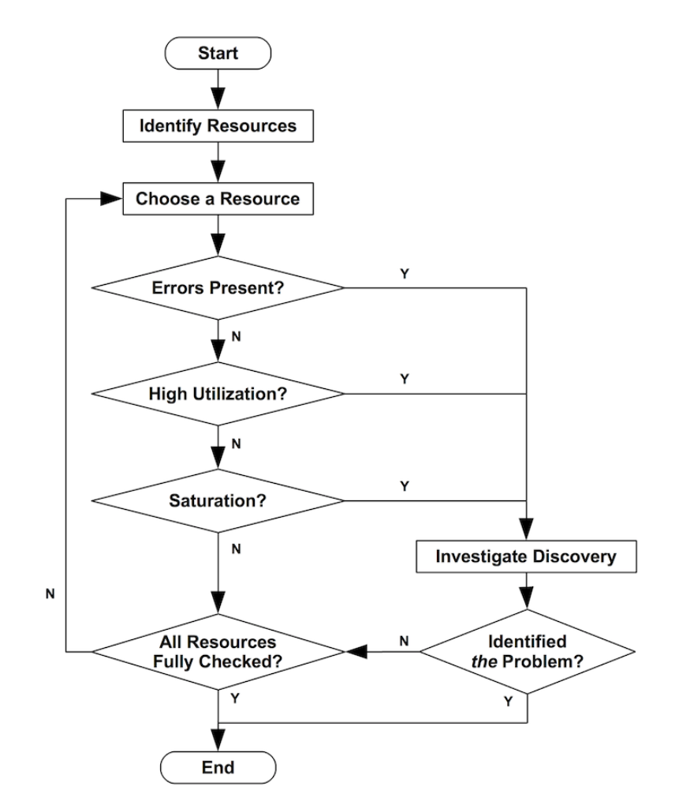

Salve Salve Pessoal!

Vou começar uma **série de posts focada exclusivamente em Performance Tuning no Linux**.

A ideia é abordar metodologias, conceitos fundamentais, livros e ferramentas, além de discutir como pensar em ajustes de performance de forma estruturada.

## Introdução

Depois da adoção em massa de virtualização, nuvem, containers e Kubernetes, vejo muito pouco se falando sobre ajuste de performance em sistemas operacionais. Algo que era bem comum no passado parece ter sido substituído pela ideia de que escalar horizontalmente é a solução padrão para qualquer problema.

Mas, antes de adicionar mais CPU, mais memória e mais recursos ao servidor, será que isso é realmente necessário? Será que sabemos, de fato, onde está o gargalo?

De forma geral, **Performance Tuning (ajuste de desempenho)** é o processo sistemático de otimizar sistemas e/ou aplicações para melhorar eficiência, previsibilidade e uso de recursos de hardware.

Não se trata apenas de “deixar mais rápido”.

Trata-se de:

- Reduzir latência
- Aumentar throughput
- Melhorar a estabilidade
- Eliminar desperdício de recursos
- Garantir previsibilidade sob carga

O processo normalmente envolve:

**Definir objetivos:** Estabelecer metas claras de desempenho e entender os requisitos de negócio (SLA, SLO, throughput esperado, latência aceitável, etc).

**Identificar gargalos:** Localizar os recursos críticos (CPU, I/O, memória, rede) que limitam o sistema.

**Ajustar recursos/configurações:** Modificar parâmetros do sistema, consultas, configurações de aplicações e/ou infraestrutura.

**Testar e validar:** Medir antes e depois, validar com metodologia e evitar conclusões precipitadas.

**Repetir:** O processo é contínuo, pois novos gargalos podem surgir após melhorias anteriores.

## Metodologia

Um dos métodos mais conhecidos é o **USE Method**, proposto por **Brendan Gregg**. Não esqueça esse nome, vamos falar muito sobre ele nesta série. 😁

**USE** significa:

- **U**tilization (**U**tilização)
- **S**aturation (**S**aturação)
- **E**rrors (**E**rros)

Podemos ver o método **USE** no fluxograma abaixo.

A ideia é simples, mas é muito poderosa, basicamente para cada recurso dos nossos sistemas (CPU, memoria, disco, etc), precisamos verificar:

- Utilização  
- Saturação  
- Erros  

Podemos encontrar maiores detalhes sobre o método **USE** no link abaixo:

[https://www.brendangregg.com/usemethod.html](https://www.brendangregg.com/usemethod.html)

Também existe uma lista de verificação utilizando o método **USE**, criada pelo próprio **Brendan Gregg**, voltada para sistemas Linux:

[https://www.brendangregg.com/USEmethod/use-linux.html](https://www.brendangregg.com/USEmethod/use-linux.html)

## Gerenciamento das Alterações

Algo que precisamos entender bem é que, ao trabalhar com ajustes de sistemas, nem toda alteração que fizermos surtirá efeito. Por isso, é fundamental seguir um processo rigoroso e bem definido.

- **Linha de base (Baseline):** Antes de aplicar qualquer alteração, devemos medir o comportamento atual do sistema. Essa será nossa referência para comparação posterior.

- **Aplicar as alterações:** Realizar mudanças em apenas um recurso ou parâmetro por vez, para que seja possível avaliar claramente o impacto da modificação.

- **Verificar as alterações:** Analisar se a mudança produziu efeito, comparando os novos resultados com a linha de base.

- **Reverter as alterações:** Retornar ao estado original após os testes. Isso aumenta a confiabilidade da análise e evita efeitos colaterais acumulados.

- **Aplicar de forma definitiva:** Somente após validar os resultados, aplicar a alteração de maneira permanente.

## Conclusão

Esta foi apenas uma introdução ao tema. Performance Tuning exige método, disciplina e entendimento profundo do sistema.

Nos próximos posts, além de aprofundarmos nas metodologias e ferramentas, vou compartilhar alguns livros que considero fundamentais para quem quer realmente dominar performance em sistemas Linux.

Até o próximo post!

🖖🖖🖖

## Referências

[https://www.brendangregg.com/](https://www.brendangregg.com/)
[https://www.brendangregg.com/usemethod.html](https://www.brendangregg.com/usemethod.html)
[https://www.brendangregg.com/linuxperf.html](https://www.brendangregg.com/linuxperf.html)