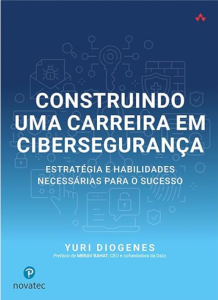

Salve Salve Pessoal!

Hoje terminei de ler o livro **Construindo uma Carreira em Cibersegurança: Estratégia e habilidades necessárias para o sucesso**, o autor é o **Yuri Diogenes****.**

O livro é muito bom!

Recomendo este livro a todos que estão considerando uma transição de carreira ou que buscam crescer profissionalmente. Embora o foco principal seja em carreiras na área de segurança da informação, seus ensinamentos são aplicáveis a diversas áreas, tanto dentro de TI quanto fora dela.

Link para o livro no site da amazon:

[https://www.amazon.com.br/Construindo-uma-Carreira-Ciberseguran%C3%A7a-habilidades/dp/8575228803](https://www.amazon.com.br/Construindo-uma-Carreira-Ciberseguran%C3%A7a-habilidades/dp/8575228803)

Até o próximo post!

:D
