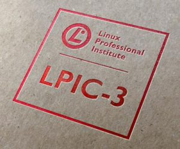
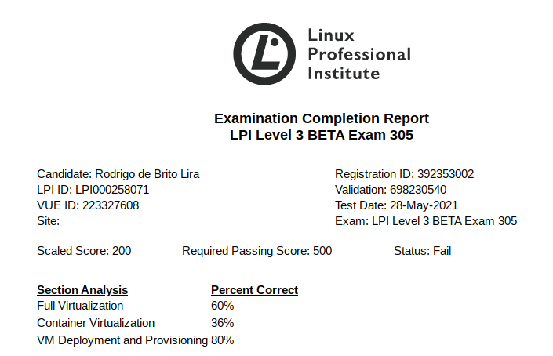

Salve Salve Pessoal!

Hoje fiz o novo **Exame 305(beta)** da **LPI**.

E como vocês podem ver na imagem abaixo, imagino que não foi dessas vez.

Mas eu só imagino, porque apesar de estar com o **Scaled Score: 200** e **Status: Fail**, o resultado oficial só sai em dois meses, hehehe. :D

O que acontece é o seguinte, como esse é um exame beta o resultado oficial é enviado via e-mail, então não sei exatamente a minha pontuação nem se eu passei ou não, assim como eu também não sei se a análise de sessão também está correta, mas imagino que ela esteja. :(

A prova é bem legal de fazer, apesar de não ter estudado nada sobre a mesma porque esqueci dela e só lembrei com o e-mail da lpi.org três dias atrás, infelizmente nesses três dias também não teve como estudar nada e não havia como remarcar a prova porque a data limite era hoje. :D

A porcentagem de acertos é bem coerente com o meu exame.

Achei meio confusa as perguntas sobre os conceitos, imagino que as perguntas poderiam ser mais claras, com certeza errei todas as perguntas sobre LXC, cloud-init, packer, etc,  porque nunca usei nem estudei. :D

Vai fazer o exame novamente?

Se não passar com certeza farei, só que dá próxima vez vou me preparar para o mesmo.

Rodrigo como você conseguiu participar do beta?

Todos os detalhes estão nesse link - [https://www.lpi.org/lpic-3-beta-signup/](https://www.lpi.org/lpic-3-beta-signup/)

Detalhes sobre o que é cobrado no exame acessem o link abaixo:

[https://wiki.lpi.org/wiki/LPIC-305\_Objectives\_V3.0](https://wiki.lpi.org/wiki/LPIC-305_Objectives_V3.0)

Até o próximo post!

:D
