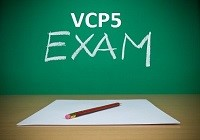

[](http://rodrigolira.eti.br/wp-content/uploads/2014/03/vcp5.jpg)Salve Salve Pessoal!

Estou disponibilizando aqui todo o material que estou utilizando para estudar para a prova VCP5-DCV da VMware, não é muita coisa mas já é um bom começo para que quer aprender um pouco mais sobre a ferramenta e para quem está querendo tirar a certificação, assim como eu :)

Site Oficial do exame:<!--more-->

```
http://mylearn.vmware.com/mgrReg/plan.cfm?plan=12457&ui=www_cert
```

Dentro do meu HD VIRTUAL você vai encontrar uma pasta chamada VCP5-DCV, dentro dela estará os seguintes arquivos:

```
VCP5-DCV-Exam-Blueprint-v2_9 - Este documento apresenta todas as informações necessária para realizar o exame.
```

```
vSphere 5.1 Install Configure Manage Student Manual Volume 1 - Manual Oficial do Curso
```

```
vSphere 5.1 Install Configure Manage Student Manual Volume 2 - Manual Oficial do Curso
```

```
vSphere 5.1 Install Configure Manage Lab Manual - Manual dos Laboratórios do Curso
```

```
VCP5 Certification Guide - Livro Oficial para a certificação (Apenas para consulta)
```

Links com Simulados:

```
http://www.simonlong.co.uk/blog/vcp5-practice-exams/
```

```
http://www.examcollection.com/VCP-510.html
```

```
http://www.aiotestking.com/vmware/category/exam-vcp5-dcv-vmware-certified-professional-data-center-virtualization-on-vsphere-5/
```

Links com vídeo aulas para baixar via torrent:

```
http://thepiratebay.se/torrent/9779907/CBT_Nuggets_-_VMware_vSphere_5.5_VCA-DCV_VCP5-DCV_with_Greg_Shie
```

Já está disponível o exame baseado na versão 5.5, porém tanto o 5.1 quanto o 5.5 são válidos para a certificação.

Lembrando que para poder realizar a prova você tem que fazer o curso oficial, o mesmo eu fiz na http://linuxclass.com.br/ via ead e recomendo a todos!
