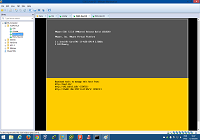

[](http://rodrigolira.eti.br/wp-content/uploads/2014/10/lab.png)Salve Salve Pessoal!

Nesse primeiro de vários posts vou mostrar para vocês um pouco do meu LAB VMware, o qual estou usando para estudar para a prova VCAP5-DCA e uso para estudar para outros fins, vou falar do hardware e do software que utilizo.

Nesse meu lab estou me baseando nos labs recomendados no livro VCAP5-DCA Official Cert Guide - [http://www.pearsonitcertification.com/store/vcap5-dca-official-cert-guide-vmware-certified-advanced-9780789753236](http://www.pearsonitcertification.com/store/vcap5-dca-official-cert-guide-vmware-certified-advanced-9780789753236), dentro das minhas limitações de hardware, hehehe...

O computador que utilizo é composto pelo seguinte.

### Hardwares:

```
Placa mãe GIGABYTE Z97M-D3H - http://br.gigabyte.com/products/product-page.aspx?pid=4970#ov
```

```
Processador Core i3-4150 - http://ark.intel.com/pt-br/products/77486/Intel-Core-i3-4150-Processor-3M-Cache-3_50-GHz
```

```
HD SSD Kingston v300 240GB - http://www.kingston.com/br/ssd/v#sv300s3 (pode-se usar discos sata ou ide, porém o desempenho cai muito)
```

```
04 Pentes de 4GB de Memoria Kingston DDR3-1333 - http://www.kingston.com/dataSheets/KVR13N9S8_4.pdf 24GB de Ram 02 Pentes de 8 Markvision e 02 Pentes de 04 Kingston(um dia deixo com 32GB :( )
```

```
Fonte Real Extream 450W - http://www.extream.com.br/_produtos/fontes_red450w.html
```

```
Etc...
```

### Softwares:

```
Windows 8.1 Professional
```

```
VMware Workstation 10.0.3 build-1895310
```

```
VMware Workstation 10.0.5 build-2443746
```

```
OBS: Desabilite todos os serviços que não são necessário que estejam rodando no momento em que você está executando as maquinas virtuais, dessa forma você terá um melhor desempenho.
```

Agora vamos ao que interessa, como está montado o ambiente de estudos. Para a virtualização do ambiente utilizo o VMware Workstation 10, o qual já vem nativo a opção de virtualização do vSphere ESXi.

O Lab é composto por 4 máquinas virtuais com as seguintes configurações:

```
ESXi5_Host-01 - 02 vCPU / 4 GB de Memoria / HD 40GB / VMware vSphere ESXi 5.5 Build 1331820
```

```
ESXi5_Host-02 - 02 vCPU / 4 GB de Memoria / HD 40GB / VMware vSphere ESXi 5.5 Build 1331820
```

```
vCenter - 02 vCPU / 4GB de Memoria / HD 40GB / Windows Server 2008 R2 com vCenter Server com webclient
```

```
VSA - 01 vCPU / 1GB de Memoria / 01 HD 5GB para o SO / 01 HD 100GB / 06 HDs 10GB / 01 HD 50GB / Nexenta Community Edtion
```

Por enquanto é só isso pessoal, no próximo post vou mostrar como esta esse ambiente, datacenter, cluster, a parte de rede (standard switch, distributed switch), armazenamento (das, nfs, iscsi), etc.

[](http://rodrigolira.eti.br/wp-content/uploads/2014/10/print1-e1413155167697.png)

Até o próximo post :)
