Salve Salve Pessoal!

Neste post vou mostrar como instalar e realizar as primeiras configurações do nosso storage virtual, o NEXENTA.

Nexenta é um SDDC (Software Defined Data Centers), um dos grandes diferenciais deste sistema é que ele é baseado no OpenSolaris e utiliza como sistema de arquivo o ZFS, além de ser parceiro da VMware, ele possui tanto a versão paga, quanto a versão para comunidade.

Não vou entrar em detalhes sobre o sistema, mas segue abaixo vários links para conhecerem ele melhor:

Site - [http://www.nexenta.com/](http://www.nexenta.com/)

Guia de Instalação - [http://info01.nexenta.com/rs/nexenta2/images/4.0.3-NexentaStor\_Installation\_Guide.pdf](http://info01.nexenta.com/rs/nexenta2/images/4.0.3-NexentaStor_Installation_Guide.pdf)

Livro - [http://www.nexenta.com/sddcfordummies?utm\_source=White%20Paper](http://www.nexenta.com/sddcfordummies?utm_source=White%20Paper)

Download Nexenta Community Edition - [http://www.nexenta.com/products/downloads/nexentastor-community-edition-download](http://www.nexenta.com/products/downloads/nexentastor-community-edition-download)

ZFS - [http://docs.oracle.com/cd/E24849\_01/html/820-0447/zfsover-2.html](http://docs.oracle.com/cd/E24849_01/html/820-0447/zfsover-2.html)

Espero que os liks sejam uteis :D

Vamos ao que interessa, em "[Meu Lab VMware - Parte 01](http://rodrigolira.eti.br/meu-lab-vmware-parte-01/)" mostrei todas as configurações de hardware e como estava configurada cada maquina virtual, hoje vamos instalar e realizar as primeiras configurações do nosso storage virtual.<!--more-->

1 - Selecione Install NexentaStor Community Edition (64-bit):

[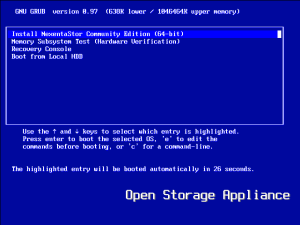](http://rodrigolira.eti.br/wp-content/uploads/2015/01/print1.png)

2 - Aperte "1" para instalar o sistema:

[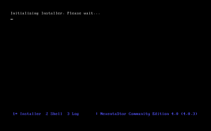](http://rodrigolira.eti.br/wp-content/uploads/2015/01/print2.png)

3 - Aceite os termos de licença:

[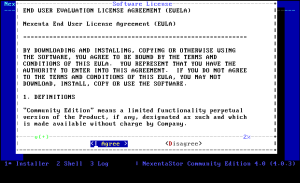](http://rodrigolira.eti.br/wp-content/uploads/2015/01/print3.png)

4 - Leia os avisos:

[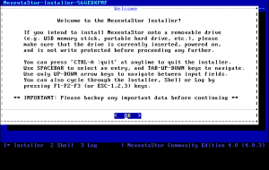](http://rodrigolira.eti.br/wp-content/uploads/2015/01/print4.png)

5 - Selecione a localização, em nosso caso Americas:

[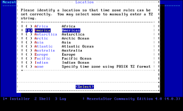](http://rodrigolira.eti.br/wp-content/uploads/2015/01/print5.png)

6 - Selecione o pais, em nosso caso o Brasil:

[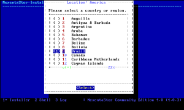](http://rodrigolira.eti.br/wp-content/uploads/2015/01/print6.png)

7 - Selecione a sua região, em meu caso o nordeste:

[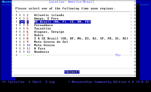](http://rodrigolira.eti.br/wp-content/uploads/2015/01/print7.png)

8 - Responda yes se a time zone estiver correto:

[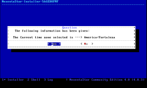](http://rodrigolira.eti.br/wp-content/uploads/2015/01/print8.png)

9 - O sistema vai verificar os discos disponíveis para instalação:

[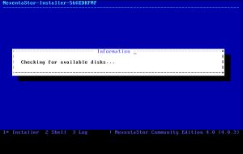](http://rodrigolira.eti.br/wp-content/uploads/2015/01/print9.png)

10 - Selecione o disco ao qual você deseja realizar a instalação do sistema.

OBS: Os valores de capacidade dos discos divergem do meu primeiro post, pois o meu storage já está pronto, essa instalação foi feita apenas para demostrar como fazer a mesma:

[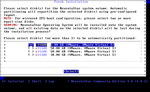](http://rodrigolira.eti.br/wp-content/uploads/2015/01/print10.png)

11 - Selecione yes para ele começar a instalação:

[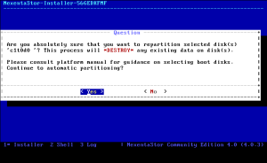](http://rodrigolira.eti.br/wp-content/uploads/2015/01/print11.png)

12 - Instalando o sistema:

[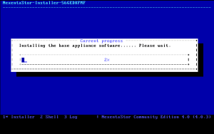](http://rodrigolira.eti.br/wp-content/uploads/2015/01/print12.png)

13 - Depois de instalado, ele da algumas informações da instalação, aperte enter para ele reiniciar o sistema:

[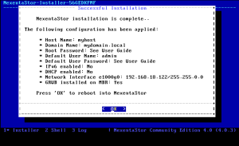](http://rodrigolira.eti.br/wp-content/uploads/2015/01/print13.png)

14 - Após o sistema reiniciar ele vai perguntar se você aceita a licença de uso do software, selecione "<I Agree>" para aceitar e aperte enter:

[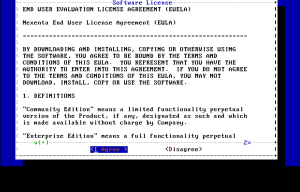](http://rodrigolira.eti.br/wp-content/uploads/2015/01/print14.png)

15 - Nesta tela será necessário o registro do sistema, acesso o link a seguir:

[http://www.nexenta.com/products/downloads/community-edition-registration](http://www.nexenta.com/products/downloads/community-edition-registration)

[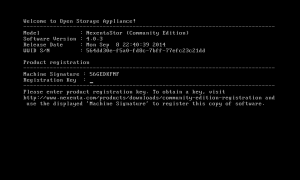](http://rodrigolira.eti.br/wp-content/uploads/2015/01/print15.png)

16 - Preencha as informações de acordo com o desejado, o sistema irá enviar um e-mail com uma chave de registro.

OBS: Observe que o preenchimento da "Machine Signature" tem que igual ao da instalação:

[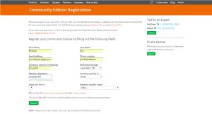](http://rodrigolira.eti.br/wp-content/uploads/2015/01/print16.png)

17 - A chave de registro chegara no e-mail preenchido anteriormente:

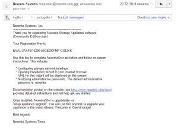

18 - Digite a chave de registro enviada para p e-mail, e aperte enter:

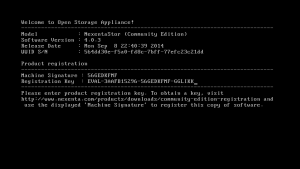

19 - Após o registro, vamos configurar o endereço IP, caso deseje usar a configuração de instalação, aperte  "n", caso deseje configurar um novo endereço, aperte "y":

[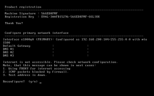](http://rodrigolira.eti.br/wp-content/uploads/2015/01/print19.png)

20 - Caso deseje que o sistema obtenha o endereço IP através de um servidor DHCP selecione "dhcp" e aperte enter, caso deseje configurar um IP estático selecione "static" e aperte enter, em nosso caso estou configurando o IP estático, caso deixe como dhcp pule para etapa 26.

[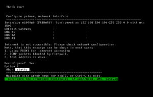](http://rodrigolira.eti.br/wp-content/uploads/2015/01/print20.png)

21 - Agora configure o ip, mascara, gateway, servidores dns e aperte enter:

[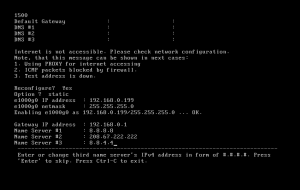](http://rodrigolira.eti.br/wp-content/uploads/2015/01/print21.png)

22 - Aperte o "n" para concluir a configuração:

[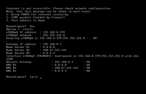](http://rodrigolira.eti.br/wp-content/uploads/2015/01/print22.png)

23 - Agora selecione o modo de acesso a interface web do servidor, escolha o que desejar HTTP ou HTTPS, como normalmente uso apenas em ambientes de testes, deixo como http, mas caso você vá usar em produção aconselho escolher https:

[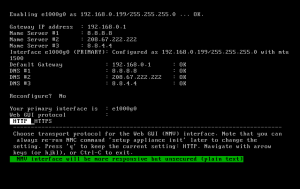](http://rodrigolira.eti.br/wp-content/uploads/2015/01/print23.png)

24 - Escolha a porta, no meu caso sempre deixo na porta padrão dele mesmo (8457):

[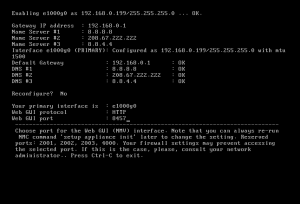](http://rodrigolira.eti.br/wp-content/uploads/2015/01/print24.png)

25 - Feito isso o servidor está instalado e com a parte de rede configurada, agora vamos acessar a interface web:

[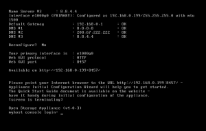](http://rodrigolira.eti.br/wp-content/uploads/2015/01/print25.png)

26 - Assim que você abrir o sistema web será apresentado a wizard1:

Nesse primeiro momento é solicitado algumas configurações como, hostname, domínio, time zone, ntp server e o layout do teclado:

[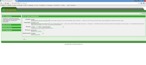](http://rodrigolira.eti.br/wp-content/uploads/2015/01/print26.png)

27 - Agora é solicitado a senha de root para acesso via console e a senha de admin para acesso a interface web:

[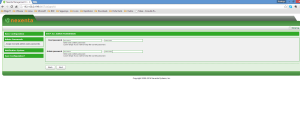](http://rodrigolira.eti.br/wp-content/uploads/2015/01/print27.png)

28 - Caso deseje receber notificações via e-mail configure o smtp, em nosso caso estamos deixando como padrão:

[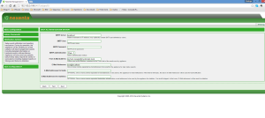](http://rodrigolira.eti.br/wp-content/uploads/2015/01/print28.png)

29 - Agora ele mostra as configurações realizadas, basta salvar e você será redirecionado ao wizard2:

[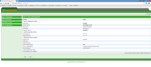](http://rodrigolira.eti.br/wp-content/uploads/2015/01/print29.png)

30 - Aqui caso deseje você pode alterar as configurações de rede:

[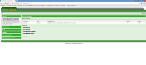](http://rodrigolira.eti.br/wp-content/uploads/2015/01/print30.png)

31 - Aqui você configura os parâmetros de iSCSI, deixe tudo no padrão, isso será mostrado em outro post:

[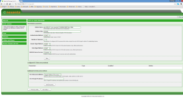](http://rodrigolira.eti.br/wp-content/uploads/2015/01/print31.png)

32 - Aqui ele mostra as configurações de disco, deixe tudo no padrão também, posteriormente irei fazer outros posts mostrado como configurar o iSCSI e o NFS, que é o que nos interessa se tratando de VMware:

[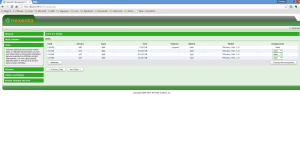](http://rodrigolira.eti.br/wp-content/uploads/2015/01/print32.png)

33 - Aqui ele mostra os volumes, como não temos nenhum criado no momento, ele não está mostrando nenhum:

[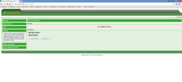](http://rodrigolira.eti.br/wp-content/uploads/2015/01/print33.png)

34 - Aqui ele mostra as pastas compartilhadas, da mesma forma que a figura anterior ele não está mostrando nada porque não temos pastas criadas:

[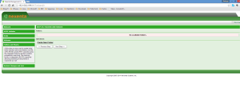](http://rodrigolira.eti.br/wp-content/uploads/2015/01/print34.png)

35 - Aqui ele mostra uma revisão das configurações, clique em "Start NVM":

[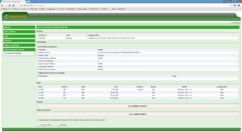](http://rodrigolira.eti.br/wp-content/uploads/2015/01/print35.png)

36 - Aqui é a interface de gerenciamento e monitoramento do Nexenta:

[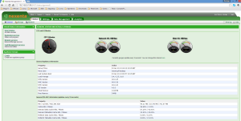](http://rodrigolira.eti.br/wp-content/uploads/2015/01/print36.png)

 

Pronto pessoal é isso ai, fizemos toda a instalação e configuração inicial do nosso storage, no próximo post vou mostrar como configurar o iSCSI e o NFS.

Espero que tenham gostado, ficou um pouco extenso, mas valeu a pena.

Até a próxima :D
