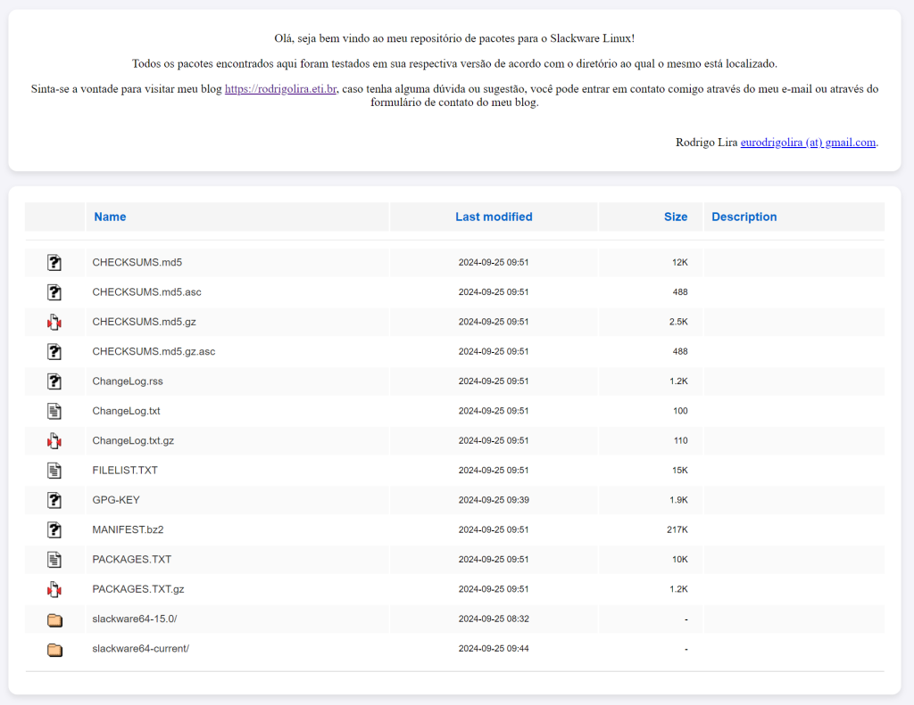

Salve Salve pessoal!

Faz algum tempo que já crio meus próprios pacotes para o **Slackware**, sejam eles baseados nos scripts do slackbuilds ou criados por mim mesmo.

Aos poucos estou submetendo os scripts para criar esses pacotes para o slackbuilds, é o caso do **Grafana** e do **Teleport Connect**, que vocês podem encontara nos links abaixo:

**Grafana** - [https://slackbuilds.org/repository/15.0/network/grafana/](https://slackbuilds.org/repository/15.0/network/grafana/)

**Teleport Connect** - [https://slackbuilds.org/repository/15.0/network/teleport-connect/](https://slackbuilds.org/repository/15.0/network/teleport-connect/)

Alguns pacotes já tem seus mantenedores no slackbuilds, então apenas ajusto os scripts para as minhas necessidades quando necessário, por exemplo, quando quero usar uma versão mais nova.

Sei que algumas pessoas tem dificuldades de criar seus pacotes, então resolvi criar um repositório onde vou ficar disponibilizando os pacotes que estou criando.

Vocês podem acessar esses pacotes através da URL abaixo:

**[https://slackbuilds.rodrigolira.eti.br](https://slackbuilds.rodrigolira.eti.br/)**

Espero que aproveitem e mandem feedback.

Até o próximo post!

:D
