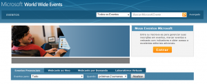

Salve Salve Galera!

Microsoft Word Wide Events (WWE) é nada mais nada menos do que um site da Microsoft dedicado a eventos. Nele você vai ficar por dentro de eventos presenciais, eventos virtuais, webcasts, podcasts, laboratórios virtuais, e muito mais. Sem contar que isso tudo de graça, ou seja mais uma fonte de estudos pra você que deseja algo mais da Microsoft sem custo algum, corra e faça sua inscrição para ficar por dentro das novidades, segue o link abaixo para o site:

[https://msevents.microsoft.com/](https://msevents.microsoft.com/CUI/default.aspx?culture=pt-br&community=0)
