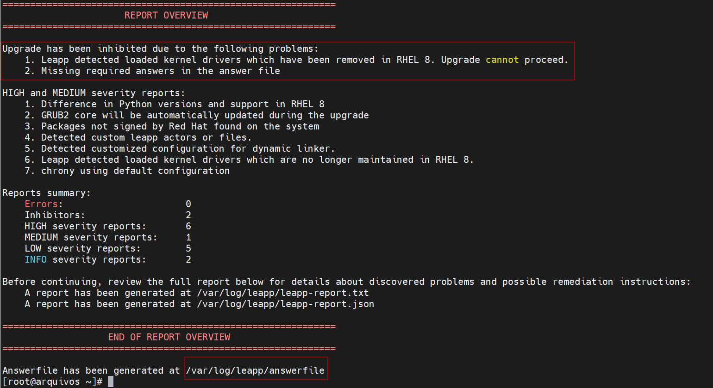
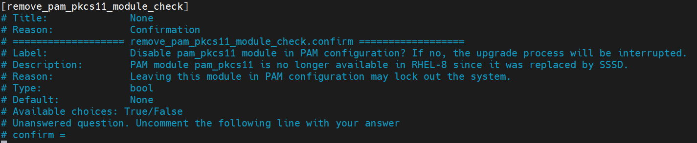
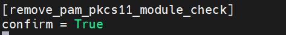
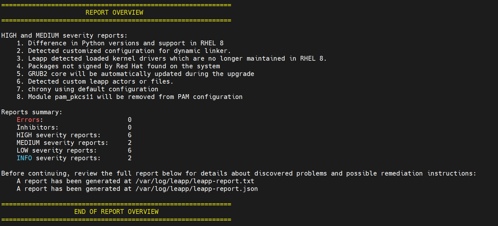
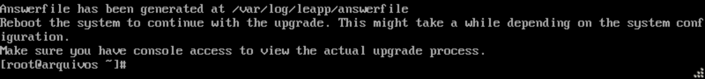
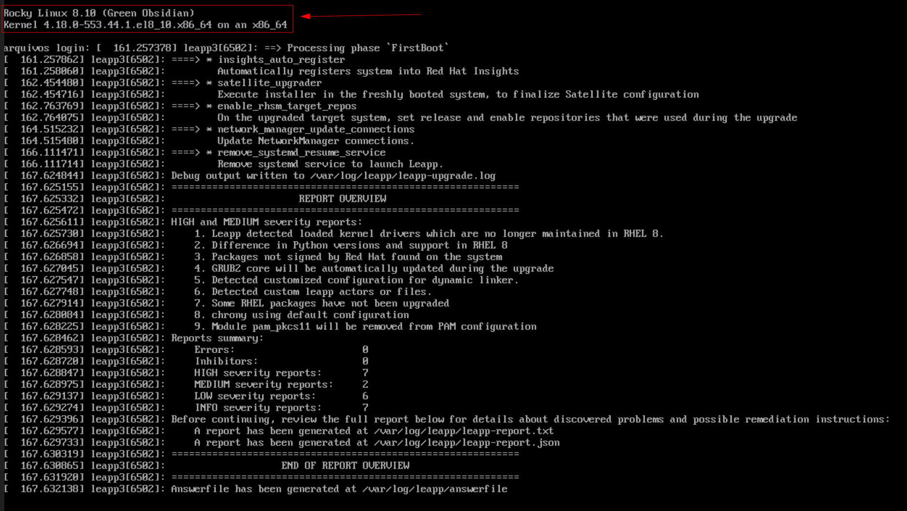

Salve Salve Pessoal!

As atualizações e o suporte ao CentOS 7 se encerram em 30 de junho de 2024, como todos nós sabemos, porém, ainda existem vários e vários servidores rodando CentOS 7 por esse mundão, como bom sysadmin que sou, também é meu caso.

Diferentemente do Ubuntu, a migração de versão do sistema operacional na família Red Hat é um pouco mais complicada, mas nada que não seja possível.

Nesse post de hoje vou mostrar todo o processo que estou utilizando para fazer a migração do CentOS 7 direto para o Rocky Linux 8, também é possível fazer esse processo para o Oracle Linux, Alma Linux e até mesmo para o Red Hat.

Para quem ainda tem interesse no CentOS 7, ainda é possível fazer o download da ISO na URL abaixo.

[https://ftp.unicamp.br/pub/centos/7/isos/x86\_64/](https://ftp.unicamp.br/pub/centos/7/isos/x86_64/)

Vamos ao que interessa! :D

Antes de mais nada precisamos deixar o sistema atualizado com os últimos pacotes que foram lançados, os repositórios padrões não estão mais acessíveis, dessa forma precisamos ajustar as URLs dos repositórios.

Faça um backup do arquivo atual.

```
# cp /etc/yum.repos.d/CentOS-Base.repo /etc/yum.repos.d/CentOS-Base.repo.backup
```

Agora crie um novo arquivo, use seu editor favorito.

```
# vim /etc/yum.repos.d/CentOS-Base.repo
```

Agora copie e cole o seguinte conteúdo.

```
[base]
name=CentOS-$releasever - Base
baseurl=https://vault.centos.org/7.9.2009/os/$basearch/
gpgcheck=1
gpgkey=file:///etc/pki/rpm-gpg/RPM-GPG-KEY-CentOS-7
enabled=1

[updates]
name=CentOS-$releasever - Updates
baseurl=https://vault.centos.org/7.9.2009/updates/$basearch/
gpgcheck=1
gpgkey=file:///etc/pki/rpm-gpg/RPM-GPG-KEY-CentOS-7
enabled=1

[extras]
name=CentOS-$releasever - Extras
baseurl=https://vault.centos.org/7.9.2009/extras/$basearch/
gpgcheck=1
gpgkey=file:///etc/pki/rpm-gpg/RPM-GPG-KEY-CentOS-7
enabled=1

[centosplus]
name=CentOS-$releasever - CentOSPlus
baseurl=https://vault.centos.org/7.9.2009/centosplus/$basearch/
gpgcheck=1
gpgkey=file:///etc/pki/rpm-gpg/RPM-GPG-KEY-CentOS-7
enabled=0
```

Agora que configuramos os novos repositórios, vamos atualizar o sistema.

```
# yum update -y
```

Após terminar a atualização do seu sistema, reinicie.

```
# systemctl reboot
```

Agora que o sistema está atualizado, vamos instalar o repositório ELevate.

```
# yum install -y http://repo.almalinux.org/elevate/elevate-release-latest-el$(rpm --eval %rhel).noarch.rpm
```

Agora vamos instalar dois pacotes, **leapp-upgrade** que é a ferramenta que faz a migração do sistema operacional e o pacote **leapp-data-rocky** que é o pacote para migração para o **Rocky Linux**.

```
# yum install -y leapp-upgrade leapp-data-rocky
```

Agora vamos fazer uma verificação do sistema, para verificar o que pode ser incompatível com o Rocky Linux 8, execute o seguinte comando.

```
# leapp preupgrade
```

Esse comando leva algum tempo, principalmente dependendo da quantidade de pacotes que você tiver instalado em seu sistema.

Ao final, ele vai gerar alguns arquivos no diretório **/var/log/leapp/**, esses arquivos contêm todos os possíveis problemas com atualização e como corrigir esses problemas. [](images/upgrade01.png)

Na imagem acima podemos ver o relatório do comando, existem dois problemas que não permite que façamos o migração para o Rocky Linux 8.

O primeiro é um módulo do kernel chamado **pata\_acpi**, remova esse módulo com o comando abaixo.

```
# rmmod pata_acpi
```

E o segundo, nós precisamos responder as questões do arquivo **/var/log/leapp/answerfile**, no meu caso ele vai desabilitar o **módulo** o **pam\_pkcs11** do **PAM**.

Provavelmente vai aparecer o mesmo para você, pelo menos apareceu em todos os CentOS 7 que migrei até agora.

Nós podemos apenas descomentar a última linha e colocar um **True** no final.

[](images/upgrade02.png)

Ou apenas executar o seguinte comando que o leapp já fará isso por nós.

```
# leapp answer --section remove_pam_pkcs11_module_check.confirm=True
```

Veja na imagem abaixo como fica o arquivo após a execução do comando acima.

[](images/upgrade03.png)

Agora, vamos executar uma verificação novamente.

```
# leapp preupgrade
```

[](images/upgrade04.png)Observe na imagem, que agora não temos nada que impossibilite a nossa migração.

Agora, basta executarmos o comando abaixo e termos um pouco de paciência.

```
# leapp upgrade
```

Quando o comando terminar de executar será solicitado para reinicie o computador.

[](images/upgrade05.png)Basta executar o comando abaxio.

```
# systemctl reboot
```

O **GRUB** mostrará uma nova entrada chamada **ELevate-Upgrade-Initramfs**, deixe o sistema iniciar normalmente por ela, a migração dos pacotes continuará.

[](images/upgrade06.png)Após reiniciar uma duas vezes, o sistema iniciará mostrando a a versão do Rocky Linux e a versão do Kernel, além disso mostrará um report do processo.

[](images/upgrade07.png)Pronto, CentOS 7 migrado com sucesso para Rocky Linux 8.

Verifique se ainda existe algum pacote para o CentOS 7 executando o comando abaixo.

```
# rpm -qa | grep el7
```

Caso exista algum pacote, você pode remover ou atualizar os pacotes, no meu caso sempre tenho o **zabbix-agent2**, remova também os repositórios obsoletos  do diretório **/etc/yum.repo.d**.

Até o próximo post!

:D
