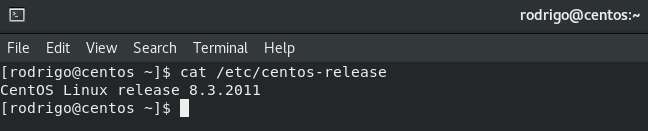
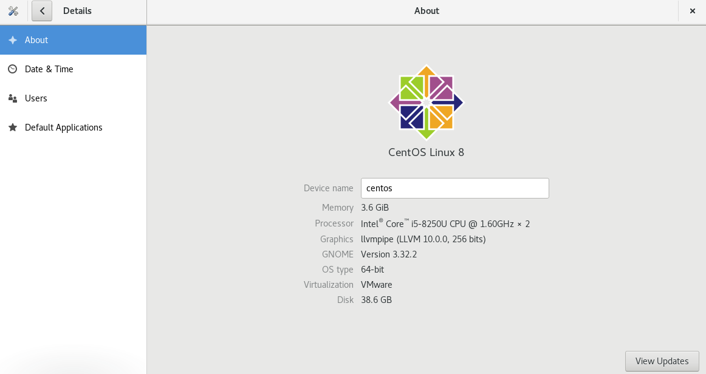
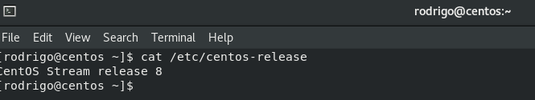

Salve Salve Pessoal!

Para quem acompanha o mundo Linux viu que o projeto CentOS Linux 8 só terá suporte até Dezembro de 2021, pois todos os esforços serão concentrados no CentOS Stream.

Não vou explicar a diferença entre as duas versões nem o motivo do fim do suporte, para entender um pouco mais sobre o que está se passando basta acessar o blog do CentOS e ler as últimas notícias.

[https://blog.centos.org/](https://blog.centos.org/)

Neste post quero me concentrar em como podermos migrar da versão 8 para Stream sem a necessidade de reinstalação do sistema completo, o processo é muito simples.

Para confirmar a versão que você está usando basta executar o seguinte comando.

```
# cat /etc/centos-release
```

[](images/centos-01.png)

Como podemos ver na imagem estou usando o **CentOS Linux 8.3**, também podemos verificar a versão através da interface gráfica, basta acessar **Settings** > **Details** > **About**.

[](images/centos-02.png)

Agora que já sabemos a versão do nosso sistema vamos migrar para a versão **Stream**.

Abra o terminal de sua preferência e digite os seguintes comandos.

```
# dnf install -y centos-release-stream
```

```
# dnf swap -y centos-{linux,stream}-repos
```

```
# dnf distro-sync -y
```

Será atualizado e instalado alguns pacotes.

Depois disso seu sistema já será o **CentOS Stream**, execute o mesmo comando do inicio ou olhe na interface gráfica.

[](images/centos-03.png)

[](images/centos-04.png)

Pronto, é só isso!

Até o próximo post.

:D
