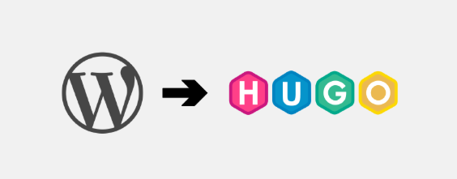

  

Salve Salve Pessoal!

Como vocês podem ver, fiz algumas mudanças no blog.  

Neste post vou falar um pouco sobre a minha decisão de fazer essa migração, como escolhi o tema, os desafios enfrentados nesse processo e o que ainda falta ajustar.

## Porque sair do Wordpress?

Desde que publiquei meu primeiro post, sempre usei WordPress. Ele foi, e ainda é a porta de entrada de muita gente para blogs e sites, é fácil, flexível e tem plugin pra absolutamente tudo.

Mas quem usa WordPress há bastante tempo sabe que muita coisa mudou, especialmente na forma de gestão e na filosofia do projeto. O que antes era um CMS simples e direto foi ganhando camadas e mais camadas de complexidade.

Alguns pontos que começaram a pesar pra mim:

**Manutenção**: Acho que esse é um dos principais motivos, atualizações do wordpress, temas, plugins, apache, mysql, php, ou seja, várias camadas para manter e constantes atualizações.  

**Segurança**: Nunca tive problemas do meu blog ser invadido, porém, o wordpress é alvo constante e acaba exigindo atenção contínua.  

**Performance**: Mesmo com cache e otimizações, a performance de sites estáticos são bem  melhores.  

**Editor (Gutenberg)**: Tem gente que gosta daquilo? Eu nunca gostei, tinha que usar um plugin para usar o editor clássico para poder criar um post, punk demais isso.  

## Porque o Hugo?

A ideia de usar um site estático não é nova, conheci o hugo faz algum tempo, mas foi depois que vi o tema blowfish que tomei a decisão de migrar, só estava sem tempo estudando para o EX442.  

Se você não conhece o **hugo**, acesse o link abaixo.

[https://gohugo.io/](https://gohugo.io/)

Sites estáticos são extremamente rápidos, sem banco de dados, sem manutenção, o conteúdo é escrito de forma simples usando Markdown(confesso que não sou fã, mas é melhor que o Gutenberg😬).

Deploy e armazenamento simples, rsync, GitHub Pages, Cloudflare Pages, S3, temos diversas possibilidades.

Como meu domínio está na **Cloudflare**, opteu por usar o **Cloudflare Pages** para publicação, e o **GitHub** para armazenar os dados.

Hoje, escrever um post é basicamente:  


flowchart TD
    A[git pull] --> B[vim POST.md]
    B --> C[hugo server -D]
    C --> D[git add / commit]
    D --> E[git push]
  

Simples :D

## Tema Blowfish

A escolha do tema **Blowfish** veio antes mesmo de escolher o hugo, vi esse tema em um dos blogs que sigo no meu rss e gostei demais dele, além disso ele é super simples de usar e configurar e vem como uma ferramenta própria de personalização, o que acaba facilitando demais o processo.

[https://blowfish.page/](https://blowfish.page/)

## Desafios da Migração

Mas, nem tudo são flores.  

Migrar anos de conteúdo do WordPress para Hugo deu um bom trabalho e levou um bom tempo, acho que passei um mês ajustando o conteúdo antes de publicar, ainda não está 100%.

Os principais desafios que enfrentei foram:

Conversão dos posts para Markdown, para isso usei o **wordpress-export-to-markdown**, testei diversas outras ferramentas,mas a melhor para mim foi essa, segue o link do mesmo.

[https://github.com/lonekorean/wordpress-export-to-markdown](https://github.com/lonekorean/wordpress-export-to-markdown)

URLs quebradas (acentos, pontos, caracteres especiais), o wordpress omite tudo isso da URL, na conversão isso foi mantido, então tive que ajustar tudo.

Categorias e tags, também tive que ajustar as diferenças, no **hugo/blowfish** é **categories** e **tags**, no wordpress era **category** e **tag**, então precisei mudar isso e deixar no padrão do **Wodpress** por causa do **SEO** para não perder as indexações do **Google** por exemplo.

Teve bastante script em shell no meio do caminho, coisa pra remover acentos, normalizar slugs, caminhos das imagens, validar links quebrados, etc.

## Falta migrar...

Como podemos ver, o blog já está funcional, mas ainda tem algumas coisas pendentes:

- Alguns posts antigos que precisam de revisão.
- Ajustes finos de SEO.
- Melhor organização de categorias e tags.
- Definir uma padronização de tamanho para as imagens.
- Limpar arquivos desnecessários.
- E o principal, migrar os comentários.

Nada crítico, mas melhorias contínuas que vão acontecendo com o tempo.

## Conclusão

A migração do **WordPress** para o **Hugo** foi, sem dúvida, uma boa decisão.  

A simplicidade e não ter mais que me preocupar com atualizações de SO, apache, php, banco de dados e vulnerabilidades aleatórias, valeu as horas de trabalho para migrar.  

Até o próximo post!

🚀🚀🚀