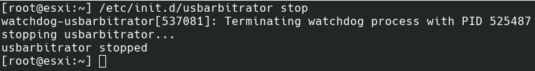
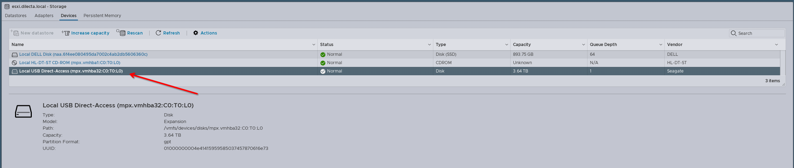
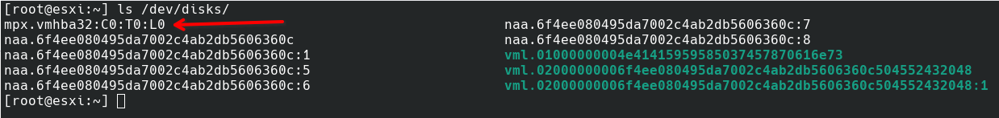
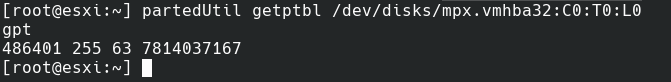
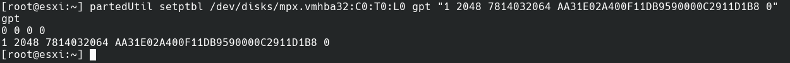
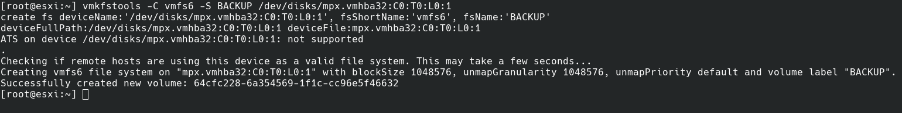
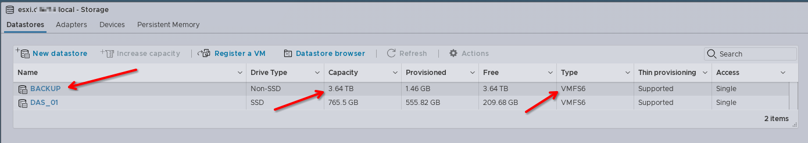

Salve Salve Pessoal!

Sempre recebo o contato de pessoas me perguntando como podemos montar um disco USB no VMware ESXi.

Mas porque eu usária um disco USB no meu ESXi Rodrigo?

No meu caso uso sempre para fazer o backup das máquinas virtuais localmente, usando o [ghettoVCB](https://github.com/lamw/ghettoVCB/) em clientes que tem apenas um servidor com a versão free.

O processo é bastante tranquilo, porém o armazenamento de dados via USB não é suportado oficialemente pela VMware, então não use em produção para ambientes com suporte oficial.

Vamos ao que importa!

**1** - A primeira coisa que precisamos fazer é parar o serviço **usbarbitrator**, execute o comando abaixo.

```
# /etc/init.d/usbarbitrator stop
```

[](images/Screenshot_20230806_102622.png)

**2** - Agora vamos desativar permanentemente esse serviço.

```
# chkconfig usbarbitrator off
```

**3** - Acessando a interface web do ESXI, indo em **Storage** > **Devices,** podemos verificar o disco, observe que ele aparece com o nome **Local USB Direct-Access**, o que facilita na identificação de qual disco desejamos formatar, no meu caso é o **mpx.vmhba32:C0:T0:L0**.

[](images/Screenshot_20230806_153458.png)Também podemos listar os discos disponíveis no ESXi via linha de comando, com o seguindo comando.

```
# ls /dev/disks/
```

[](images/Screenshot_20230806_153721.png)**OBS:** Os discos no ESXi normalmente começam com a seguinte nomenclatura, **mpx.vmhba\*\*\*** ou com **naa.\*\*\***.

**4** - Agora que o disco foi identificado podemos formatar ele, vamos começar rotulando ele como um disco do tipo **GPT**.

```
# partedUtil mklabel /dev/disks/mpx.vmhba32:C0:T0:L0 gpt
```

**5** - Agora vamos criar a partição, no meu caso será uma única partição. Porém precisamos saber o setor inicial e final do disco.

O setor incial sempre será 2048, porém o final varia de acordo com o tamanho do disco, podemos usar a saída do comando abaixo para fazer esse cálculo.

```
# partedUtil getptbl /dev/disks/mpx.vmhba32:C0:T0:L0
```

[](images/Screenshot_20230806_154527.png)Observe na imagem que a saída para o meu disco foi:

**486401 255 63 7814032067**

Agora só precisamos multiplicar os três primeiros valores e subtrair por um.

**486401 \* 255 \* 63 - 1 = 7814032064**

O resultado é nosso setor final, no meu caso **7814032064**.

Com essa informação agora podemos criar nossa partição, use o seguinte comando.

```
# partedUtil setptbl /dev/disks/mpx.vmhba32:C0:T0:L0 gpt "1 2048 7814032064 AA31E02A400F11DB9590000C2911D1B8 0"
```

[](images/Screenshot_20230806_155225.png)

O código **AA31E02A400F11DB9590000C2911D1B8** é o código para o tipo de sistemas de arquivos VMFS.

**6** - Agora basta formatarmos a partição com o sistema de arquivos **VMFS6**.

```
#vmkfstools -C vmfs6 -S BACKUP /dev/disks/mpx.vmhba32:C0:T0:L0:1
```

[](images/Screenshot_20230806_155405.png)

**BACKUP** foi o nome que eu escolhi para montar o disco no datastores, você pode usar qualquer nome.

Pronto, o disco foi formatado e já deverá estar disponível para uso.

[](images/Screenshot_20230806_155545.png)Até o próximo post!

:D
