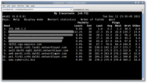

O mtr combina a funcionalidade dos programas traceroute e ping em uma única ferramenta de diagnóstico de rede. Use mtr para monitorar banda de saída, latência entre outros. Um ótimo aplicativo para resolver pequenos problemas de rede.

Click [AQUI](http://www.bitwizard.nl/mtr/) para fazer o download.
