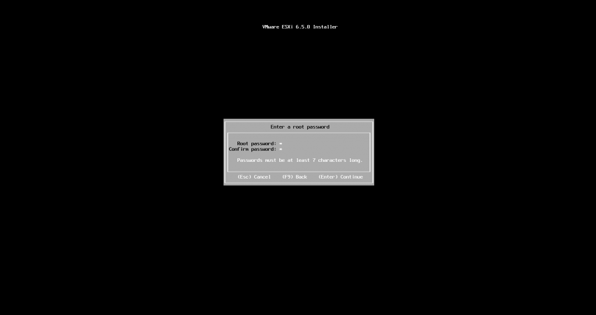
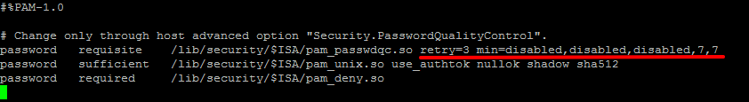
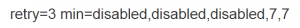
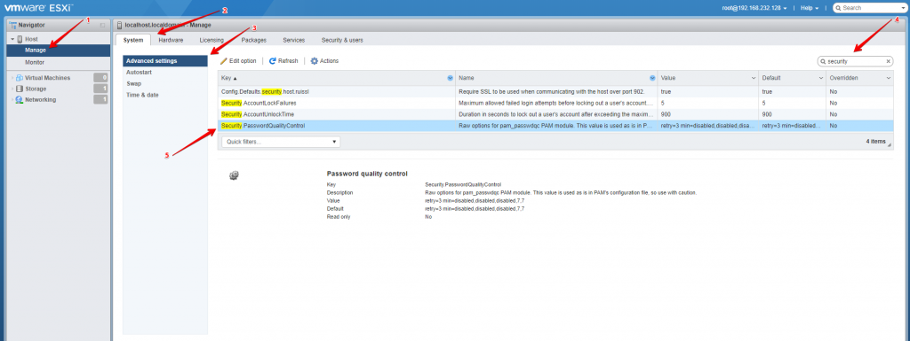
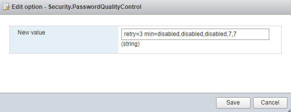

Salve Salve Pessoal!

Nesse post vou falar sobre a complexidade se senhas do ESXi.

Por padrão, quando vamos instalar um novo servidor ESXi, nós podemos configurar uma senha com baixa complexidade, o único pré-requisito que ela precisa atender é que tenha no mínimo 7 caracteres.

Porém, depois de instalado, se desejarmos alterar a senha, o nível de complexidade exigido é bem maior.

Vamos entender um pouco sobre como funciona.

O gerenciamento e controle de senhas do ESXi é feito através do módulo **pam\_passwdqc** do **PAM do Linux**.

**Os pré-requisitos padrão para a senha do ESXi são:**

1. Quatro classes de caracteres: números, caracteres especiais, letras maiúsculas e minúsculas.
2. O tamanho deve ser maior que 7 e menos que 40 caracteres.
3. As senhas não podem conter palavras ou parte de palavras do dicionário.

O arquivo de configuração padrão **/etc/pam.d/passwd**.

Não vou entrar em detalhes sobre o arquivo, apenas a parte que nos interessa, mas se quiser saber um pouco mais sobre o **PAM** e o módulo **pam\_passwdqc**, acesse os link abaixo:

[http://www.linux-pam.org/](http://www.linux-pam.org/)

Vamos entender um pouco os valores do arquivo, ele é dividido em dois campos, o primeiro campo(**retry**) é composto por apenas um valor, o segundo campo(**min**) é composto por cinco valores separados por vírgula.

**retry=X** (o usuário pode tentar X vezes inserir uma senha que corresponda as necessidades de complexidade)

**min=(N valor)**

**N0 = X:** Senhas contendo caracteres de uma classe de caracteres. **N1 = X:** Senhas contendo caracteres de duas classes de caracteres. **N2 = X:** Frases secretas devem conter palavras com pelo menos X caracteres de comprimento. **N3 = X:** Senhas contendo caracteres de três classes de caracteres. **N4 = X:** As senhas contendo caracteres de todas as quatro classes de caracteres.

Por padrão os valores do **ESXi 6.5** são:

Ou seja:

**retry=3** (o usuário pode tentar 3 vezes inserir uma senha que corresponda as necessidades de complexidade)

**min=(N valor)**

**N0 = disabled** Desabilitado **N1 = disabled** Desabilitado **N2 = disabled** Desabilitado **N3 = 7:** Senhas contendo caracteres de três classes de caracteres devem ter pelo menos sete caracteres. **N4 = 7:** As senhas contendo caracteres de todas as quatro classes de caracteres devem ter pelo menos sete caracteres.

É altamente recomendado a mudança através da interface do ESXI, para isso acesse o host **ESXi** > **Manage** > **System** > **Advanced settings** > pesquise por **security** > **Security.PasswordQualityControl**.

Clique em **Edit option**, altere de acordo com a sua necessidade e clique em **Save**.

Pronto, a complexidade foi alterada de acordo com a sua necessidade.

Os valores podem mudar de acordo com a versão do ESXi.

Até a próxima! :D
