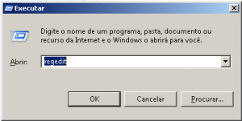
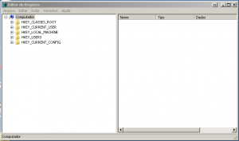
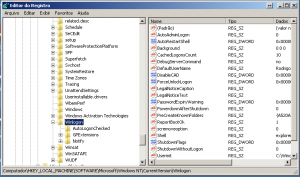
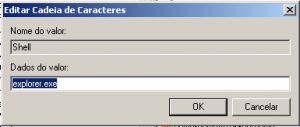
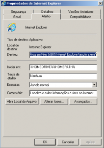
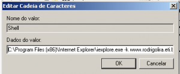

Salve Salve Galera!

Nesse post vou mostrar como alterar a forma de inicialização do windows, ou seja, ao invés de iniciar normalmente com o "explorer.exe", iniciar com um programa especifico como por exemplo o internet explore.

Seguinte primeiro de tudo abra o regedit:

Aperte a tecla do Windows + R para abrir o executar do windows, digite regedit e click em ok.

Vai abrir o editor de registro do windows:

Com o editor aberto você vai executar o seguinte passo-a-passo:<!--more-->

HKEY\_LOCAL\_MACHINE > SOFTWARE > Microsoft > Windows NT > Winlogon, dentro de Winlogon vai ter o registro com nome shell, como mostra a imagem abaixo:

Dê um duplo click no registro Shell e aparecerá a seguinte janela:

O valor explorer.exe é o que determina a forma de como o seu windows vai iniciar o ambiente gráfico, para fazer com que ele inicialize de forma diferente basta mudar esse valor.

Colocaremos o "internet explore 9" para iniciar no lugar do "explorer.exe", para fazer isto basta copiar o caminho completo do internet explore 9 e colar no lugar do explorer.exe.

Para isso basta dar um click com o botão direito do mouse em cima do ícone do internet explore e em seguida um click em propriedades.

Agora copie o caminho completo dentro de destino, que é o caminho completo para o programa, como abaixo:

Cole o caminho no lugar do valor "explore.exe" sem as aspas duplas, como abaixo:

Agora basta da um click em ok e reiniciar o computador, quando o seu windows iniciar ele vai abrir diretamente o Internet Explore 9, ao invés do explorer.exe.

A opção -k determina que o Internet Explore abra o site www.rodrigolira.eti.br/blog em modo de tela cheia e trava a tela.

Pronto, é isso ai galera, qualquer dúvidas enviar um e-mail ou cometar.
