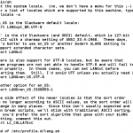

[](http://rodrigolira.eti.br/wp-content/uploads/2013/08/lang.sh_.png)Salve Salve Pessoal!

Várias pessoas tem dificuldade de configurar o idioma no Slackware, grande maioria configura no KDE pensando que está configurando no  Slackware.

Pois bem, antes de tudo vamos ver as opções de idiomas que temos disponível em nosso sistema.

Execute o comando:

```
#locale -a
```

Esse comando exibe todos as opções disponíveis. No nosso caso pt\_BR e pt\_BR.utf8 (utf8 para usar a codificação unicode)

O arquivo de configuração padrão dos idiomas no Slackware é o lang.sh que fica no /etc/profile.d/.

Edite esse arquivo

```
#vim /etc/profile.d/lang.sh (use o seu editor favorito)
```

Procure a seguinte linha:

```
export LANG=en_US
```

Substitua por:

```
export LANG=pt_BR.UTF-8
```

Salve o arquivo e reinicie o computador, quando reiniciar o idioma padrão vai ser português Brasil independente da interface gráfica que você utiliza.

Até a próxima!
