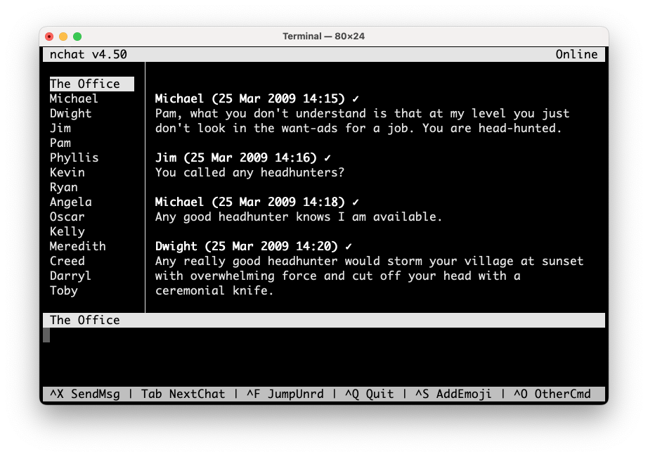

Salve Salve Pessoal!

Como a maioria do pessoal sabe o **WhatsApp** não tem um app oficial para **Linux**, e os apps alternativos que vemos por ai normalmente são baseados em Electron, particularmente eu nunca gostei de nenhum.

Normalmente ficam travando, ou a sincronização não funciona tão bem, são bem pesados e consomem muitos recursos do computador, defeitos diversos, além disso também não gosto de usar no navegador, consome muitos recursos também.

Porém está semana estava pesquisando e acabei achando um projeto bem legal no github, o **nchat**.

O **nchat** é um cliente para **Telegram** e **WhatsApp** baseado em terminal para **Linux** e **macOS**.

Aqui tem algumas das características do nchat:

- Esquemas de cores e atalhos de teclado personalizáveis
- Ir para o chat não lido
- Cache do histórico de mensagens com suporte para exportação de texto
- Confirmação de leitura da mensagem
- Receber/enviar mensagens formatadas em markdown
- Responder / apagar / editar / encaminhar / enviar mensagens
- Listar diálogos para selecionar chats, contatos, emojis, arquivos
- Mostrar status do usuário (online, ausente, digitando)
- Alternar para visualizar emojis textuais vs. gráficos
- Visualizar/salvar arquivos de mídia (documentos, fotos, vídeos)
- Enviar e exibir reações

E o melhor de tudo, funciona perfeitamente e com um consumo mínimo de recursos.

Abaixo segue o link para o projeto.

[https://github.com/d99kris/nchat](https://github.com/d99kris/nchat)

Caso seja um usuário de Slackware, criei os scripts para criar um pacote, você pode acessar via slackbuilds.org na URL abaixo.

[https://slackbuilds.org/repository/15.0/network/nchat/](https://slackbuilds.org/repository/15.0/network/nchat/)

Caso deseje o pacote pronto, você pode baixar de meu repositório pessoal.

[https://slackbuilds.rodrigolira.eti.br/](https://slackbuilds.rodrigolira.eti.br/)

Até o próximo post!

:D
