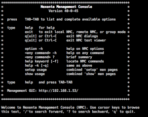
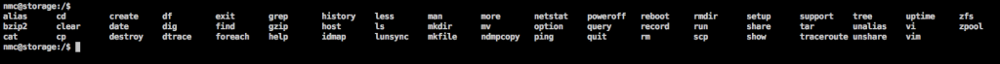
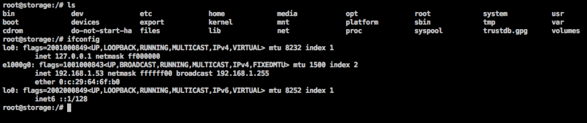

Salve Salve Pessoa!

Por padrão quando logamos no Nexenta via SSH nós caimos dentro do NMC (Nexenta Management Console).

[](http://rodrigolira.eti.br/wp-content/uploads/2016/07/Screen-Shot-2016-07-21-at-09.47.11-2.png)

<!--more-->É um console de gerenciamento próprio, com comandos limitados ao gerenciamento do Nexenta. Se apertar-mos TAB 2x ele exibira todos os comando possíveis.

[](http://rodrigolira.eti.br/wp-content/uploads/2016/07/Screen-Shot-2016-07-21-at-09.46.20-2.png)Mas como eu faço para fazer alterações avançadas no sistema, editar arquivos diretamente no /etc por exemplo. É possível entrar no shell do sistema, para isso faça o seguinte:

Digite:

```
nmc@storage:/$ option expert_mode=1
```

```
nmc@storage:/$ !bash
You are about to enter the Unix ("raw") shell and execute low-level Unix command(s). Warning: using low-level Unix commands is not recommended! Execute? (y/n)
```

Confirme digitando "**y**" e você já entrará no shell do sistema.

```
root@storage:/volumes#
```

Pronto, agora você já tem acesso aos diretórios do sistema como o /etc /home e etc, e comandos normalmente encontrados na familia Unix, como o ls, ifconfig e etc.

[](http://rodrigolira.eti.br/wp-content/uploads/2016/07/Screen-Shot-2016-07-21-at-10.06.22-2.png)

Até a próxima :D
