Salve Salve Pessoal!

Neste post vou mostrar como configurar o Link Aggregation no Nexenta, é muito simples. Vou mostrar como fazer via interface web e via linha de comando. Para quem não sabe o que é o Nexenta, eu já falei sobre ele em outros posts, procurem aqui no blog ;).

Mãos a obra :D<!--more-->

1 - Acesse o Nexenta via interface web:

[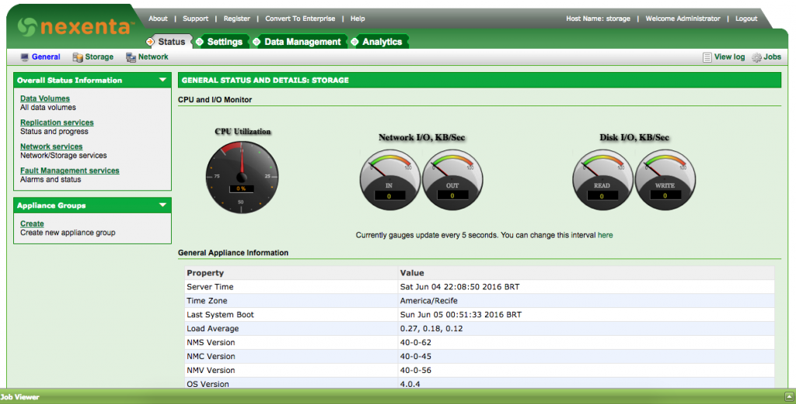](http://rodrigolira.eti.br/wp-content/uploads/2016/06/network-01.png)

 

2 - Menu Settings > Network:

[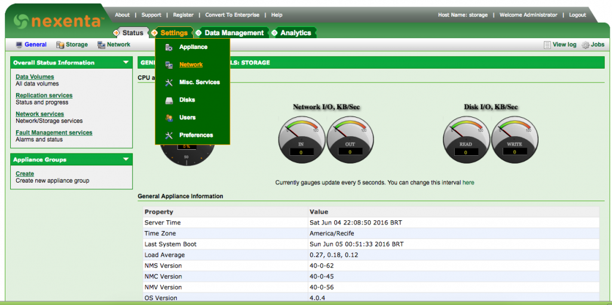](http://rodrigolira.eti.br/wp-content/uploads/2016/06/network-02.png)

 

3 - Na tela de configuração de rede, podemos observar as interfaces que estão disponíveis e em uso, configurar gateway, hostname, entre outras configuração, clique em **Create**:

[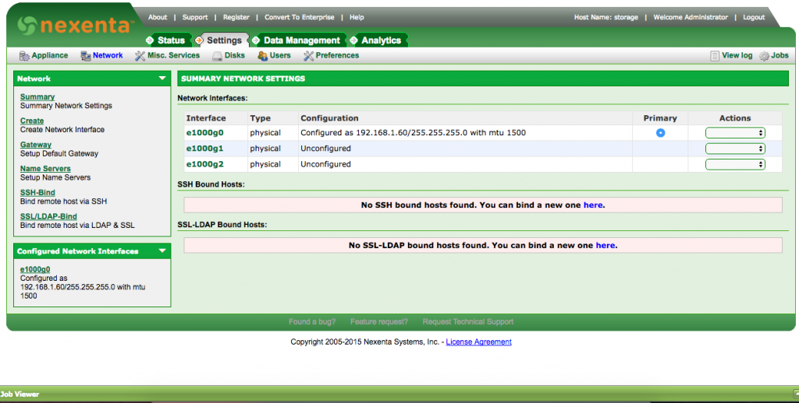](http://rodrigolira.eti.br/wp-content/uploads/2016/06/network-03.png)

 

4 - Em **All Available Devices**, selecione as duas interfaces que estão disponíveis:

[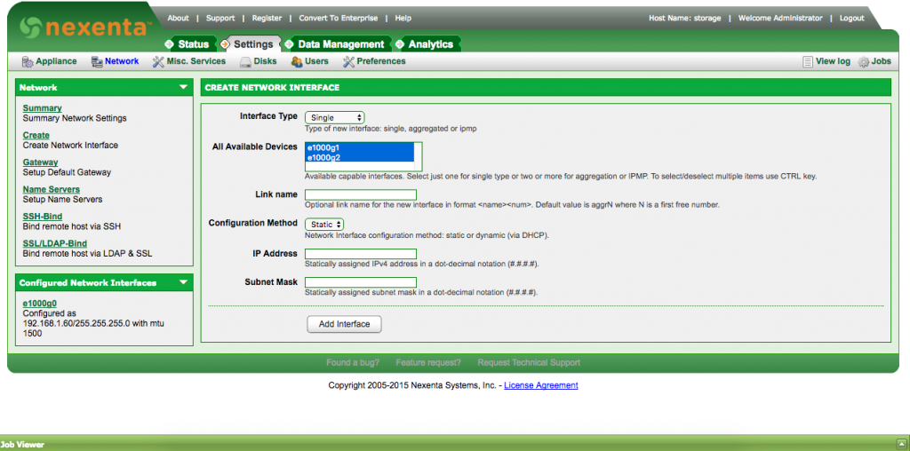](http://rodrigolira.eti.br/wp-content/uploads/2016/06/network-04.png)

 

5 - Em **Interface Type**, selecione **Aggregated**:

[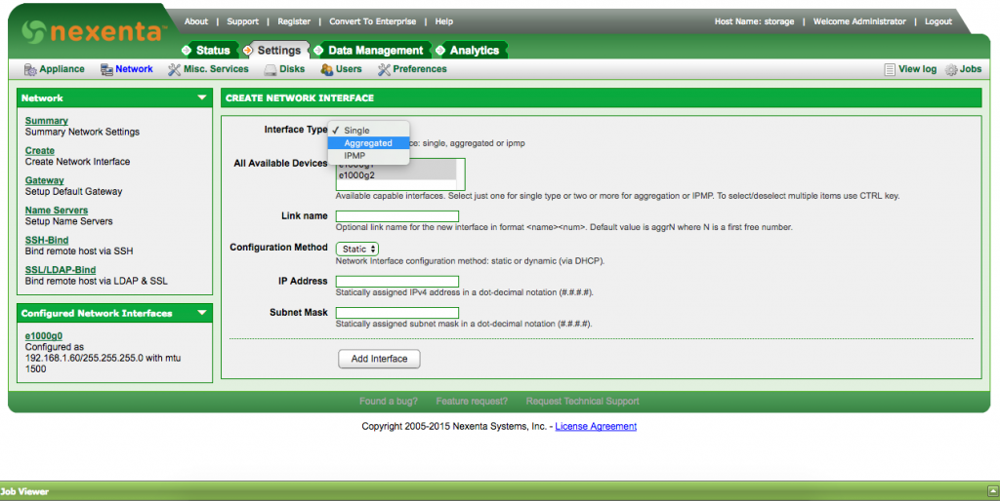](http://rodrigolira.eti.br/wp-content/uploads/2016/06/network-05.png)

 

6 - Em **Link Name**, adicione um nome para a interface, o padrão é colocar **aggrN**, onde **N** representa um numero, no nosso caso, vamos colocar o nome **aggr1**.

[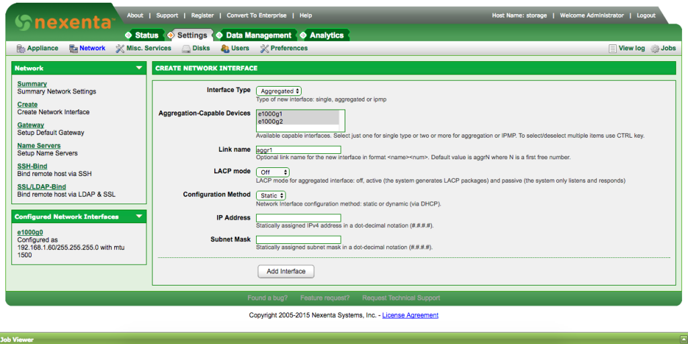](http://rodrigolira.eti.br/wp-content/uploads/2016/06/network-22.png)

 

7- Em **LACP mode**, vamos deixar em **Off**, para entender melhor essa diferença, existem vários sites explicando.

Ex: [http://www.cisco.com/c/en/us/td/docs/ios/12\_2sb/feature/guide/gigeth.html](http://www.cisco.com/c/en/us/td/docs/ios/12_2sb/feature/guide/gigeth.html)

[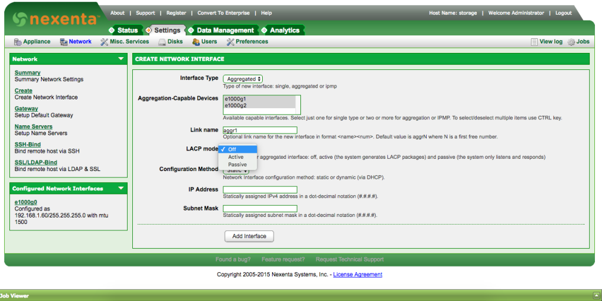](http://rodrigolira.eti.br/wp-content/uploads/2016/06/network-06.png)

 

8 - Em **Configuration Method**, vamos deixar como **Static**, para configurarmos o nosso IP manualmente.

[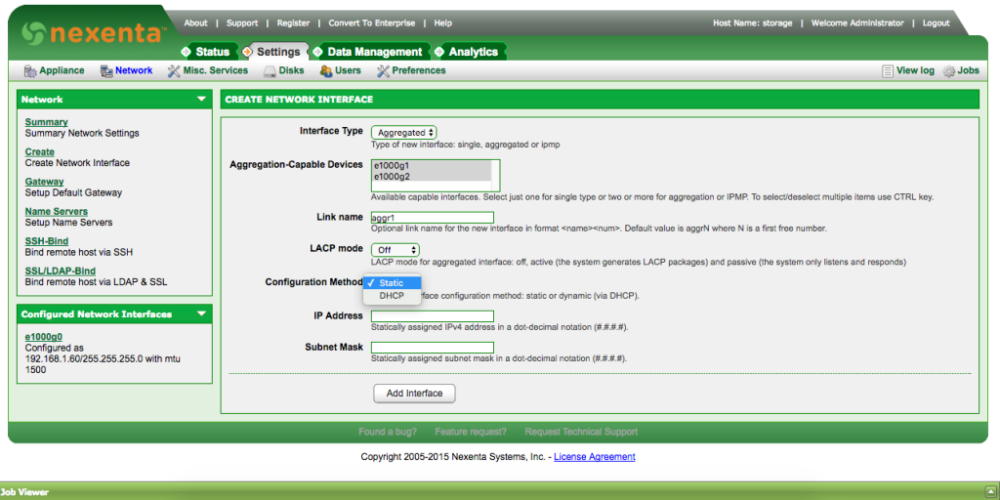](http://rodrigolira.eti.br/wp-content/uploads/2016/06/network-07.png)

 

9 - Em **IP Address,** configure o endereço IP e em **Subnet Mask**, configure a mascara de rede, agora clique em **Add Interface**.

 

10 - Pronto, nosso Link Aggregation está configurado e funcionando, veja na imagem abaixo:

[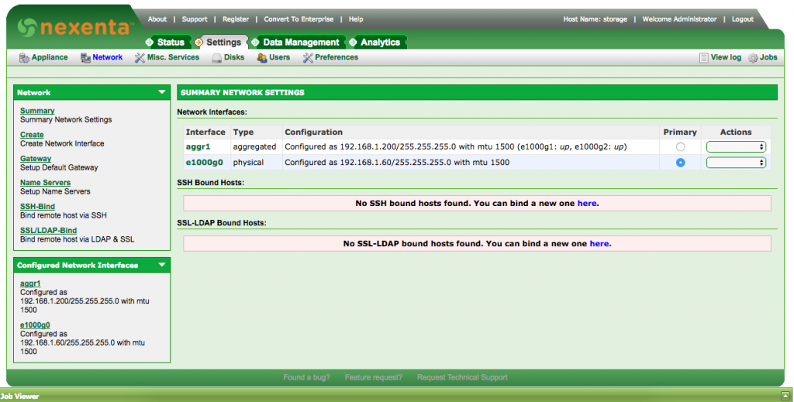](http://rodrigolira.eti.br/wp-content/uploads/2016/06/network-09.png)

 

Agora vamos fazer essa configuração via console.

Dica: Use o **TAB** para auto completar e mostrar as opções possíveis ;)

1 - Via console digite o seguinte comando:

[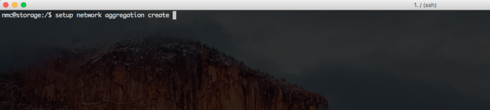](http://rodrigolira.eti.br/wp-content/uploads/2016/06/network-10.png)

 

2 - Usando a barra de espaços, selecione as duas interfaces e tecle ENTER.

[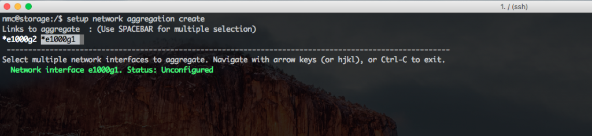](http://rodrigolira.eti.br/wp-content/uploads/2016/06/network-11.png)

 

3 - Selecione o LACP mode e tecle ENTER:

[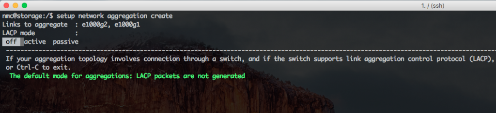](http://rodrigolira.eti.br/wp-content/uploads/2016/06/network-12.png)

 

4 - Adicione o nome da interface e tecle ENTER:

[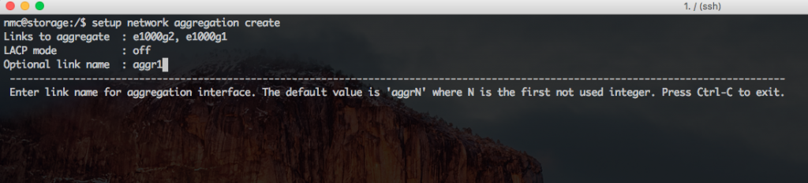](http://rodrigolira.eti.br/wp-content/uploads/2016/06/network-13.png)

 

5- Deixe o padrão em Policy e tecle ENTER:

[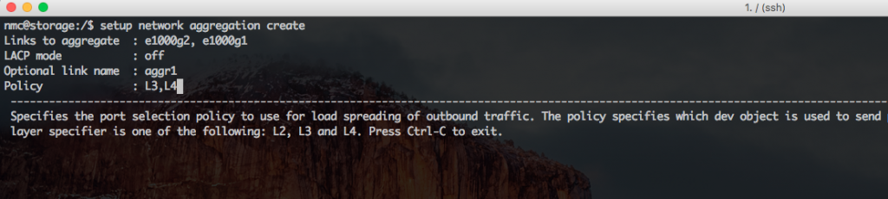](http://rodrigolira.eti.br/wp-content/uploads/2016/06/network-14.png)

 

6 - Pronto, o Link Aggregation foi criado, execute o comando abaixo para listar todas as interfaces de link aggregation:

[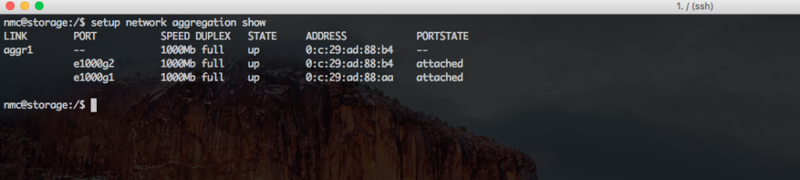](http://rodrigolira.eti.br/wp-content/uploads/2016/06/network-15.png)

 

7 - Execute o comando abaixo para exibir todas as interfaces e sua configuração, como podemos ver, a interface aggr1 que acabamos de criar não está com IP configurado.

[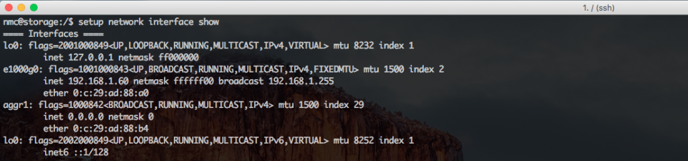](http://rodrigolira.eti.br/wp-content/uploads/2016/06/network-16.png)

 

8 - Para configurar o IP na interface aggr1, execute o seguinte comando:

[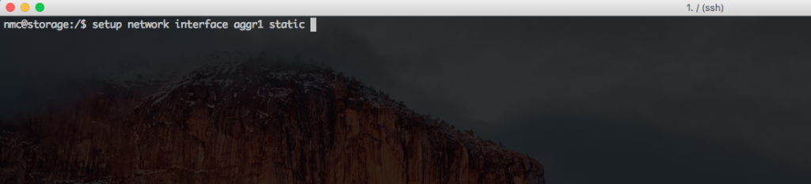](http://rodrigolira.eti.br/wp-content/uploads/2016/06/network-17.png)

 

9 - Adicione o IP e tecle ENTER:

[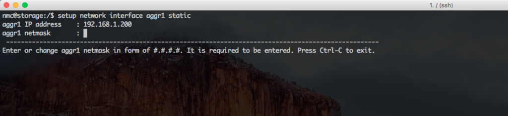](http://rodrigolira.eti.br/wp-content/uploads/2016/06/network-18.png)

 

10 - Adicione a mascara e tecle ENTER:

[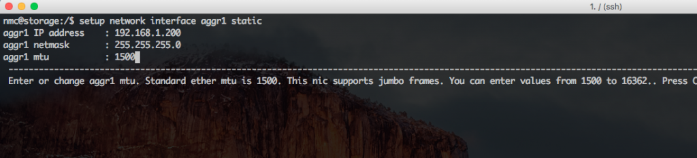](http://rodrigolira.eti.br/wp-content/uploads/2016/06/network-19.png)

 

11 - Configure o mtu e tecle ENTER:

[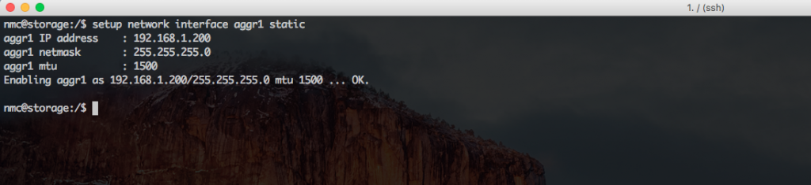](http://rodrigolira.eti.br/wp-content/uploads/2016/06/network-20.png)

 

12 - Pronto, nosso Link Aggregation está configurado e funcionando, execute o comando abaixo e verifique:

[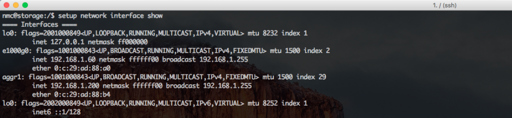](http://rodrigolira.eti.br/wp-content/uploads/2016/06/network-21.png)

 

Espero que você tenha gostado, até a próxima :D
