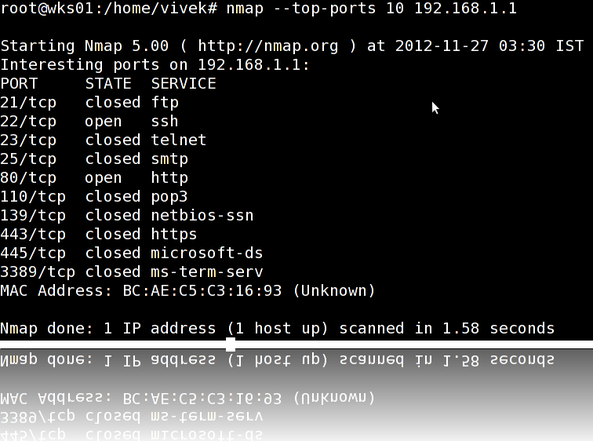
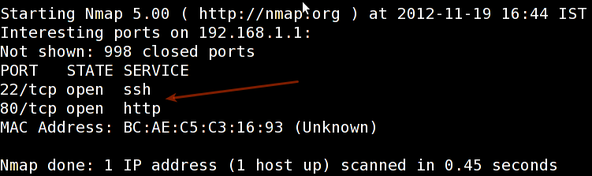
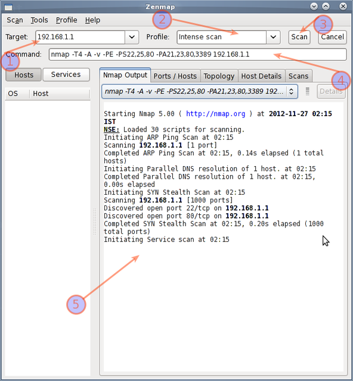

É uma ferramenta de segurança de código aberto para exploração de rede, varredura de segurança e auditoria. No entanto, o nmap  vem com muitas opções que podem tornar o utilitário mais robusto e difícil de seguir para novos usuários.

O objetivo deste post é a introdução de um usuário para a ferramenta de linha de comando nmap para escanear um host e/ou rede, de modo a descobrir os possíveis pontos vulneráveis das maquinas. Você também vai aprender a usar o Nmap para fins ofensivos e defensivos.

[](http://www.cyberciti.biz/networking/nmap-command-examples-tutorials/attachment/welcome-nmap/)

 

Configuração de exemplo (LAB)

Varredura de portas pode ser ilegal em algumas países. Assim é mais pratico configurar um laboratório como o exemplo abaixo:

```
                              +---------+
        +---------+           | Network |         +--------+
        | server1 |-----------+ swtich  +---------|server2 |
        +---------+           | (sw0)   |         +--------+
                              +----+----+
                                   |
                                   |
                         +---------+----------+
                         | wks01 Linux/OSX    |
                         +--------------------+
```

<!--more-->

## #1: Scan de um host ou um endereço (IPv4)

```
### Scan em um único endereço ###
nmap 192.168.1.1

## Scan em um host pelo nome ###
nmap server1.cyberciti.biz

## Scan em um host pelo nome e obtendo mais informações ###
nmap -v server1.cyberciti.biz
```

Exemplos de saída:

[](http://www.cyberciti.biz/faq/howto-install-nmap-on-centos-rhel-redhat-enterprise-linux/)Fig.01: nmap output

 

## #2: Scan múltiplos endereços ou sub-redes (IPv4)

```
nmap 192.168.1.1 192.168.1.2 192.168.1.3
```

```
## Scan na mesma sub-rede i.e. 192.168.1.0/24
```

```
nmap 192.168.1.1,2,3
```

Scan no range de endereços:

```
nmap 192.168.1.1-20
```

Scan usando caracteres coringas:

```
nmap 192.168.1.*
```

Scan em uma sub-rede inteira:

```
nmap 192.168.1.0/24
```

## #3: Lendo uma lista de redes ou hosts em um arquivo (IPv4)

É possível fazer um scan utilizando uma lista com endereços de hosts ou redes, isso é ultil quando precisamos scannear uma rede muito grande ou varios hosts, para isso crie um arquivo de acordo com o padrão abaixo: `cat > /tmp/test.txt`

Exemplo de saída:

```
server1.cyberciti.biz
192.168.1.0/24
192.168.1.1/24
10.1.2.3
localhost
```

Fazendo o scan:

```
nmap -iL /tmp/test.txt
```

## #4: Excluindo hosts ou sub-redes (IPv4)

Ao fazer um scan em uma grande sub-rede você pode excluir um ou vários hosts.

```
nmap 192.168.1.0/24 --exclude 192.168.1.5
nmap 192.168.1.0/24 --exclude 192.168.1.5,192.168.1.254
```

Ou excluir em uma lista /tmp/exclude.txt

```
nmap -iL /tmp/scanlist.txt --excludefile /tmp/exclude.txt
```

## #5: Detectando o versão do sistema operacional (IPv4)

```
nmap -A 192.168.1.254
nmap -v -A 192.168.1.1
nmap -A -iL /tmp/scanlist.txt
```

## #6: Descubra se o alvo é protegido por um firewall

```
nmap -sA 192.168.1.254
nmap -sA server1.cyberciti.biz
```

## #7: Scan quando o host é protegido por um firewall

```
nmap -PN 192.168.1.1
nmap -PN server1.cyberciti.biz
```

## #8: Scan em rede IPv6

A opção -6 ativa a opção de ipv6 a sua sintaxe é:

```
nmap -6 IPv6-Address-Here
nmap -6 server1.cyberciti.biz
nmap -6 2607:f0d0:1002:51::4
nmap -v A -6 2607:f0d0:1002:51::4
```

## #9: Scan para descobrir quais servidores e dispositivos estão funcionando

nmap -sP 192.168.1.0/24

Exemplo de saída:

```
Host 192.168.1.1 is up (0.00035s latency).
MAC Address: BC:AE:C5:C3:16:93 (Unknown)
Host 192.168.1.2 is up (0.0038s latency).
MAC Address: 74:44:01:40:57:FB (Unknown)
Host 192.168.1.5 is up.
Host nas03 (192.168.1.12) is up (0.0091s latency).
MAC Address: 00:11:32:11:15:FC (Synology Incorporated)
Nmap done: 256 IP addresses (4 hosts up) scanned in 2.80 second
```

## #10: Executa uma verificação rápida

```
nmap -F 192.168.1.1
```

## #11: Mostra a razão da porta estar em determinado estado

```
nmap --reason 192.168.1.1
nmap --reason server1.cyberciti.biz
```

## #12: Mostra apenas portas abertas (ou possivelmente abertas)

```
nmap --open 192.168.1.1
nmap --open server1.cyberciti.biz
```

## #13: Mostra todos os pacotes enviados e recebidos

```
nmap --packet-trace 192.168.1.1
nmap --packet-trace server1.cyberciti.biz
```

## 14#: Mostra interface e rotas dos hosts

Isso é útil para detecção de problemas na rede

```
nmap --iflist
```

Exemplo de saída:

```
Starting Nmap 5.00 ( http://nmap.org ) at 2012-11-27 02:01 IST
************************INTERFACES************************
DEV    (SHORT)  IP/MASK          TYPE        UP MAC
lo     (lo)     127.0.0.1/8      loopback    up
eth0   (eth0)   192.168.1.5/24   ethernet    up B8:AC:6F:65:31:E5
vmnet1 (vmnet1) 192.168.121.1/24 ethernet    up 00:50:56:C0:00:01
vmnet8 (vmnet8) 192.168.179.1/24 ethernet    up 00:50:56:C0:00:08
ppp0   (ppp0)   10.1.19.69/32    point2point up

**************************ROUTES**************************
DST/MASK         DEV    GATEWAY
10.0.31.178/32   ppp0
209.133.67.35/32 eth0   192.168.1.2
192.168.1.0/0    eth0
192.168.121.0/0  vmnet1
192.168.179.0/0  vmnet8
169.254.0.0/0    eth0
10.0.0.0/0       ppp0
0.0.0.0/0        eth0   192.168.1.2
```

## #15: Especificar uma porta

```
map -p [port] hostName
## Scan na porta 80
nmap -p 80 192.168.1.1

## Scan TCP na porta 80
nmap -p T:80 192.168.1.1

## Scan UDP na porta 53
nmap -p U:53 192.168.1.1

## Scan two nas portas ##
nmap -p 80,443 192.168.1.1

## Scan port ranges ##
nmap -p 80-200 192.168.1.1

## Combinar várias opções ##
nmap -p U:53,111,137,T:21-25,80,139,8080 192.168.1.1
nmap -p U:53,111,137,T:21-25,80,139,8080 server1.cyberciti.biz
nmap -v -sU -sT -p U:53,111,137,T:21-25,80,139,8080 192.168.1.254

## Scan todas as portas usando coringas ##
nmap -p "*" 192.168.1.1

## Scan de portas mais comuns ##
nmap --top-ports 5 192.168.1.1
nmap --top-ports 10 192.168.1.1
```

Exemplo de saída:

```
Starting Nmap 5.00 ( http://nmap.org ) at 2012-11-27 01:23 IST
Interesting ports on 192.168.1.1:
PORT     STATE  SERVICE
21/tcp   closed ftp
22/tcp   open   ssh
23/tcp   closed telnet
25/tcp   closed smtp
80/tcp   open   http
110/tcp  closed pop3
139/tcp  closed netbios-ssn
443/tcp  closed https
445/tcp  closed microsoft-ds
3389/tcp closed ms-term-serv
MAC Address: BC:AE:C5:C3:16:93 (Unknown)

Nmap done: 1 IP address (1 host up) scanned in 0.51 seconds
```

## #16: A maneira mais rápida de descobrir todas as portas e computadores em uma rede

```
nmap -T5 192.168.1.0/24
```

## #17: Detectando um sistema operacional remoto 

```
nmap -O 192.168.1.1
nmap -O  --osscan-guess 192.168.1.1
nmap -v -O --osscan-guess 192.168.1.1
```

Exemplo de saída:

```
Starting Nmap 5.00 ( http://nmap.org ) at 2012-11-27 01:29 IST
NSE: Loaded 0 scripts for scanning.
Initiating ARP Ping Scan at 01:29
Scanning 192.168.1.1 [1 port]
Completed ARP Ping Scan at 01:29, 0.01s elapsed (1 total hosts)
Initiating Parallel DNS resolution of 1 host. at 01:29
Completed Parallel DNS resolution of 1 host. at 01:29, 0.22s elapsed
Initiating SYN Stealth Scan at 01:29
Scanning 192.168.1.1 [1000 ports]
Discovered open port 80/tcp on 192.168.1.1
Discovered open port 22/tcp on 192.168.1.1
Completed SYN Stealth Scan at 01:29, 0.16s elapsed (1000 total ports)
Initiating OS detection (try #1) against 192.168.1.1
Retrying OS detection (try #2) against 192.168.1.1
Retrying OS detection (try #3) against 192.168.1.1
Retrying OS detection (try #4) against 192.168.1.1
Retrying OS detection (try #5) against 192.168.1.1
Host 192.168.1.1 is up (0.00049s latency).
Interesting ports on 192.168.1.1:
Not shown: 998 closed ports
PORT   STATE SERVICE
22/tcp open  ssh
80/tcp open  http
MAC Address: BC:AE:C5:C3:16:93 (Unknown)
Device type: WAP|general purpose|router|printer|broadband router
Running (JUST GUESSING) : Linksys Linux 2.4.X (95%), Linux 2.4.X|2.6.X (94%), MikroTik RouterOS 3.X (92%), Lexmark embedded (90%), Enterasys embedded (89%), D-Link Linux 2.4.X (89%), Netgear Linux 2.4.X (89%)
Aggressive OS guesses: OpenWrt White Russian 0.9 (Linux 2.4.30) (95%), OpenWrt 0.9 - 7.09 (Linux 2.4.30 - 2.4.34) (94%), OpenWrt Kamikaze 7.09 (Linux 2.6.22) (94%), Linux 2.4.21 - 2.4.31 (likely embedded) (92%), Linux 2.6.15 - 2.6.23 (embedded) (92%), Linux 2.6.15 - 2.6.24 (92%), MikroTik RouterOS 3.0beta5 (92%), MikroTik RouterOS 3.17 (92%), Linux 2.6.24 (91%), Linux 2.6.22 (90%)
No exact OS matches for host (If you know what OS is running on it, see http://nmap.org/submit/ ).
TCP/IP fingerprint:
OS:SCAN(V=5.00%D=11/27%OT=22%CT=1%CU=30609%PV=Y%DS=1%G=Y%M=BCAEC5%TM=50B3CA
OS:4B%P=x86_64-unknown-linux-gnu)SEQ(SP=C8%GCD=1%ISR=CB%TI=Z%CI=Z%II=I%TS=7
OS:)OPS(O1=M2300ST11NW2%O2=M2300ST11NW2%O3=M2300NNT11NW2%O4=M2300ST11NW2%O5
OS:=M2300ST11NW2%O6=M2300ST11)WIN(W1=45E8%W2=45E8%W3=45E8%W4=45E8%W5=45E8%W
OS:6=45E8)ECN(R=Y%DF=Y%T=40%W=4600%O=M2300NNSNW2%CC=N%Q=)T1(R=Y%DF=Y%T=40%S
OS:=O%A=S+%F=AS%RD=0%Q=)T2(R=N)T3(R=N)T4(R=Y%DF=Y%T=40%W=0%S=A%A=Z%F=R%O=%R
OS:D=0%Q=)T5(R=Y%DF=Y%T=40%W=0%S=Z%A=S+%F=AR%O=%RD=0%Q=)T6(R=Y%DF=Y%T=40%W=
OS:0%S=A%A=Z%F=R%O=%RD=0%Q=)T7(R=N)U1(R=Y%DF=N%T=40%IPL=164%UN=0%RIPL=G%RID
OS:=G%RIPCK=G%RUCK=G%RUD=G)IE(R=Y%DFI=N%T=40%CD=S)
Uptime guess: 12.990 days (since Wed Nov 14 01:44:40 2012)
Network Distance: 1 hop
TCP Sequence Prediction: Difficulty=200 (Good luck!)
IP ID Sequence Generation: All zeros
Read data files from: /usr/share/nmap
OS detection performed. Please report any incorrect results at http://nmap.org/submit/ .
Nmap done: 1 IP address (1 host up) scanned in 12.38 seconds
           Raw packets sent: 1126 (53.832KB) | Rcvd: 1066 (46.100KB)
```

## #18: Detectando serviços remotos e sua versão

```
nmap -sV 192.168.1.1
```

Exemplo de saída:

```
Starting Nmap 5.00 ( http://nmap.org ) at 2012-11-27 01:34 IST
Interesting ports on 192.168.1.1:
Not shown: 998 closed ports
PORT   STATE SERVICE VERSION
22/tcp open  ssh     Dropbear sshd 0.52 (protocol 2.0)
80/tcp open  http?
1 service unrecognized despite returning data.
```

## #19: Scan de host usando TCP ACK (PA) e TCP Syn (PS) ping

Caso o firewall esteja bloqueando os pings tente os seguintes comandos:

```
nmap -PS 192.168.1.1
nmap -PS 80,21,443 192.168.1.1
nmap -PA 192.168.1.1
nmap -PA 80,21,200-512 192.168.1.1
```

## #20: Scan em host usando ping

```
nmap -PO 192.168.1.1
```

## #21: Scan a host usando UDP ping

```
nmap -PU 192.168.1.1
nmap -PU 2000.2001 192.168.1.1
```

## #22: Descubra as portas mais utilizadas usando TCP SYN

```
 
### scan ###
nmap -sS 192.168.1.1

### Portas mais utilizadas utilizando TCP connect
nmap -sT 192.168.1.1

### Portas mais usadas utilizando TCP ACK
nmap -sA 192.168.1.1

### Portas mais usadas utilizando TCP window
nmap -sW 192.168.1.1

### Portas mais usadas utilizando TCP Maimon
nmap -sM 192.168.1.1
```

## #23: Scan de host utilizando serviços UDP (UDP scan)

Serviços mais comuns utilizando protocolo UDP

```
nmap -sU nas03
nmap -sU 192.168.1.1
```

Exemplo de saída:

```
 
Starting Nmap 5.00 ( http://nmap.org ) at 2012-11-27 00:52 IST
Stats: 0:05:29 elapsed; 0 hosts completed (1 up), 1 undergoing UDP Scan
UDP Scan Timing: About 32.49% done; ETC: 01:09 (0:11:26 remaining)
Interesting ports on nas03 (192.168.1.12):
Not shown: 995 closed ports
PORT     STATE         SERVICE
111/udp  open|filtered rpcbind
123/udp  open|filtered ntp
161/udp  open|filtered snmp
2049/udp open|filtered nfs
5353/udp open|filtered zeroconf
MAC Address: 00:11:32:11:15:FC (Synology Incorporated)

Nmap done: 1 IP address (1 host up) scanned in 1099.55 seconds
```

## #24: Scan pelo protocolo IP

Este tipo de scan você pode determinar qual o tipo de protocolo ip deseja (TCP, ICMP, IGMP, etc.)

```
nmap -sO 192.168.1.1
```

## #25: Scan de firewall com falha de segurança

Os seguintes tipos de verificação explorar uma brecha sutil no TCP, é bom para testar a segurança de ataques comuns:

```
 
## TCP Null engana o firewall para obter uma resposta ##
nmap -sN 192.168.1.254

## TCP Fin varredura no firewall ##

nmap -sF 192.168.1.254

## TCP Xmas varredura no firewall ##
```

## #26: Scan de firewall com fragmentos de pacotes

```
nmap -f 192.168.1.1
nmap -f fw2.nixcraft.net.in
nmap -f 15 fw2.nixcraft.net.in
## Set your own offset size with the --mtu option ##
nmap --mtu 32 192.168.1.1
```

## #27: Scan decoys (camufla o ip)

```
nmap -n -Ddecoy-ip1,decoy-ip2,your-own-ip,decoy-ip3,decoy-ip4 remote-host-ip
nmap -n -D192.168.1.5,10.5.1.2,172.1.2.4,3.4.2.1 192.168.1.5
```

## #28: Scan de firewall com MAC spoofing

```
 
### Spoof de MAC address ##
nmap --spoof-mac MAC-ADDRESS-HERE 192.168.1.1

### Adiciona outras opções ###
nmap -v -sT -PN --spoof-mac MAC-ADDRESS-HERE 192.168.1.1

### Use um MAC randômico ###
### O número 0 faz com que o nmap escolha aleatoriamente ###
nmap -v -sT -PN --spoof-mac 0 192.168.1.1
```

## #29: Salvando a saída em um arquivo de texto

```
nmap 192.168.1.1 > output.txt
nmap -oN /path/to/filename 192.168.1.1
nmap -oN output.txt 192.168.1.1
```

## #30: Instalando nmap em modo gráfico?

Instalando utilizando o comando apt-get:

`$ sudo apt-get install zenmap`

Exemplo da saída:

```
[sudo] password for vivek:
Reading package lists... Done
Building dependency tree
Reading state information... Done
The following NEW packages will be installed:
  zenmap
0 upgraded, 1 newly installed, 0 to remove and 11 not upgraded.
Need to get 616 kB of archives.
After this operation, 1,827 kB of additional disk space will be used.
Get:1 http://debian.osuosl.org/debian/ squeeze/main zenmap amd64 5.00-3 [616 kB]
Fetched 616 kB in 3s (199 kB/s)
Selecting previously deselected package zenmap.
(Reading database ... 281105 files and directories currently installed.)
Unpacking zenmap (from .../zenmap_5.00-3_amd64.deb) ...
Processing triggers for desktop-file-utils ...
Processing triggers for gnome-menus ...
Processing triggers for man-db ...
Setting up zenmap (5.00-3) ...
Processing triggers for python-central ...
```

Inicializando o nmap em modo gráfico:

`$ sudo zenmap`

Nmap em modo gráfico:

[](http://www.cyberciti.biz/networking/nmap-command-examples-tutorials/attachment/nmap-usage-examples-output/)

Artigo original: [www.cyberciti.biz](http://www.cyberciti.biz/networking/nmap-command-examples-tutorials/)
