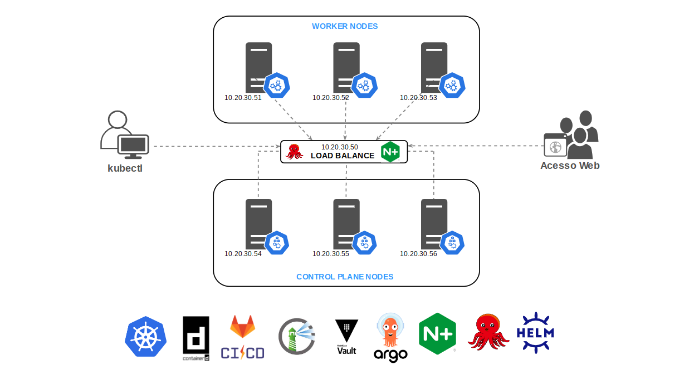

Salve Salve Pessoal!

Passando por aqui para falar um pouco sobre o que desejo escrever em 2023 aqui no blog.

Como vocês podem ver na imagem acima, temos o desenho de uma arquitetura de um cluster kubernetes e algumas logos de ferramentas abaixo.

Então, esse será a arquitetura padrão que vou utilizar para falar sobre todas essas ferramentas, meu intuito é que a gente veja desde a construção de um cluster kubernetes até o deploy automático de uma aplicação usando o ArgoCD.

**Mas porque essas ferramentas exatamente?**

Simples, essas são as ferramentas padrão que estou utilizando no meu dia a dia.

**Podemos ver outras ferramentas além dessas?**

Sim, pode ser que eu acabe falando sobre outras ferramentas.

**Você vai deixar de falar sobre virtualização e outros temas?**

Não, mas meu foco maior vai estar nessas ferramentas.

Vou tentar fazer mais vídeos para facilitar o entendimento de vocês, pode ser até que sejam vídeos ao vivo, mas não quero prometer isso.

Espero ver vocês por aqui no ano de 2023 e tenham um feliz ano novo!

Até o próximo ano!

:D
