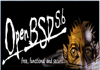

Lançada a versão 5.6 do OpenBSD.

Para maiores detalhes acesse o link: [http://www.openbsd.org/56.html](http://www.openbsd.org/56.html)

Para download: [http://www.openbsd.org/ftp.html](http://www.openbsd.org/ftp.html)

Segue abaixo um vídeo de instalação da nova versão feito por [Antonio Feitosa](http://br.linkedin.com/in/teebsd) do [@openbsd\_br](https://twitter.com/openbsd_br) .

<!--more-->

 

<iframe src="//www.youtube.com/embed/LxQzptE7vcI" width="420" height="315" frameborder="0" allowfullscreen="allowfullscreen"></iframe>
