Salve Salve Pessoal!

Para quem não conhece o **OpenWrt** é um sistema operacional Linux para dispositivos embarcados, normalmente roteadores, onde conseguimos substituir o firmware original por ele, já falei sobre ele em alguns outros posts, abaixo segue a lista de alguns desses posts:

[https://rodrigolira.eti.br/?s=openwrt&submit=Search](https://rodrigolira.eti.br/?s=openwrt&submit=Search)

Para mais informações sobre o OpenWrt acesse o link abaixo:

[https://openwrt.org](https://openwrt.org)

Neste post vou mostrar como podemos colocar ele dentro do VMware vSphere 6.7, diferentemente de outros Linux, o OpenWrt já vem no formato .img e não segue um processo de instalação normal, então precisamos converter o disco de .img para .vmdk, depois fazer o upload desse arquivo para dentro de nosso ambiente, para facilitar esse processo podemos usar o StarWind V2V Converter.

Vamos ao que interessa :D

Baixe a imagem do OpenWrt para arquitetura x86 no link abaixo:

[https://downloads.openwrt.org/releases/18.06.1/targets/x86/64/](https://downloads.openwrt.org/releases/18.06.1/targets/x86/64/)

[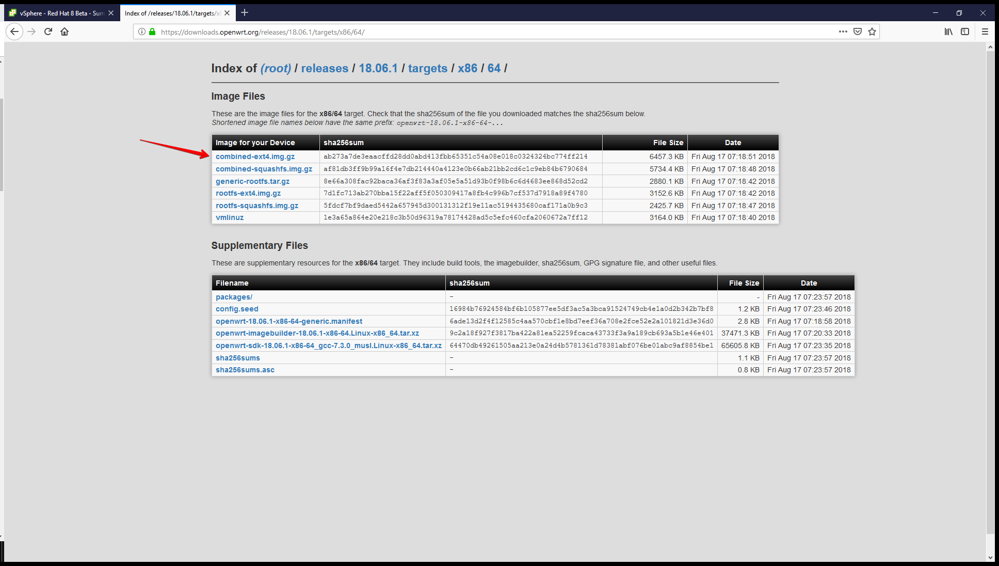](images/001.png)

O arquivo vem no formato .gz, ou seja, vem compactado, descompacte ele com o seu programa favorito, por exemplo o winrar.

Agora acesse o link abaixo, baixe e instale o StarWind V2V Converter.

[https://www.starwindsoftware.com/starwind-v2v-converter](https://www.starwindsoftware.com/starwind-v2v-converter)

Depois de ter baixado a imagem do OpenWrt e baixado e instalado o StarWind V2V Converter, vamos criar uma máquina virtual sem disco para o OpenWrt.

Mas porque isso?

Como falei antes o OpenWrt vem no formado .img e vamos converter ele para um .vmdk, ou seja um arquivo de disco virtual do VMware vSphere.

Vamos criar nossa máquina virtual, acesse seu ambiente vSphere 6.7.

**1** - Clique em cima do host com o botão direito do mouse e depois **New Virtual Machine...**

[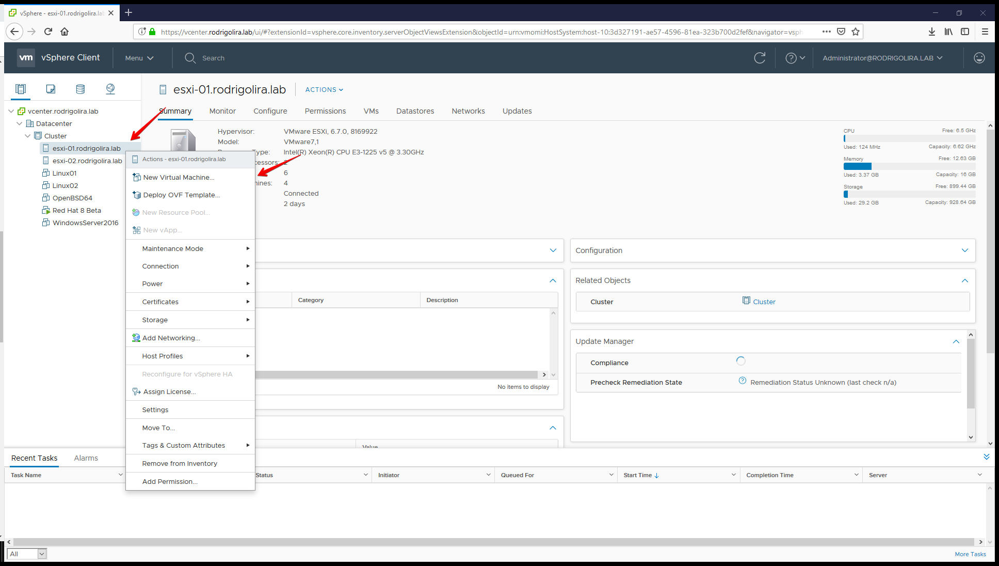](images/002.png)**2** - Selecione **Create a new virtual machine** e clique em **NEXT**.

[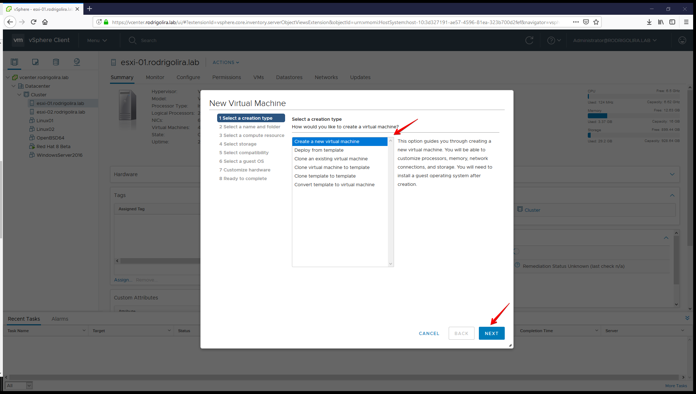](images/003.png)

**3** - Digite um **nome** **para máquina virtual** e cliente em **NEXT**.[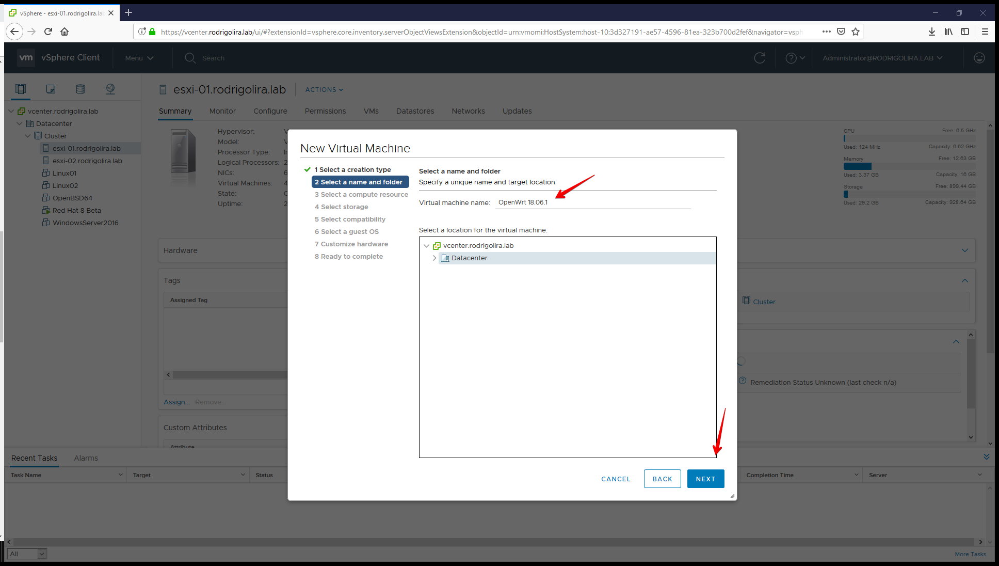](images/004.png)

**4** - Selecione o **host** e clique em **NEXT**.

[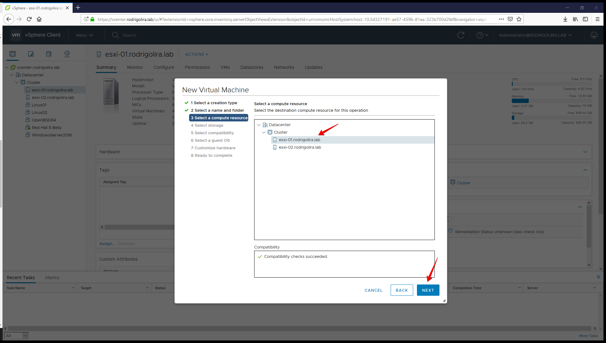](images/005.png)

**5** - Selecione o **datastore** de destino e clique em **NEXT**.

**OBS:** Memorize o datastore, pois vamos precisar dele :P[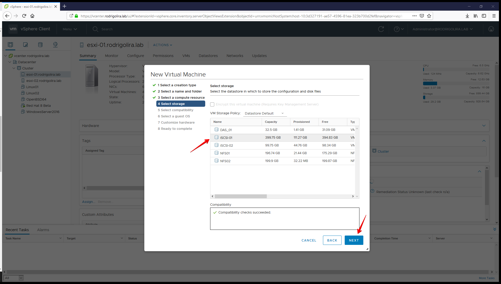](images/006.png)**6** - Selecione a compatibilidade de hardware e clique em **NEXT**.

[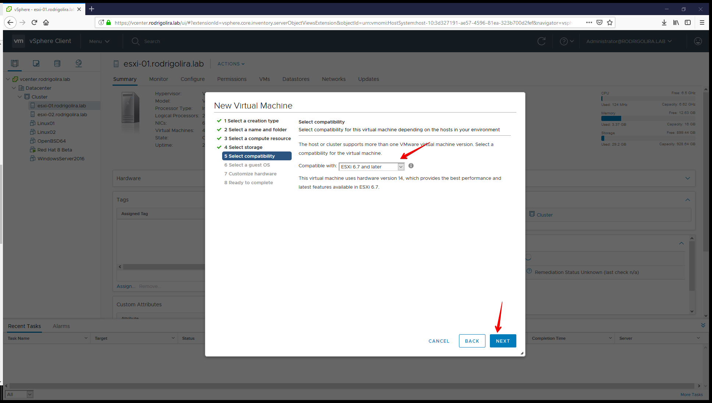](images/007.png)

**7** - Selecione **Linux** em **Guest OS Family** e **Other 4.x (64-bit)** em **Guest OS Version** e cliquem em **NEXT**.

[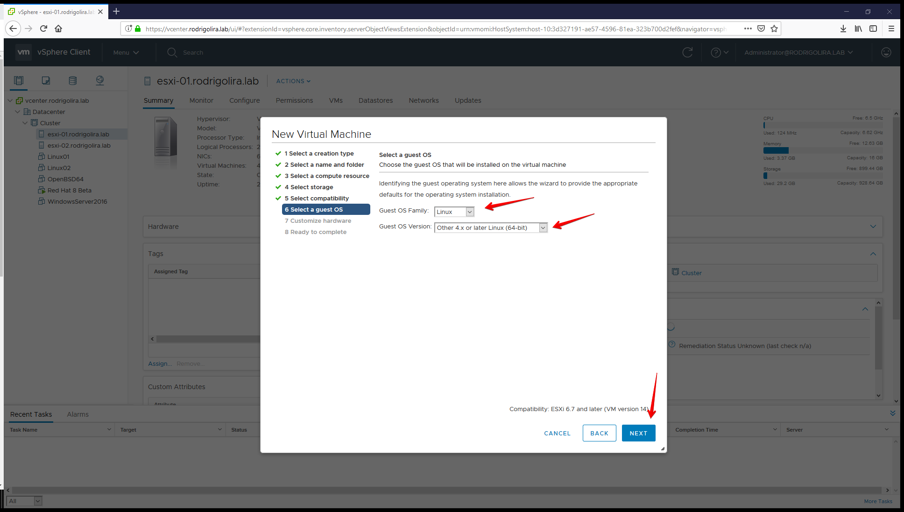](images/008.png)

**8** - Clique no "**x**" para não criar um disco virtual para máquina virtual.

[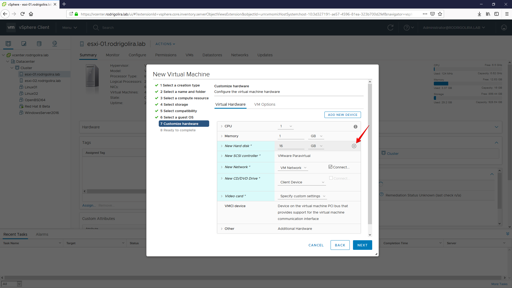](images/009.png)

**9** - Personalize as configurações de hardware como desejado, clique em **VM Options** depois em **Boot Options > Firmware** e selecione **BIOS**, depois clique em **NEXT**.

[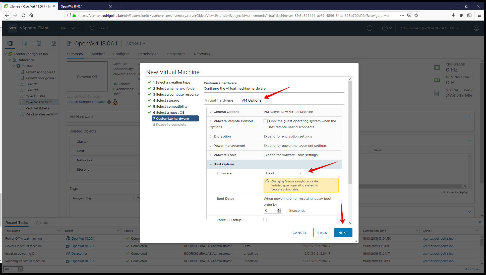](images/010-1.png)**10** - Reveja as configurações e clique em **FINISH**.

[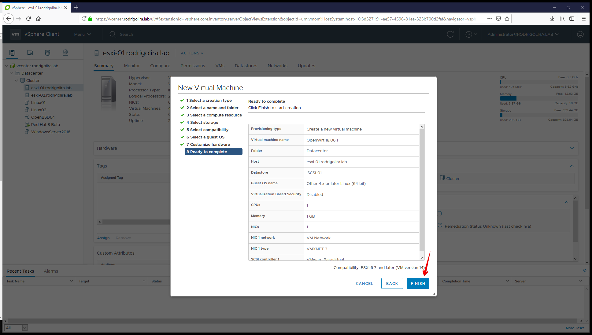](images/011.png)

Agora vamos converter o disco com o **StarWind V2V Converter** e enviar para o ambiente **vSphere 6.7**.

**11** - Inicie o **StarWind V2V Converter**, Selecione **Local file** e clique em **Next**.

[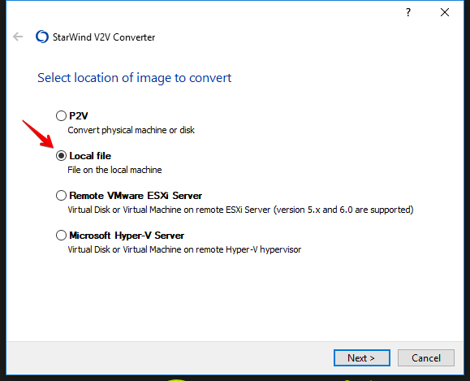](images/012.png)**12** - Procure o arquivo **.img** do **OpenWrt**.

[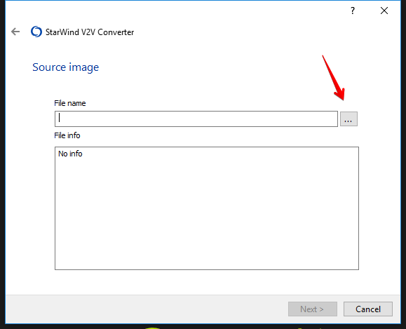](images/013.png)**13** - Selecione o arquivo e clique em **Abrir**.

[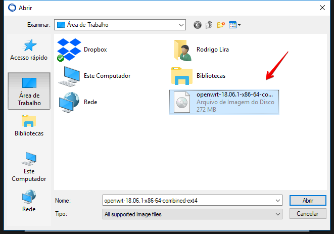](images/014.png)

**14** - Verifique se o caminho para o arquivo está correto, clique em **Next**.

[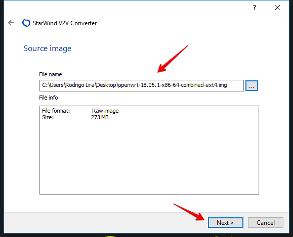](images/015.png)

 

**15** - Selecione **StarWind V2V Converter** para podermos enviar o arquivo convertido direto para o servidor, clique em **Next**.

[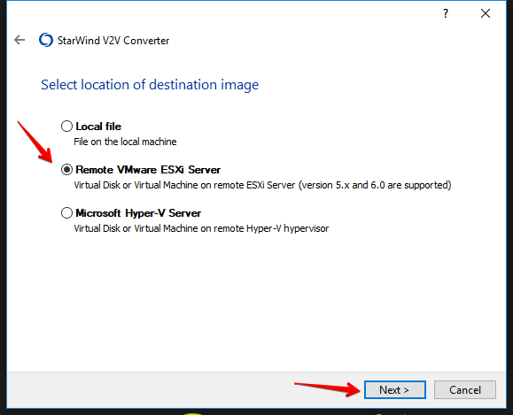](images/016.png)**16** - Digite o endereço do servidor, usuário e senha, clique em **Next**.

**OBS:** Podemos colocar o endereço do **vCenter**, porém quando vamos escolher o datastore as pastas das máquinas virtuais não apareceram.

[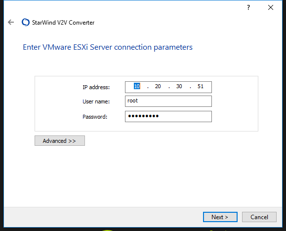](images/017.png)**17** - Clique em **Next**.

[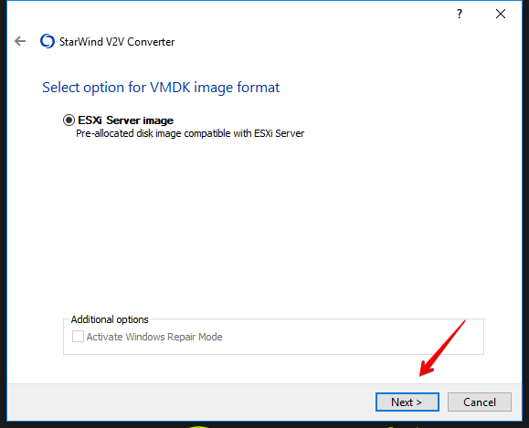](images/018.png)

**18** - Selecione o destino.[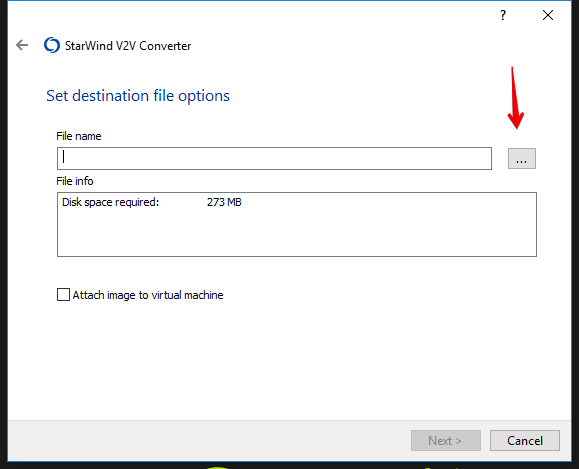](images/019.png)**19** - Selecione o **datastore** e a **pasta**, no caso a mesma pasta da máquina virtual que criamos anteriormente.

[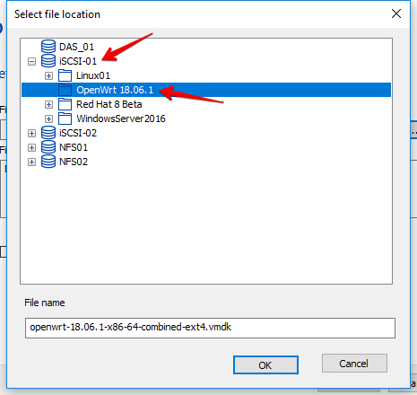](images/020.png)**20** - Marque **Attach image to virtual machine** para o **StarWind** adicionar o disco virtual as configurações da máquina virtual e clique em **Next**.

[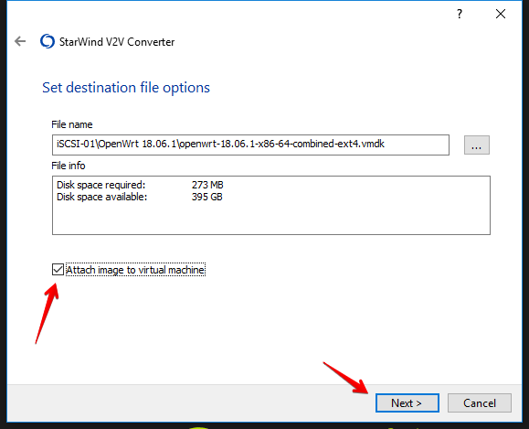](images/021.png)**21** - Selecione a qual máquina virtual ele deve adicionar o disco virtual e clique em **Next**.

[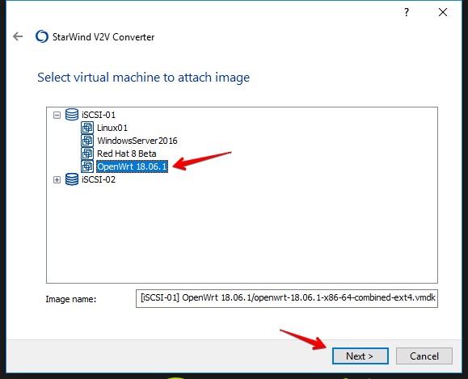](images/022.png)**22** - Clique em **Finish**.

[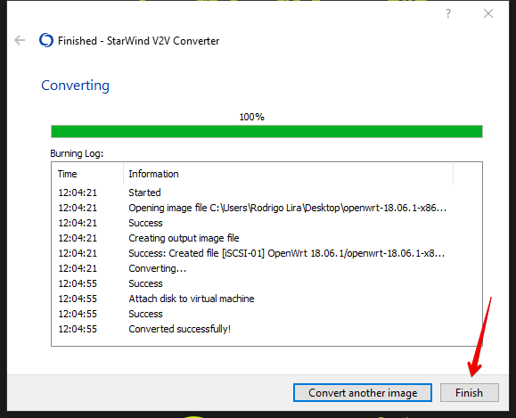](images/023.png)Pronto, máquina virtual com o OpenWrt está configurada.

Agora só iniciar e começar a brincadeira com ela.

[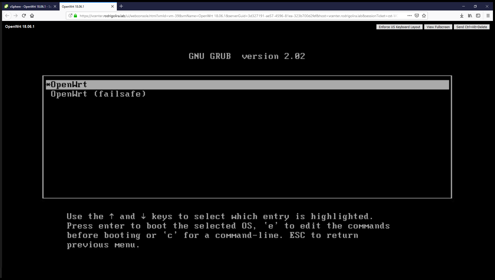](images/024.png)

Espero que tenham gostado do post.

Até a próxima!

:D
