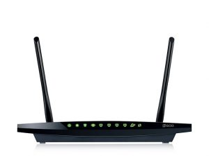
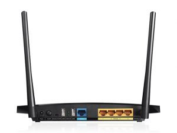

Salve Salve Pessoal!

Recentemente adquiri um TP-Link TL-WDR3600 (N600) para ser o Gateway, DHCP Server, DNS Server, etc, do meu lab.

[](http://rodrigolira.eti.br/wp-content/uploads/2016/09/01.jpg) [](http://rodrigolira.eti.br/wp-content/uploads/2016/09/02.jpg)

Um dos destaques que podemos citar nesse roteador é o fato de todas as suas interfaces serem Gigabit, por sua wireless trabalhar tanto em 2.4 quanto em 5.gGhz e por possuir duas entradas USB.

Maiores detalhes do mesmo no link abaixo:

[http://www.tp-link.com/en/products/details/TL-WDR3600.html#specifications](http://www.tp-link.com/en/products/details/TL-WDR3600.html#specifications)

Por padrão ele vem com o firmware da própria TP-Link, dessa forma se torna muito limitado para o meu uso no lab, para podermos usar melhor o mesmo podemos substituir o firmware original pelo OpenWrt, que é um GNU/Linux para dispositivos embarcados, maiores detalhes sobre o OpenWrt e os recursos disponíveis para esse roteador no link abaixo:

[https://wiki.openwrt.org/toh/tp-link/tl-wdr3600](https://wiki.openwrt.org/toh/tp-link/tl-wdr3600)

Com isso ganhamos em desempenho e flexibilidade, podendo instalar diversos pacotes nativos do GNU/Linux.

Também podemos adicionar dispositivos USB no roteador, no meu caso adicionei um pendrive de 16GB para poder aumentar a capacidade de memória interna do roteador que é muito limitada como mostra as imagens abaixo:

[](http://rodrigolira.eti.br/wp-content/uploads/2016/09/Captura-de-Tela-2016-09-09-a?s-21.51.07.png)

[](http://rodrigolira.eti.br/wp-content/uploads/2016/09/Captura-de-Tela-2016-09-09-a?s-21.52.58.png)

Fiz um pequeno passo-a-passo de como instalar e configurar o pendrive.

1 - Acesse o roteador via terminal:

2- Atualize a lista de pacotes disponíveis:

```
# opkg update
```

3 - Instale os seguintes pacotes:

```
# opkg install kmod-usb-core kmod-usb-storage kmod-usb-storage-extras kmod-scsi-core block-mount kmod-fs-ext4 fdisk e2fsprogs
```

4 - Levante os seguintes modulos:

```
# modprobe sd_mod
# modprobe usb-storage
# modprobe ext4
```

5 - Formate o pendrive usando o fdisk, você pode personalizar o layout da forma que quiser, porém eu criei uma única partição:

[](http://rodrigolira.eti.br/wp-content/uploads/2016/09/Captura-de-Tela-2016-09-09-a?s-21.58.37.png)

[](http://rodrigolira.eti.br/wp-content/uploads/2016/09/Captura-de-Tela-2016-09-09-a?s-21.58.58.png)

6 - Execute o comando abaixo para preparar o pendrive para root overlay:

```
# mount /dev/sda1 /mnt ; tar -C /overlay -cvf - . | tar -C /mnt -xf - ; umount /mnt
```

7 - Crie o fstab com os comandos abaixo:

```
# block detect > /etc/config/fstab
# sed -i s/option$'\t'enabled$'\t'\'0\'/option$'\t'enabled$'\t'\'1\'/ /etc/config/fstab
# sed -i s#/mnt/sda1#/overlay# /etc/config/fstab
```

8 - Verifique se o dispositivo está montando corretamente:

```
# mount /dev/sda1 /overlay
```

9 - Reinicie o roteador:

```
# reboot
```

Pronto, se tiver tudo dado certo o armazenamento interno do roteador está sendo montado no pendrive, como mostra as imagens abaixo:

[](http://rodrigolira.eti.br/wp-content/uploads/2016/09/Captura-de-Tela-2016-09-09-a?s-22.02.45.png) [](http://rodrigolira.eti.br/wp-content/uploads/2016/09/Captura-de-Tela-2016-09-09-a?s-22.04.42.png)

Também modifiquei o software do DHCP Server e do DNS Server, mas isso ficará para um próximo post.

Espero que tenham gostado e até a próxima :D

Referências:

[https://wiki.openwrt.org/doc/howto/extroot](https://wiki.openwrt.org/doc/howto/extroot)

[https://fixmynix.com/configuring-extroot-with-openwrt-on-tp-link-mr-3220/](https://fixmynix.com/configuring-extroot-with-openwrt-on-tp-link-mr-3220/)
