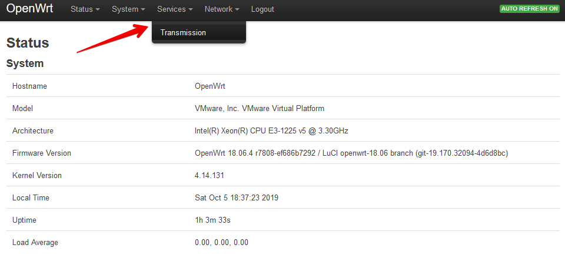
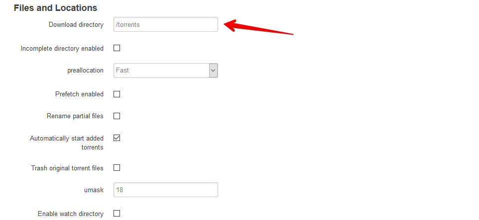
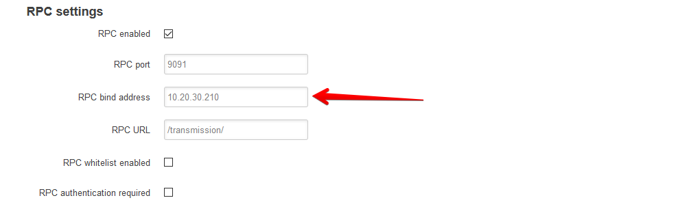
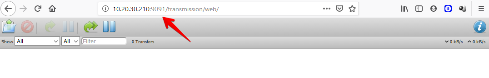
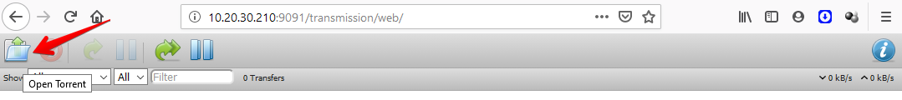
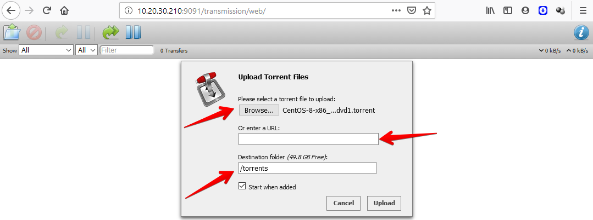
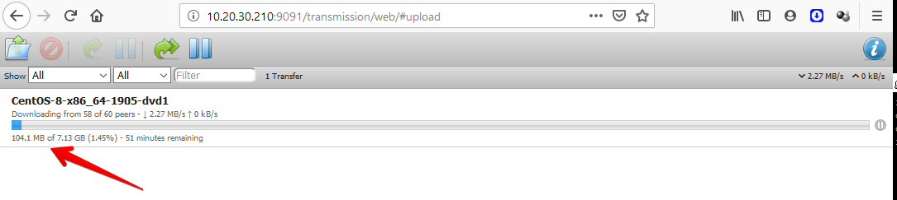
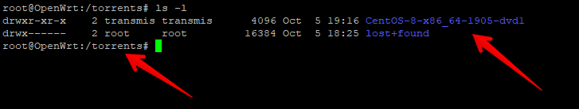

[](images/openwrt.png)

Salve Salve Pessoal!

As vezes fazemos o download de arquivos via torrent, como por exemplo alguma imagem de sistema operacional e queremos deixar o torrent ativo para compartilhamento a mesma com a comunidade, porém as vezes o custo com energia fica caro para deixarmos o computador ligado 24 horas por dia.

Para resolver esse problema temos a possibilidade de criar um servidor de torrent direto no nosso roteador com o OpenWrt.

Nesse post vamos ver como instalar e usar o Transmission diretamente no nosso roteador, para quem não conhece o Transmission acesse o link abaixo:

[https://transmissionbt.com/](https://transmissionbt.com/ "https://transmissionbt.com/")

Alguns detalhes antes de começarmos a instalação do Transmission , o meu roteador é um N600 da TP-Link, o mesmo possui duas entradas USB dessa forma coloquei um disco USB de 1TB para o armazenamento dos arquivos, se você pensa em fazer a mesma coisa e não sabe como acesse o link abaixo para saber como colocar um novo disco no seu roteador.

https://rodrigolira.eti.br/openwrt-como-gateway-do-meu-lab/

https://rodrigolira.eti.br/openwrt-montando-um-pendrive-como-particao-raiz/

Agora vamos ao que interessa. :D

**1** - Acesse seu roteador via SSH e execute os comandos de atualização dos repositórios e depois a instalação dos pacotes.

```
# opkg update

# opkg install transmission-daemon-openssl transmission-cli-openssl transmission-web transmission-remote-openssl luci-app-transmission

# service transmission start

# service transmission enable
```

Se desejar o **transmissions** em **português** também instale o pacote **luci-i18n-transmission-pt-br**.

**2** - Agora acesse seu roteador via interface web, veja que um novo menu  **Services** é criado, nele temos o **Transmission**.

[](images/03.png)

**OBS**: O menu Services já pode existir em seu **OpenWrt** caso você já tenha instalado algum outro serviço.

Vamos ver as configurações básicas para o funcionamento do Transmission.

**3** - Clieque em **Enable** para habilitar o **Transmission**.

[](images/04.png)

**4** - Digite o caminho do diretório de download.

[](images/05.png)

**5** - No campo **RPC bind address** digite o **endereço IP** da interface de rede que permitirá acesso web ao Transmission.

[](images/06-1.png)

**6** - Clique em **Save & Apply**.

[](images/07.png)

OBS: Se você não consegui abrir a URL, reinicie o serviço do Transmission pelo terminal com o comando abaixo.

```
# service transmission restart
```

**7** - Agora acesse o **endereço IP** que foi liberado mais a porta **9091**.

[](images/08-1.png)

**8** - Clique em **Open Torrent** para adicionar o arquivo de torrent.

[](images/09-1.png)

**9** - Na aba que se abri podemos usar a opção de **Browser** para procurar o arquivo de torrent em nosso computador, podemos inserir diretamente a **URL** e podemos informar o **diretório de destino**, depois só clicar em **Upload**.

[](images/10.png)

**10** - Se tivermos pares o download do arquivo começara como mostra a imagem abaixo.

[](images/11.png)

**11** - Depois de concluído o download o mesmo estará disponível dentro do diretório configurado.

[](images/12.png)Pronto, agora temos nosso próprio servidor de torrent sem precisar de um computador.

Espero que tenham gostado.

Até a próxima!

:D
