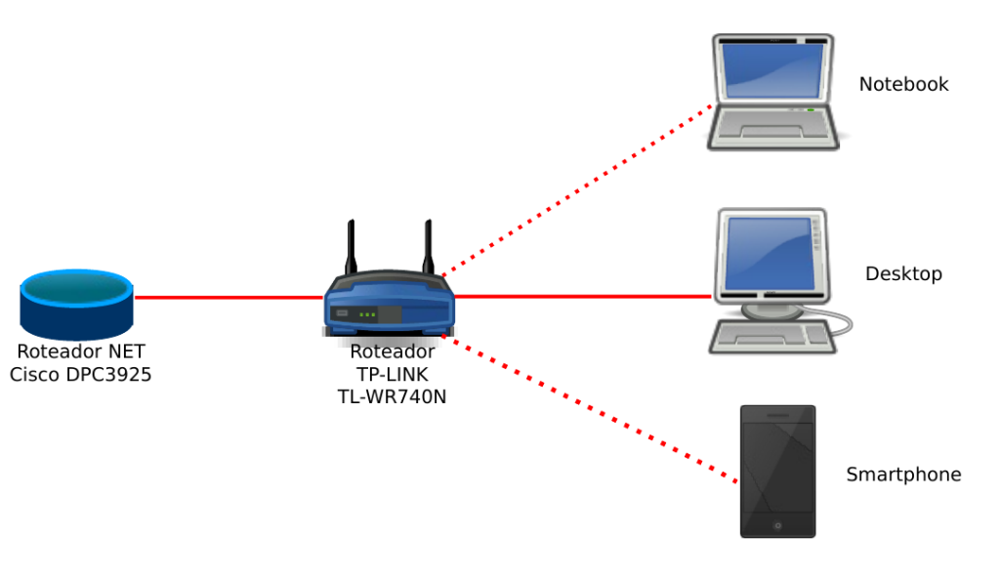
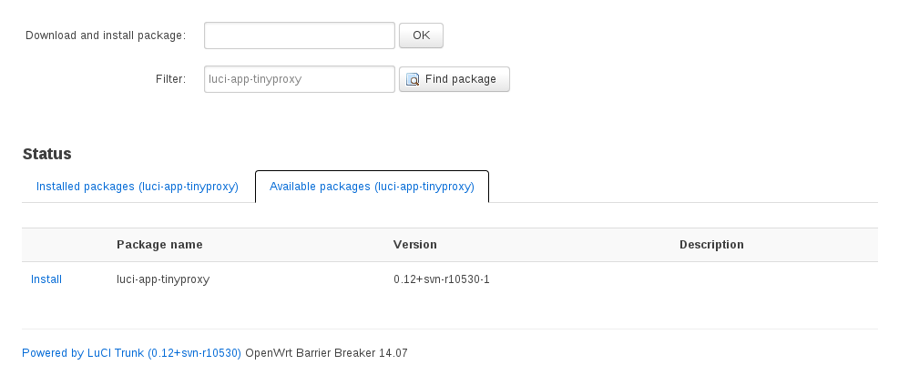
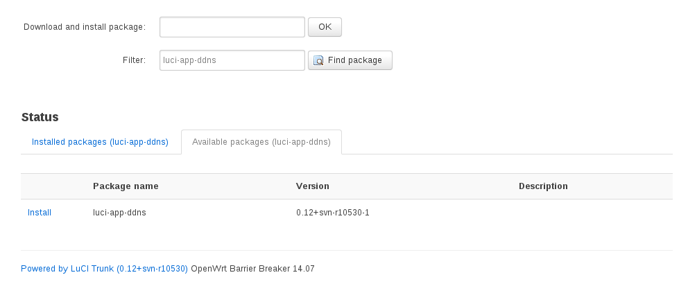
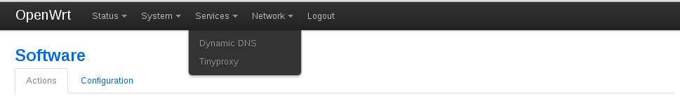
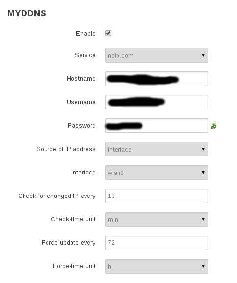

[](http://rodrigolira.eti.br/wp-content/uploads/2015/06/openwrt21.jpg)Salve Salve Pessoal!

Já fazia algum tempo que vinha querendo implementar está solução em minha casa, tenho um filho de 6 anos e acho necessário bloquear algumas coisas indevidas, tudo na internet hoje está fácil demais :(

Então vamos lá, o cenário é bastante simples, segue uma imagem do mesmo:

[](http://rodrigolira.eti.br/wp-content/uploads/2015/06/imagem41.png)

 

Vamos a explicação :D<!--more-->

O Roteador NET é um modelo da cisco que permite trabalhar em bridge, dessa forma o Roteador TP-LINK recebe diretamente o IP real da internet, o notebook e o smartphone usam a rede sem fio e o desktop usa a rede cabeada.

O firmware do Roteador TP-LINK foi substituido pelo sistema OpenWRT, que é um linux para dispositivos embarcados, para saber mais sobre o mesmo acesso o link:

[https://openwrt.org/](https://openwrt.org/)

Eu também fiz um post anterior ensinando como instalar o OpenWRT usando o VMware Workstation, dessa forma você pode realizar diversos testes, antes de aplicar as configurações diretamente no roteador, segue o link:

[http://rodrigolira.eti.br/instalando-o-openwrt-no-vmware-workstation/](http://rodrigolira.eti.br/instalando-o-openwrt-no-vmware-workstation/)

Então, vamos as configurações:

1 - Como falei anteriormente coloque o roteador da operadora em modo bridge, caso seu roteador não tenha suporte a esta operação, coloque o seu roteador atrás do roteador da operadora e no roteador da operadora configure a DMZ apontando para o IP do seu roteador, dessa forma toda solicitração que chegar na WAN do roteador da operadora será encaminhado ao seu roteador "OpenWRT".

2 - Substitua o firmware original do roteador, no link abaixo você vai encontrar uma lista de compatibilidade com diversos roteadores:

[http://wiki.openwrt.org/toh/start](http://wiki.openwrt.org/toh/start)

Por padrão o OpenWRT recebe IP via DHCP na porta WAN e coloca todas as outras interfaces (cabeada e sem fio) em uma bridge, e ativa o DHCP Server, oferecendo IPs na faixa 192.168.1.1/24, ou seja, após a instalação o seu equipamento já deverá estar pronto para uso, dependendo do caso.

3 - Agora vamos instalar o TinyProxy e o DDNS. Acesse o roteador através do IP 192.168.1.1, o mesmo vem sem senha e o login é root e navegue até:

```
System > Software
```

Clique em Update list para ele poder atualizar o repositório:

[](http://rodrigolira.eti.br/wp-content/uploads/2015/06/imagem51.png)

Ou caso deseje fazer isso via linha de comando bata digitar:

```
# opkg update
```

Agora selecione a aba "Available packages"  digite "luci-app-tinyproxy" e clique em "find package", depois clique em install e confirme:[](http://rodrigolira.eti.br/wp-content/uploads/2015/06/imagem91.png)

 

Caso deseje instalar via console o comando é o seguintes:

```
# opkg install luci-app-tinyproxy
```

Porque não instalei o Squid? Meu equipamento não tem espaço o suficiente, simples assim :(

Faça o mesmo procedimento com o pacote "luci-app-ddns":

[](http://rodrigolira.eti.br/wp-content/uploads/2015/06/imagem101.png)

Via console:

```
# opkg install luci-app-ddns
```

Depois dos pacotes instalados irá aparecer uma nova aba no menu com o nome "Services", como mostra a imagem abaixo:

[](http://rodrigolira.eti.br/wp-content/uploads/2015/06/imagem81.png)

 

 

4 - Vamos configurar o firewall, você tanto pode configurar via interface gráfica, quanto pode ser via console, eu aconselho via console, pois já vou deixar os confs abaixo :D

Via interface gráfica você vai em:

```
Network > Firewall
```

Via console você vai editar o arquivo:

```
/etc/config/firewall
```

E adicione o seguinte conteúdo:

```
config redirect 
 option _name 'proxy' 
 option src 'lan' 
 option proto 'tcp' 
 option src_dport '80' 
 option dest_port '8888' 
 option src_dip '!192.168.1.1' 
 option dest_ip '192.168.1.1'
```

Após isso basta reiniciar o serviço:

```
# /etc/init.d/firewall restart
```

6 - Agora vamos configurar o TinyProxy, a configuração dele é bem simples, acesse:

```
Services > Tinyproxy
```

Ele pode ser configurado totalmente via interface gráfica, ou via console, segue abaixo o meu arquivo de configuração:

```
config tinyproxy
 option User 'nobody'
 option Group 'nogroup'
 option Port '8888'
 option Timeout '600'
 option DefaultErrorFile '/usr/share/tinyproxy/default.html'
 option StatFile '/usr/share/tinyproxy/stats.html'
 option MaxClients '100'
 option MinSpareServers '5'
 option MaxSpareServers '20'
 option StartServers '10'
 option MaxRequestsPerChild '0'
 option ViaProxyName 'tinyproxy'
 list ConnectPort '443'
 list ConnectPort '563'
 option enabled '1'
 option FilterExtended '1'
 option Filter '/lib/uci/upload/cbid.tinyproxy.cfg02822b.Filter'
 option FilterURLs '1'
 option LogLevel 'Connect'
 option Syslog '1'
 option enable '1'
 option Allow '192.168.1.0/24'
```

Após a substituição das configurações basta reiniciar o serviço:

```
# /etc/init.d/tinyproxy restart
```

A partir de agora as solicitações de páginas já devem estar sendo filtradas pelo Tinyproxy, para configurar as páginas que devem ser bloqueadas, crie um arquivo .txt e coloque o que deseja bloquear, depois disso navegue até:

```
Services > Tinyproxy > Filtering and ACLs
```

Clique no botão escolher aquivos, depois disso basta escolher o arquivo txt que você criou.

Pronto proxy já está bloqueando os domínios :D

7- Agora vamos configurar o DDNS, acesse:

```
Service > Dynamic DNS
```

Configure de acordo com o serviço que você usa, no meu caso uso o noip.com, segue abaixo as configurações:

[](http://rodrigolira.eti.br/wp-content/uploads/2015/06/imagem111.png)

 

Você também pode configurar via console, edite o arquivo:

```
#/etc/config/ddns
```

Segue o meu arquivo de configuração:

```
config service 'myddns'
 option interface 'wan'
 option use_syslog '1'
 option use_https '0'
 option force_interval '72'
 option force_unit 'hours'
 option check_interval '10'
 option check_unit 'minutes'
 option retry_interval '60'
 option retry_unit 'seconds'
 option service_name 'noip.com'
 option domain 'SEU_DOMINIO'
 option username 'SEU_USUARIO'
 option password 'SUA_SENHA'
 option ip_source 'interface'
 option ip_interface 'wlan0'
 option enabled '1'
```

Depois basta reiniciar o serviço:

```
#/etc/init.d/ddns restart
```

Bem é isso ai pessoal, espero que vocês tenham gostado, assim que foram surgindo novas configurações vou postando aqui no blog.

Até a próxima :D
