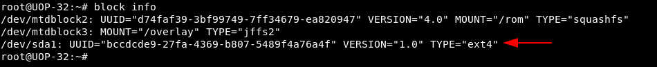
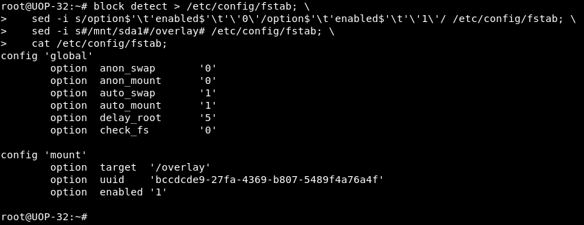
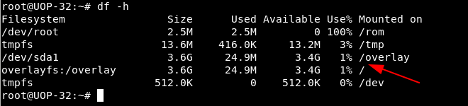

Salve Salve Pessoal!

Neste post vou mostrar como podemos configurar um pendrive e expandir o nosso sistema de arquivos no OpenWrt, logicamente que para isso precisamos que o nosso dispositivo, tenha uma interface usb. ;)

Vamos entender um pouco mais sobre o sistema de arquivos do OpenWrt, o sistema de arquivos é formado basicamente por duas partições:

**/ (partição raiz, somente leitura)**

**/overlay (partição de leitura/escrita)**

O **/overlay** é mesclado com o **/** usando o recurso overlayfs do kernel linux, assim mostrando um único sistema de arquivos com permissões de leitura/gravação.

Agora vamos ao que interessa! :P

O procedimento abaixo foi realizado em um **TP-Link TL-WR1043N/ND v1** com o **OpenWrt 18.06.1 r7258-5eb055306f / LuCI openwrt-18.06 branch (git-18.228.31946-f64b152)**.

**OBS:** Antes de realizar os procedimentos, veja a documentação do OpenWrt para verificar o procedimento exato para seu roteador.

**1 -** Atualize a lista de pacotes.

```
# opkg update
```

**2 -** Instale os pacotes necessários.

```
# opkg install block-mount kmod-fs-ext4 kmod-usb-storage e2fsprogs kmod-usb-ohci kmod-usb-uhci fdisk
```

**3 -** Verifique os discos e veja se seu pendrive aparece, normalmente aparecerá como **/dev/sda1**.

```
# block info
```

[](images/2018-12-11_21-09.png)

**OBS:** Se seu dispositivo não estiver formatado como **ext4** ou **f2fs**, realize a formatação utilizando o **fdisk**, para detalhes de como realizar esse procedimento acesse o link abaixo:

https://rodrigolira.eti.br/openwrt-como-gateway-do-meu-lab/

**4 -** Depois de formatado, imagino que seu pendrive esteja como /dev/sda1, execute o comando abaixo para transfira o conteúdo do **/overlay** para o **/dev/sda1**.

```
# mount /dev/sda1 /mnt ; tar -C /overlay -cvf - . | tar -C /mnt -xf - ; umount /mnt
```

**OBS:** Se seu pendrive não estiver como **sda1**, troque o **/dev/sda1** do comando acima pela sua partição.

**5** - Gere um novo fstab.

```
# block detect > /etc/config/fstab; \
     sed -i s/option$'\t'enabled$'\t'\'0\'/option$'\t'enabled$'\t'\'1\'/ /etc/config/fstab; \
     sed -i s#/mnt/sda1#/overlay# /etc/config/fstab; \
     cat /etc/config/fstab;

```

[](images/2018-12-11_21-12.png)

**6 -** Monte o **/dev/sda1** no **/overlay**.

```
# mount /dev/sda1 /overlay
```

**7 -** Reinicie o roteador.

```
# reboot
```

**8 -** Após o equipamento reiniciar, execute um **df -h** para verificar se o procedimento foi realizado com sucesso.

```
# df -h
```

[](images/2018-12-11_21-16.png)Se tudo estiver dado certo, seu pendrive será o **/overlay**.

Pronto, até a próxima!

:D
