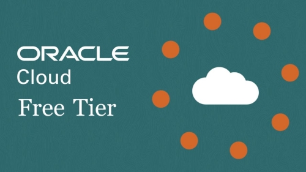

Salve Salve Pessoal!

Vou começar a escrever uma série de posts falando como podemos usar a **Oracle Cloud Free Tier** no nosso dia-a-dia e tirar proveito desses recursos gratuitos oferecidos pela Oracle.

Para que não conhece a **Oracle Cloud** disponibiliza um **Free Tier** (**Modo Gratuito**) de alguns de seus serviços de nuvem, dessa forma podemos testar e usar esses serviços sem desembolsar nenhum centavo e o melhor de tudo é que são sem limites de tempo, diferentemente de seus concorrentes que disponibilizam alguns serviços gratuitos mas com limites de tempo.

Mas o que está incluído nesse **Free Tier**?

- **2 máquinas virtuais**
- **2 bancos de dados de até 20GB**
- **Armazenamento de Arquivos e Objetos**
- **Load Balancer**

Entre outros recursos que vamos ver no decorrer dos posts.

A proposta é mostrar como podemos instalar e configurar diversas ferramentas na solução de Cloud da Oracle e não ter custo nenhum.

Por exemplo, veremos como instalar o novo Zabbix 5.0 LTS, como instalar um servidor de DNS Autoritativo e diversas outras ferramentas.

Um detalhe importante, sempre farei essas instalações e configurações usando o Oracle Linux, ou seja, dessa forma o processo de instalação será o mesmo em seu ambiente local. ;)

Para começar no próximo post mostrarei como criar sua conta na Oracle Cloud.

Até o próximo post!

:D
