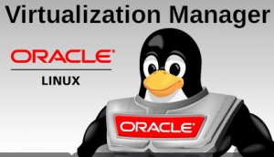
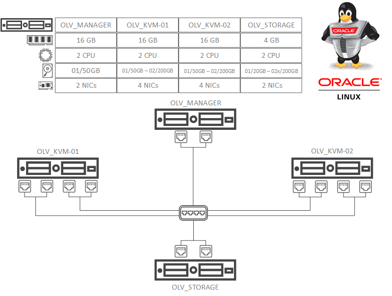

Salve Salve Pessoal!

É com muito prazer que começo mais uma serie de posts, dessa vez vamos falar sobre o **Oracle Linux Virtualization Manager**.

Para quem não conhece o **Oracle Linux Virtualization Manager** é a nova solução de virtualização da Oracle, ele é baseado no **oVirt 4.2.8** e **KVM**, para quem conhece e usa a outra solução de virtualização da Oracle o **Oracle VM Server** sabe que ele usa o **Xen**.

Para maiores detalhes sobre o **oVirt** você pode acessar o link abaixo.

[https://ovirt.org/release/4.2.8/](https://ovirt.org/release/4.2.8/)

Não vou entrar em detalhes de features do Oracle Linux Virtualization Manager nesse momento, espero fazer diversos posts mostrando cada uma delas.

A base do laboratório que vamos criar para nossos testes é a seguinte:

Vamos entender um pouco mais sobre o que esse imagem quer dizer.

O servidor OLV\_Manager será o servidor de gerenciamento, ele terá 16 GB de memoria RAM, 2 CPU, 1 disco de 50GB e duas interfaces de rede, que vão estar em agregação de link.

O servidores OLV\_KVM serão nossos virtualizadores, eles terão 16 GB de memoria RAM, 2 CPU, 1 disco de 50GB para sistema operaciona e outro disco de 200GB para storage local e quatro interfaces de rede, que também vão estar em agregação link.

O servidor OVL\_STORAGE será nosso storage, irá trabalhar com os protocolos iSCSI e NFS, ele terá 4 GB de memoria RAM, 2 CPU, 1 disco de 20GB para o sistema operacional e dois discos de 200GB para dados do iSCSI/NFS e duas interfaces de rede, que vão estar em agregação de link.

O sistema operacional de todos os servidores será o Oracle Linux 7.6.

Bem, por enquanto é isso, no próximo post já veremos o requisitos de software e hardware para instalação do **Oracle Linux Virtualization Manager**, e já faremos a instalação do mesmo.

Até o próximo post!

:D
