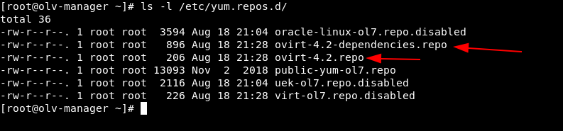
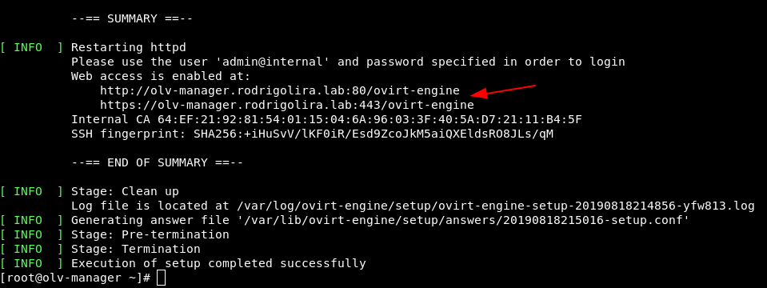
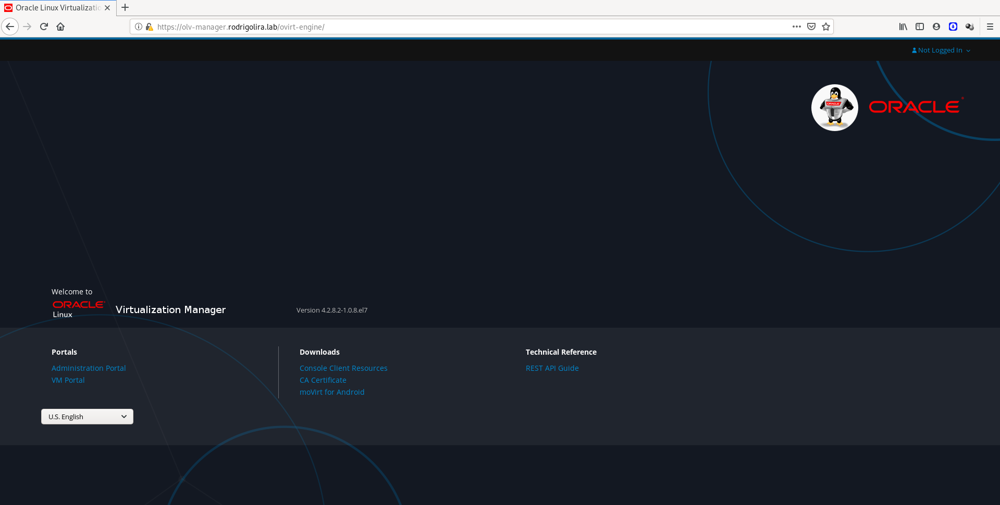
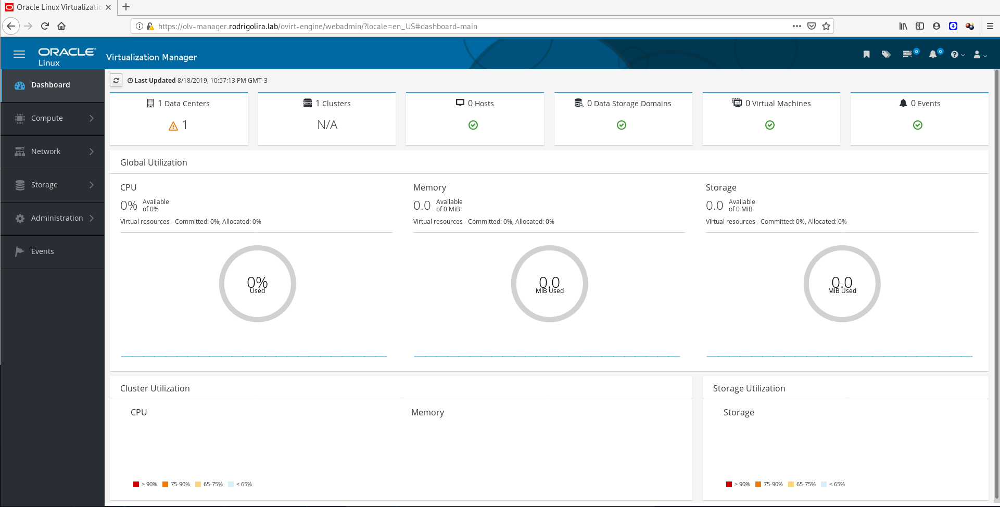

[](images/olvm.png)

Salve Salve Pessoal!

Vamos dar continuidade a nossa serie de posts sobre o **Oracle Linux Virtualization Manager**.

No último post vimos como fazer a instalação do Oracle Linux 7 hoje vamos fazer a instalação do **Manager**, se você não leu nenhum dos outros dois posts, acesse os links abaixo:

https://rodrigolira.eti.br/oracle-linux-virtualization-manager-parte-01/

https://rodrigolira.eti.br/oracle-linux-virtualization-manager-parte-02/

A primeira coisa que vamos precisar fazer é a instalação do pacote  **ovirt-release42.rpm**, execute o seguinte comando:

```
# yum install -y https://yum.oracle.com/repo/OracleLinux/OL7/ovirt42/x86_64/ovirt-release42.rpm
```

Este pacote vai fazer a instalação dos repositórios necessários para instalação de todos os demais pacotes do Manager, como mostra a imagem abaixo.

[](images/2019-08-18_22-31.png)

Agora que já instalamos os repositórios vamos a instalação do **ovirt-engine** e suas **dependências**, execute o seguinte comando:

```
# yum install -y ovirt-engine
```

Depois de concluir a instalação do pacote **ovirt-engine** e suas dependências execute o seguinte comando para começar a configuração do **Manager**:

```
# engine-setup --accept-defaults
```

Com esse comando estamos fazendo a configuração do Manager e aceitando as configurações padrões do mesmo, será solicitado apenas a senha do usuário **admin** e se tudo ocorrer bem a instalação será realizada com sucesso.

A tela abaixo mostra uma instalação realizada com sucesso, ao final da instalação será exibida a URL de login no sistema.

[](images/2019-08-18_22-51.png)

**OBS:** Se não usarmos a opção **\--accept-defaults** será solicitado diversas informações sobre o nosso ambiente, como estamos fazendo a instalação em ambiente de laboratório, não haverá problemas em usar as opções padrão, em outro momento farei a instalação passo a passo falando sobre cada ponto.

Abra o navegador na URL informada, e clique em **Administration Portal** para logar no ambiente.

[](images/2019-08-18_22-54.png)

Pronto, **Oracle Linux Virtualization Manager** instalado com sucesso.

[](images/2019-08-18_22-57.png)

No próximo post vamos ver a instalaçõs dos **Oracle Linux KVM compute hosts**, ou seja, os servidores que serão gerenciados pelo nosso manager.

Até o próximo post!

:D
