[](images/olvm.png)

Salve Salve Pessoal!

Dando continuidade a nossa serie hoje vamos começar a adicionar os hosts em nosso ambiente, mas antes vamos ver os requisitos para instalação do mesmos.

**Requisitos mínimos:**

Oracle Linux 7 update 6 com Unbreakable Enterprise Kernel Release 5 update 1 ou posterior.

Processador 64-bit com dois núcleos e suportar as flags de virtualização de hardware Intel VT-x ou AMD AMD-V.

2 GB de memoria RAM.

1 placa de rede gigabit.

45 GB de disco local.

**Requisitos recomendados:**

Oracle Linux 7 update 6 com Unbreakable Enterprise Kernel Release 5 update 1 ou posterior.

Processador 64-bit com dois núcleos ou mais e suportar as flags de virtualização de hardware Intel VT-x ou AMD AMD-V.

2 GB de memoria RAM ou mais.

2 placas de rede Gigabit ou mais.

45 GB de disco local ou mais.

Não vou mostar novamente o processo de instalação do sistema operacional, o processo é o mesmo que fizemos na **parte 02**, acesse o link abaixo e veja como é todo o processo:

https://rodrigolira.eti.br/oracle-linux-virtualization-manager-parte-02/

Para ver todos os posts dessa serie até o momento acesse os links baixo:

[Oracle Linux Virtualization Manager – Parte 01](https://rodrigolira.eti.br/oracle-linux-virtualization-manager-parte-01/)

[Oracle Linux Virtualization Manager – Parte 02](https://rodrigolira.eti.br/oracle-linux-virtualization-manager-parte-02/)

[Oracle Linux Virtualization Manager – Parte 03](https://rodrigolira.eti.br/oracle-linux-virtualization-manager-parte-03/)

Depois do sistema operacional instalado e atualizado, vamos adicionar o host ao nosso ambiente.

**1** - No host que vai ser adicionado ao ambiente faça a instalação do repositório com o comando abaixo:

```
# yum install https://yum.oracle.com/repo/OracleLinux/OL7/ovirt42/x86_64/ovirt-release42.rpm
```

**2** - Não é obrigado mas vamos liberar o acesso ao Cockipt para acessos posteriores diretamente ao host, execute os comandos:

```
# firewall-cmd --zone=public --add-port=9090/tcp

# firewall-cmd --zone=public --add-port=9090/tcp --permanent
```

**3** - Depois de realizar os comanos acima no host, acesse o Manager, clique em **Compute** e depois em **Host**.

[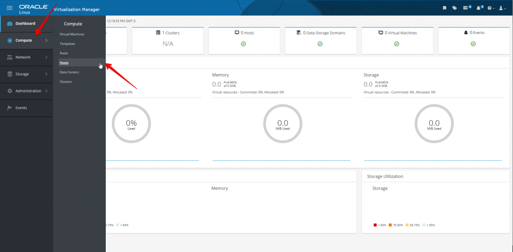](images/01.png)

**4** - Clique em **New**.

[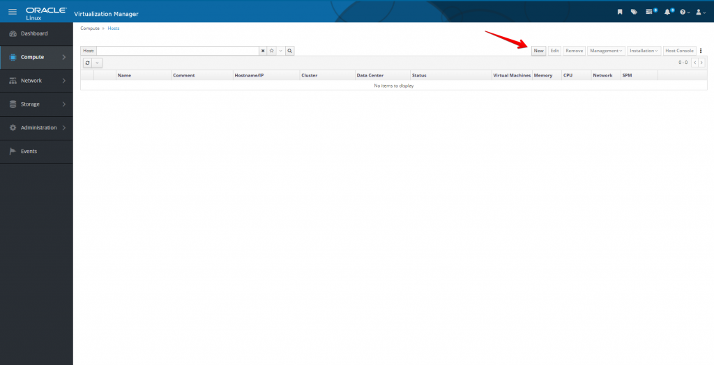](images/02.png)

**5** - Insira as seguintes informações:

**Name**: nome do host.

**Comment**: comentário sobre o host, não é obrigatório.

**Hostname**: **FQDN** ou endereço **IP** do host que vai ser adicionado.

**Password**: senha do usuário root do host, a **Oracle** **recomenda** o uso de chaves, mas como estamos em ambiente de teste vamos usar a senha mesmo.

[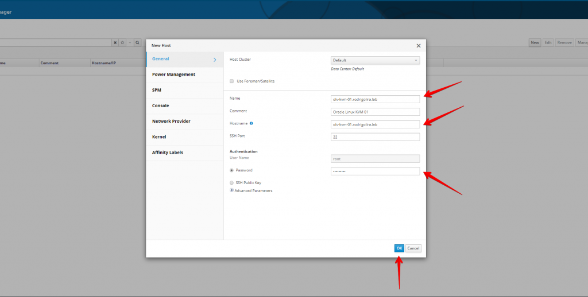](images/03.png)

**6** - Cloque em **Ok**, o aviso é referente a configuração de gerenciamento de energia que não está configurado no momento.

[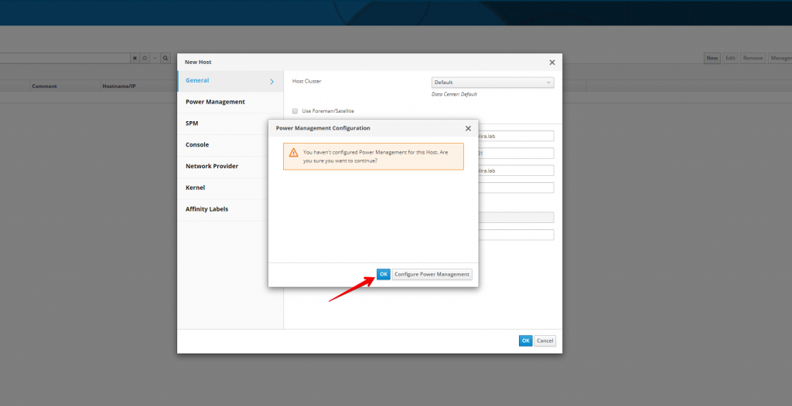](images/04.png)

**7** - Nesse momento os pacotes e dependências necessários começam a ser instalados.

[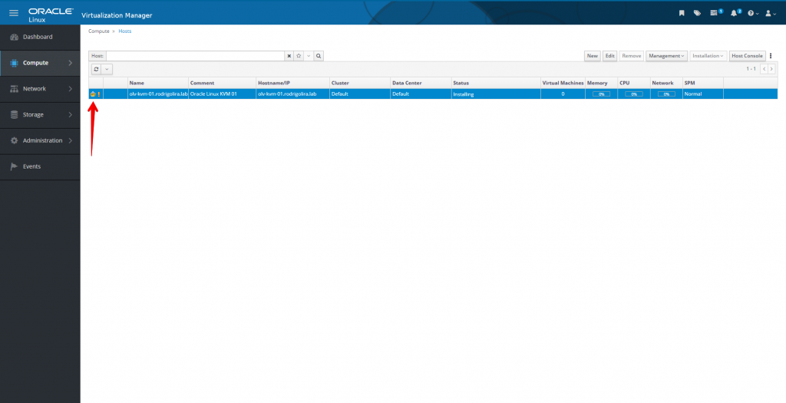](images/05.png)

**8** - Podemos acompanhar o que está acontecendo clicando em **Tasks**.

[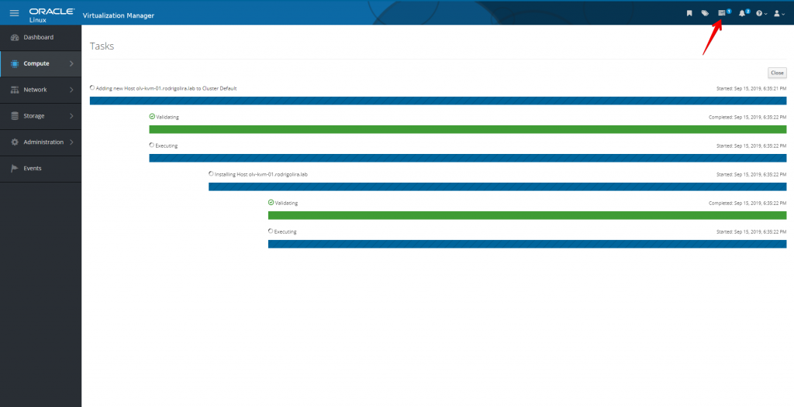](images/06.png)

**9** - Para termos maiores detalhes de tudo o que está acontecendo e sendo instalado podemos clicar em **Events**.

[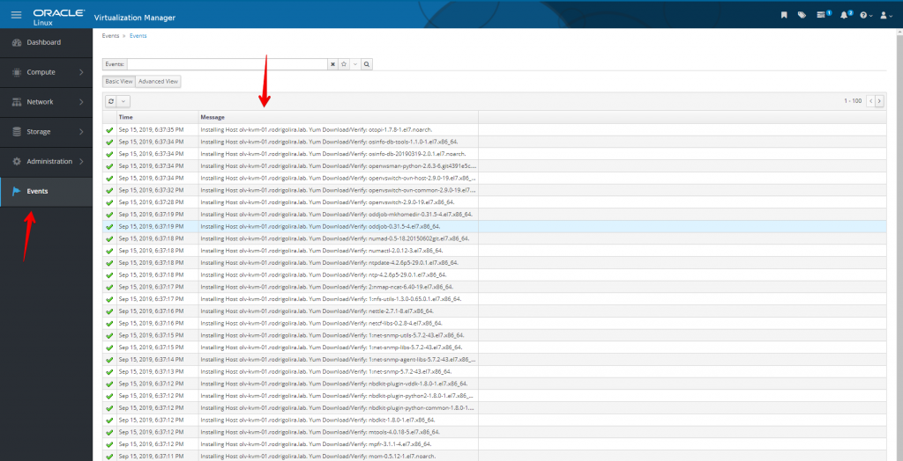](images/07.png)

**8** - Depois de tudo instalado o host é adicionado ao ambiente e fica com o status de **Up**.

[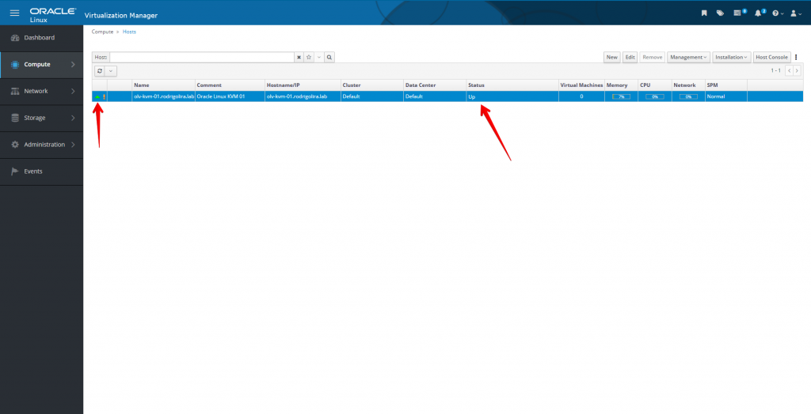](images/08.png)

**9** - Para obter maiores detalhes sobre o host podemos clicar no nome do host.

[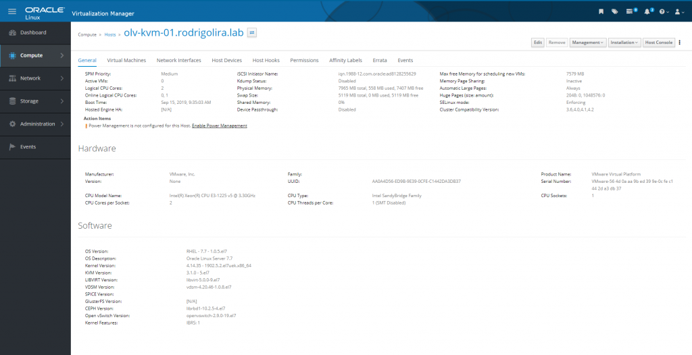](images/09.png)

Agora podemos realizar o mesmo procedimento para o segundo host.

Pronto, nesse momento nosso host já foi adicionado com sucesso ao ambiente. :D

**Vamos para algumas dicas extras.** ;)

Podemos obter erro ao tentar adicionar o host ao nosso ambiente, como mostra a imagem abaixo:

[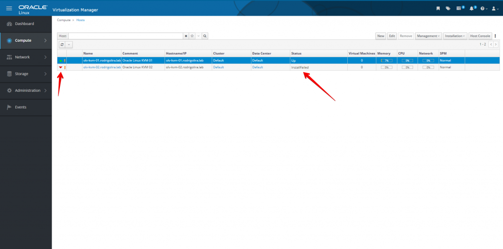](images/Oracle-Linux-Virtualization-Manager-Google-Chrome-2019-09-15-20.27.03.png)

Podemos verificar esses erros na aba **Events**, porém para maiores detalhes sobre o problema devemos acessar o **Manager** via **SSH** e acessar o seguinte diretório **/var/log/ovirt-engine/host-deploy**, depois disso verifique os **logs** mais recentes e filtre pelos erros.

[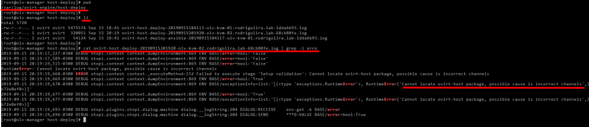](images/OLV_MANAGER-Royal-TS-2019-09-15-20.24.42.png)

No caso do erro acima, não fiz a instalação do repositório, mostrado no **passo 1**, refiz o **passo 1**,  depois disso mandei **reinstalar**, como a imagem abaixo:

[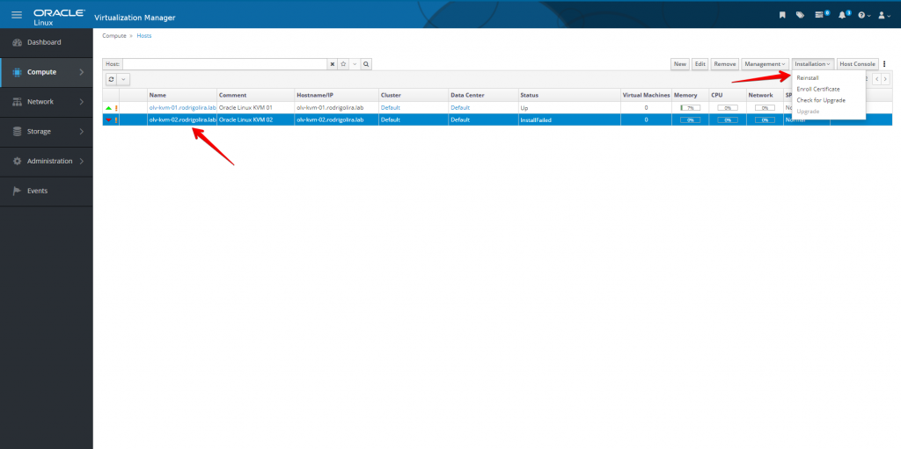](images/Oracle-Linux-Virtualization-Manager-Google-Chrome-2019-09-15-20.33.08.png)

Pronto, o host é adicionado ao ambiente.

[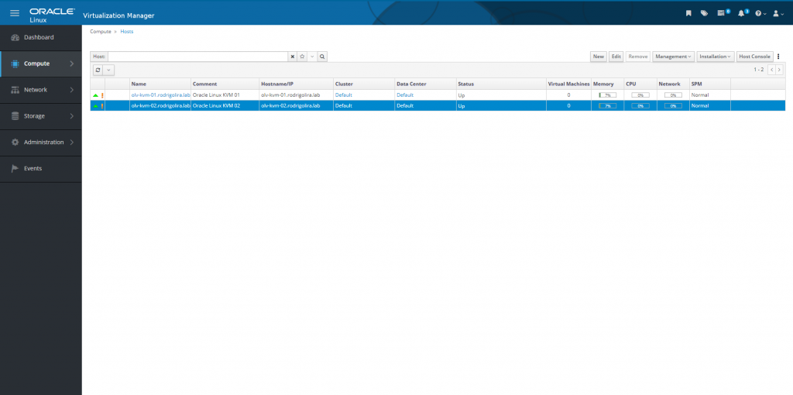](images/Oracle-Linux-Virtualization-Manager-Google-Chrome-2019-09-15-20.51.44.png)

**OBS:** O Oracle Linux Virtualization Manager cria um datacenter e cluster padrão durante a instalação, em outros posts veremos como podemos criar manualmente cada um, porém para nosso laboratório atual vamos usar o padrão mesmo.

Espero que tenham gostado!

No próximo post vamos configurar a parte de redes dos nossos hosts.

Até a próxima!

:D
