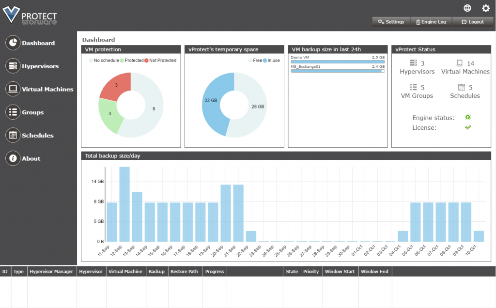
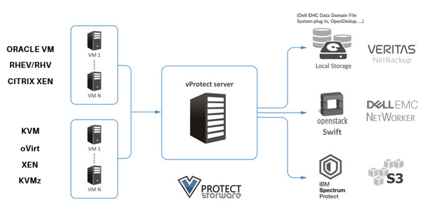

Salve Salve Pessoal!

Vou começar uma serie de posts falando sobre uma ferramenta de backup para máquinas virtuais chamada vProtect.

O vProtect é uma solução de backup para ambientes virtuais em plataformas abertas, como Oracle VM, Citrix XenServer, RHEV, oVirt, KVM, etc.

Nós podemos trabalhar com ele através de duas interfaces de gerenciamento CLI e Web.

Possui uma interface simples, facilitando nossa vida na hora de realizar um backup ou um restore.

Os backups podem ser armazenados de diversas formas - localmente via NFS, ou em soluções de terceiros OpenStack Swift, IBM Spectrum Protect, Veritas NetBackup, EMC Networker ou no Amazon S3.

**Algumas funcionalidades:**

- Backup em nível de VM
- Proteção híbrida (2º nível pode estar no servidor TSM ou na nuvem)
- Recuperação de desastres com base no IBM Spectrum Protect (TSM)
- Deduplicação de dados
- Backup priorizado
- Suporte para Xen
- Suporte para KVM
- Tecnologia de Snapshot consistentes
- Interfaces de gerenciamento fáceis de usar e intuitivas
- Escalabilidade
- Modelo de licenciamento econômico para ambientes TSM existentes

Por enquanto é só, no próximo post vou mostra o processo de instalação e configuração.

Até a próxima :D
