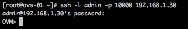
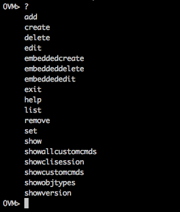
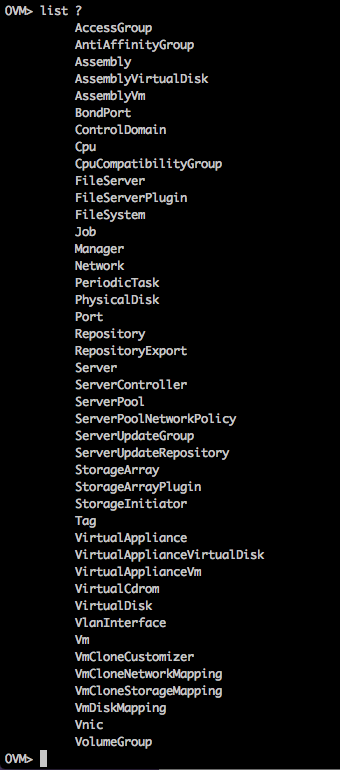
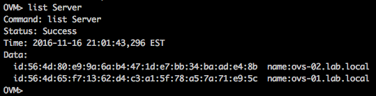

Salve Salve Pessoal!

Este é o primeiro de uma serie de posts que quero fazer falando sobre o **Oracle VM Command Line Interface (CLI)**.

O **Oracle VM Command Line Interface (CLI)** oferece os mesmo recursos que o ambiente web, dessa forma podemos gerenciar nossos hosts e nosso manager por linha de comando.

O que algumas pessoas se atrapalham, é que apesar de você conectar via SSH na CLI, ela não roda na mesma porta que o servidor, ou seja, a conexão via ssh para gerenciamento do servidor é diferente da conexão via ssh para gerenciamento do Oracle VM. Assim como o usuário também é diferente, usamos o mesmo usuário que gerencia o manager.

A porta padrão para conexão da CLI é **10000**.

O usuário padrão é o **admin**.

Então para conectar na CLI do Oracle VM usamos qualquer programa cliente de acesso SSH. Supondo que você esteja usando um linux, o comando para se conectar a CLI seria:

**#ssh -l admin -p 10000 IP\_DO\_MANAGER**

Depois de estarmos dentro da CLI nós temos vário comandos disponíveis, a CLI do Oracle VM é muito intuitiva e auto completa os comandos, basta colocarmos o sinal de interrogação " **?** ", assim como os equipamentos da Cisco(se me lembro bem). ;)

Então depois de conectados, só precisamos colocar uma interrogação que ele já lista os comandos possíveis, veja o exemplo abaixo:

A CLI nos retornou vários comandos possíveis :D

Vamos avançar um pouco mais, vamos digitar "**list ?**" e vamos ver o que a CLI vai retornar.

Retornou bem mais opções, a brincadeira começa a ficar boa :D

Agora vamos digitar "**list Server**":

Retornou o **id** e o **nome** do servidores do meu ambiente.

Existe milhares de opções possíveis, mas tudo depende de sua paciência para procurar aquilo que precisa, nos próximos posts vamos explorar mais a CLI, vamos por exemplo criar VMs, Repositórios, Redes e etc.

Mas por hoje ficamos por aqui :D

Espero que tenha gostado e até a próxima :D
