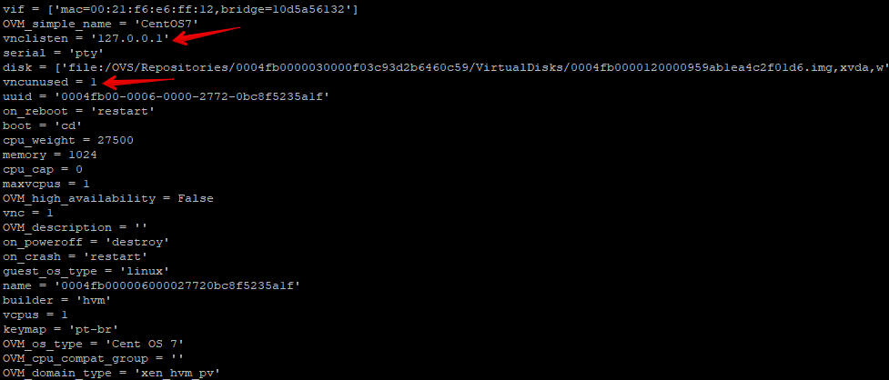
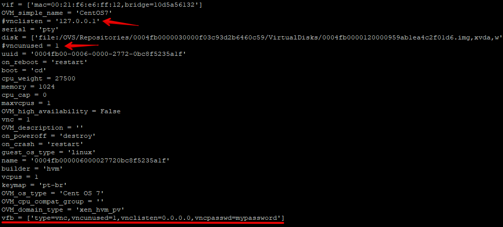
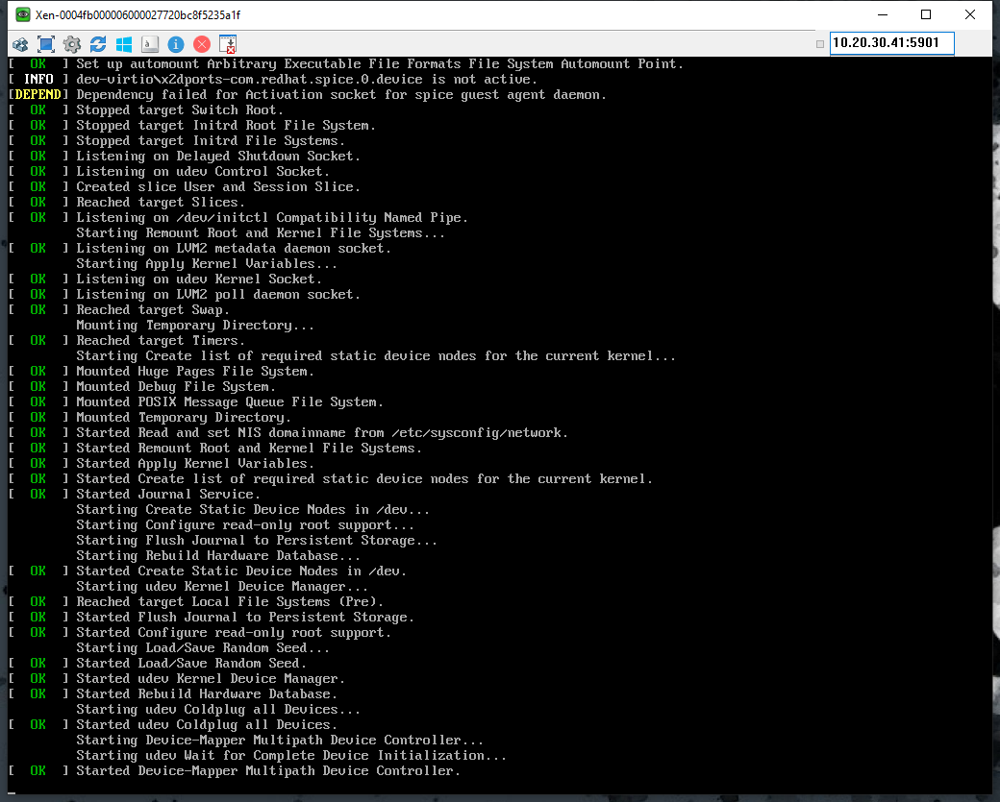

[](2288945.bmp)

Salve Salve Pessoal!

Nesse post vou mostrar como podemos acessar nossas máquinas virtuais via VNC Client no Oracle VM Server.

Antes de começar, vamos entender um pouquinho mais sobre como é feita a conexão com as máquinas virtuais do Oracle VM Server.

O acesso as máquinas virtuais através do Oracle VM Manager é feito utilizando um console VNC que usa HTML5.

Esse console VNC é desenvolvido sobre o cliente **noVNC** e é executado diretamente no host do Oracle VM Manager.

O noVNC é um cliente VNC baseado em acesso web que é renderizado usando HTML5, WebSockets e Canvas.

Se deseja conhecer um pouco mais sobre ele acesse o link abaixo:

[http://kanaka.github.io/noVNC/](http://kanaka.github.io/noVNC/)

Então para que nós tenhamos acesso as máquinas virtuais através do navegador, ele deve suportar os elementos Canvas e WebSockets do HTML5.

Por padrão nenhum software adicional precisa ser instalado no Oracle VM Servers ou nas máquinas virtuais para usar o console VNC.

O Manager usa um túnel para proteger os dados do console da máquina virtual pela rede, desta forma o Manager não se comunica diretamente com o cliente VNC, mas se conecta através de um encapsulamento criptografado e uma porta SSH 69xx.

**ATENÇAO: O QUE VAMOS FAZER A PARTIR DE AGORA NÃO É O COMPORTAMENTO PADRÃO DO ORACLE VM SERVER, ENTÃO FAÇA POR SUA CONTA EM RISCO.**

Agora vamos ver como podemos usar um software de cliente VNC padrão para acessar nossas VMS.

Acesse o Oracle VM Server via SSH e navegue até a pasta de configurações da VM.

```
# cd /OVS/Repositories/0004fb0000030000598e525857751f9a/VirtualMachines/0004fb000006000027720bc8f5235a1f/
```

0004fb0000030000598e525857751f9a - **ID do Repositório**

0004fb000006000027720bc8f5235a1f - **ID da Máquina Virtual**

Edite o arquivo **vm.cfg**, observe que temos duas linhas que fazem referência ao **VNC**.

**vnclisten = '127.0.0.1'**

**vncunused = 1**

[](images/002-1.png)

Vamos precisar comentar essas duas linhas e adicionar a seguinte linha no arquivo.

```
vfb = ['type=vnc,vncunused=1,vnclisten=0.0.0.0,vncpasswd=mypassword']
```

Não se preocupe com o lugar que vai inserir a linha.

[](images/003-2.png)

Os parâmetros adicionados são o seguinte:

**vfb** - driver

**type=vnc** - driver de tipo vnc

**vncunused=1** - o servidor encontra uma porta não utilizada acima de 5900, se tivermos mais de uma vm, as portas serão alocadas em ordem de inicialização.

**vnclisten=0.0.0.0** - ip onde o serviço vai escultar, por padrão todas os IPs definidos no servidor Oracle VM Server.

**vncpasswd=mypassword** - senha de acesso.

Depois de configurado, basta inicializar a máquina virtual que você já poderá acessar ela através de um software vnc client.

[](images/004.png)

Pronto, configuração rápido e fácil.

**OBS:** Como já falei em posts anteriores, quando fazemos alguma alteração manualmente no arquivo de configuração de uma máquina virtual, essa configuração se perde caso façamos alguma alteração através do Manager, outro ponto, é que essa forma de acesso as máquinas virtuais não é o padrão de acesso, então cuidado na hora de utilizar.

Espero que tenha gostado e até a próxima!

:D
