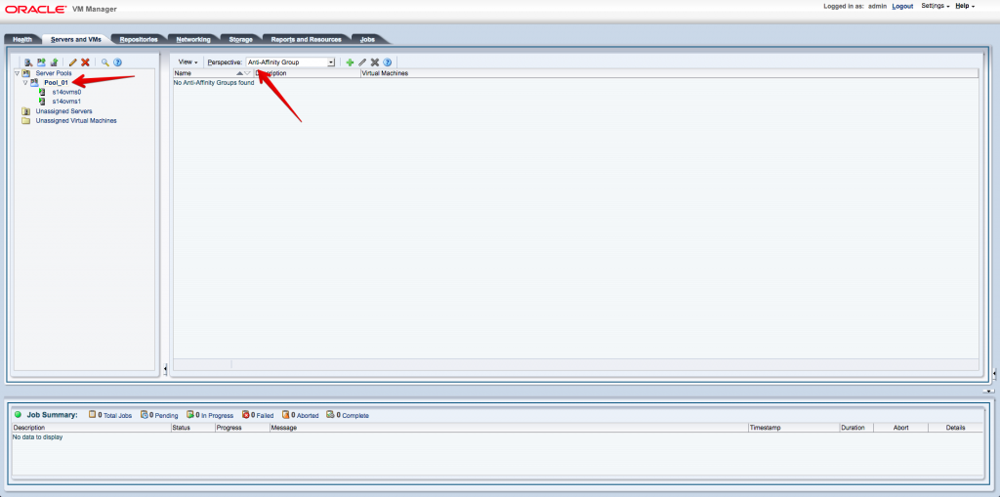
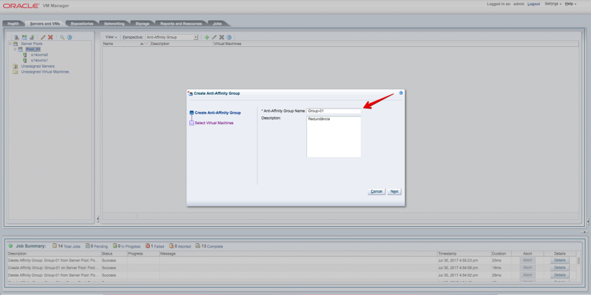
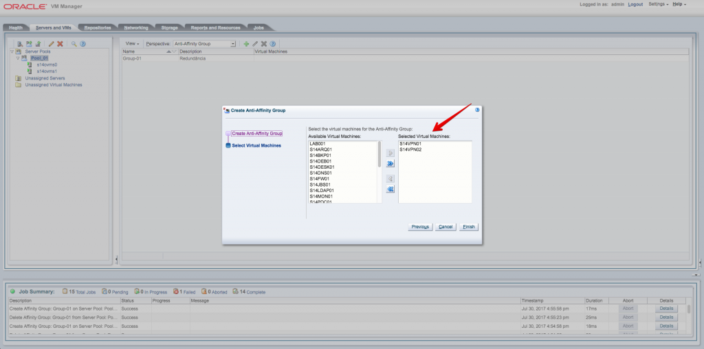
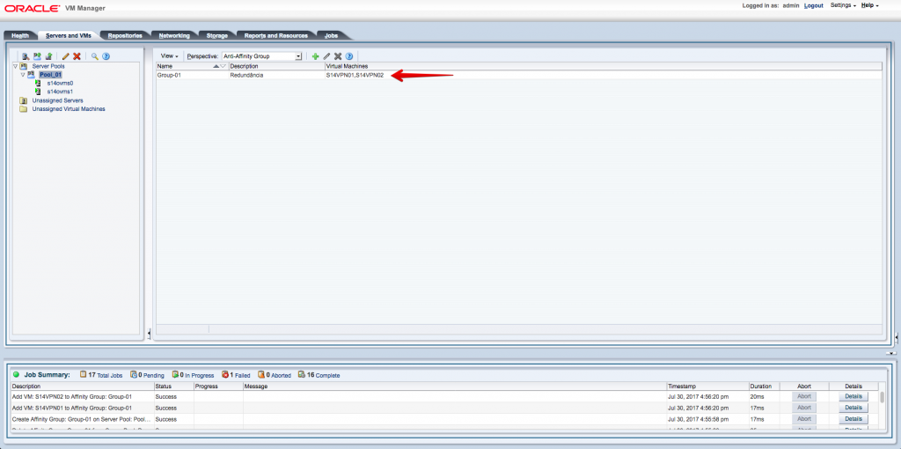

Salve Salve Pessoal!

O anti-affinity group ou grupo anti-afinidade especifica que máquinas virtuais nunca devem ser executadas no mesmo servidor Oracle VM. Um grupo anti-afinidade aplica-se a todos os servidores em um pool de servidores.

Configuramos grupos anti-afinidade quando queremos redundância ou balanceamento de carga de aplicativos específicos em nosso ambiente por exemplo.

Para configurar um grupo anti-afinidade siga os passos abaixo.

Clique na aba **Servers and VMs** e selecione o **Pool de Servidores**, em **Perspective** selecione **Anti-Affinity Group**, clique em adicionar.

Digite um nome para o grupo e uma descrição.

Selecione os servidores que farão parte do grupo e clique em **Finish**.

Pronto, o grupo é criado com sucesso, como mostra a imagem abaixo.

**Algumas regras :(**

Lembre-se de que as vms que farão parte desse grupo devem já devem estar em servidores diferentes.

Caso as vms estejam no mesmo servidor, o grupo anti-afinidade será criado, porém só será inserido apenas uma vm ao grupo, podemos migrar a vm que não foi inserida de servidor e posteriormente adiciona-la ao grupo.

As vms que fizerem parte do mesmo grupo não podem ser migradas para um servidor que já tenha uma vm do grupo.

Em caso de falha do servidor físico, se a vm estiver com HA habilitado, a regra acima é ignorada e a vm que estava no servidor com falha será iniciado no outro servidor, mesmo tendo uma vm do mesmo grupo.

Espero que tenham gostado, até a próxima :D
