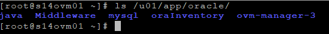
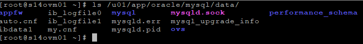
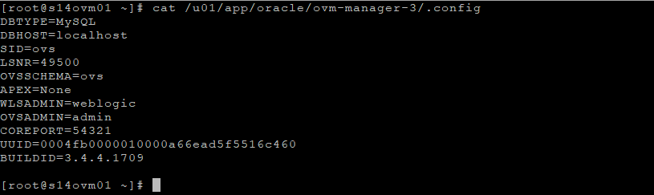
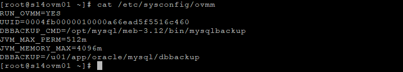
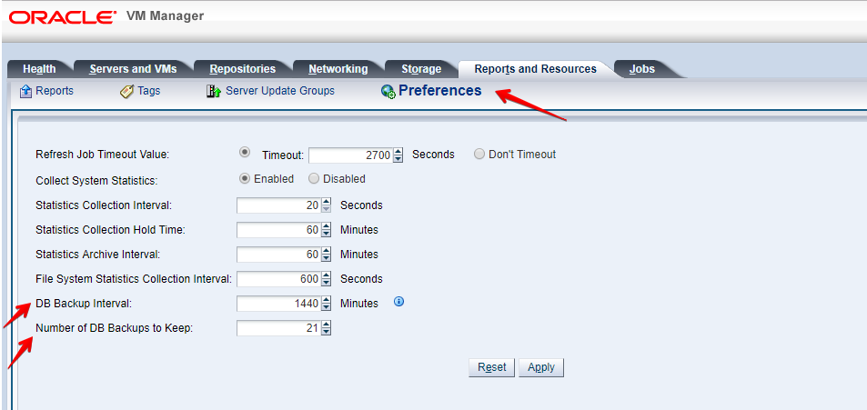
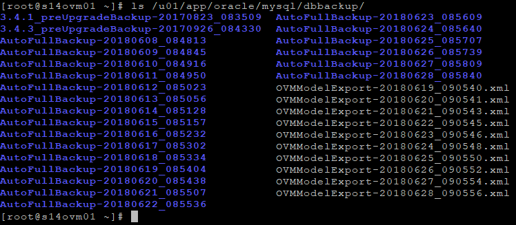
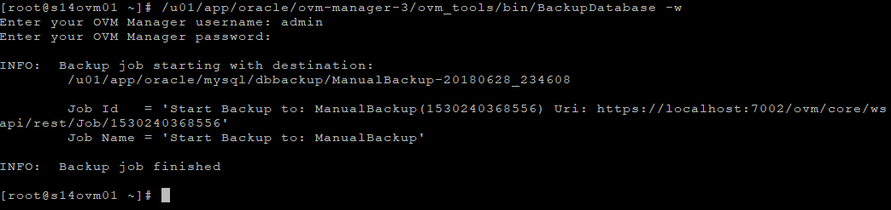
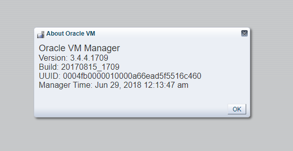

Salve Salve Pessoal!

No post anterior vimos como como podemos realizar o backup do Oracle VM Servers, mesmo a Oracle dizendo que não existe a necessidade, se você não leu esse post recomendo que leia agora no link abaixo:

[Oracle VM Server – Backup (Servers)](https://rodrigolira.eti.br/oracle-vm-server-backup-servers/)

Agora vamos ver como realizar o backup do Oracle VM Manager, mas primeiro vamos entender um pouco mais sobre o Manager.

Desde a sua versão 3.2 o Oracle VM utiliza o banco de dados **MySQL Enterprise Edition**, vale lembrar que não podemos utilizar esse banco para outro serviço que não seja a própria solução, a porta utilizada para comunicação é a **49500**, com isso a Oracle também implementou o **MySQL Enterprise Backup**, dessa forma o backup é feito de forma automática. :D

Vamos ver quais diretórios e arquivos são necessários realizar backup, para caso o Manager venha ser perdido nós possamos restaurar o mesmo.

O **Oracle VM Manager** é executado em cima de um servidor **WebLogic**, ai vem uma parte interessante que quero abordar em um post próximo, apesar de não podermos colocar a autenticação do Oracle VM via **LDAP** ou **AD**, podemos fazer isso dentro do WebLogic, vamos ver como fazer isso em breve. ;)

Continuando, quase todos os componentes Oracle VM Manager se encontram dentro do diretório **/u01**, mais especificamente **/u01/app/oracle/.**

Para nosso caso, precisamos prestar atenção em três pontos:

**1 - /u01/app/oracle/mysql/data** - arquivos do banco, ou seja nosso banco de dados.

**2 - /u01/app/oracle/ovm-manager3/.config** - arquivo de configuração do Oracle VM Manager para o banco de dados.

**3 - /etc/sysconfig/ovmm** - arquivo de configuração do Oracle VM Manager para backups.

Pronto, agora que já entendemos um pouco mais sobre o Oracle VM Manager, vamos ao backup.

Por padrão o Oracle VM Manager realiza o backup do banco dados de forma automática, ele salva os últimos 21 dias. Mas onde está essa configuração?

Acesse o Oracle VM Manager e navegue até a aba **Reports and Resources** > **Preferences**:

Nas duas ultimas opões são definidas a quantidade de backups e o intervalo em minutos entre cada backup, posso mudar essas opções? Sim, você pode adequar de acordo com a sua necessidade.

Então tranquilo, o próprio Manager se encarrega de fazer o backup, mas onde ele faz esse backup?

Bem, o backup é feito dentro do diretório **/u01/app/oracle/mysql/dbbackup/**.

O Oracle VM Manager utiliza um padrão de nome para realização do backup, sempre que o backup for realizado de forma automática será **AutoFullBackup-DATA\_HORA** como podemos ver na imagem acima.

Nós podemos verificar que existem outros diretórios com um padrão de nome diferente, **VERSAO\_preUpgradeBackup-DATA-HORA**, esse backup é gerado sempre que for ser realizada a atualização da versão do Oracle VM Manager, ou seja, o processo de atualização se encarrega de realizar um backup automático antes da atualização.

Nós também podemos gerar um backup manual utilizando o utilitário **BackupDatabase** que se encontra no diretório **/u01/app/oracle/ovm-manager-3/ovm\_tools/bin/**, será solicitado o login e senha do Manager, depois disso um backup é gerado dentro do mesmo diretório dos backups automáticos.

Observando a imagem abaixo vemos que o nome do backup muda, ao invés de ser **AutoFullBackup-DATA\_HORA**, passa a ser **ManualBackup-DATA\_HORA**.

Na execução do backup manual execute com a opção **\-h (--help)**, para verificar todas as possibilidades de uso do utilitário.

Pronto, agora sabemos como realizar o backup do Oracle VM Manager, mas mesmo assim o backup está sendo salvo dentro do mesmo servidor, isso não é uma boa pratica.

Se você prestou atenção no arquivo **/etc/sysconfig/ovmm**, verificou que ele passa uma variável chamada **DBBACKUP=/u01/app/oracle/mysql/dbbackup**, essa variável define exatamente o local onde será salvo o backup, ou seja, podemos montar um compartilhamento NFS por exemplo e o backup será salvo diretamente em outro servidor.

Fora o banco de dados, precisamos salvar outro arquivo para uma futura restauração do nosso Oracle VM Manager, precisamos salvar o arquivo **/etc/sysconfig/ovmm**, dentro desse arquivo encontramos a variável **UUID=0004fb0000010000a66ead5f5516c460**, esse é o UUID do meu Oracle VM Manager.

Quando vamos realizar a restauração do nosso ambiente em caso de perda por exemplo, precisamos passar  o número do **UUID** como parâmetro, esse arquivo só precisa ser salvo uma única vez, mas nos só conseguimos esse **UUID** nesse arquivo? Não, existem outros lugares onde conseguimos esse UUID, mas a recomendação da Oracle é que seja salvo esse arquivo.

**Então, apenas para esclarecer um pouco mais, para recuperarmos todo o nosso Manager, nós precisamos um backup, seja ele automático ou manual e do arquivo /etc/sysconfig/ovmm.**

Até o próximo post! :D
