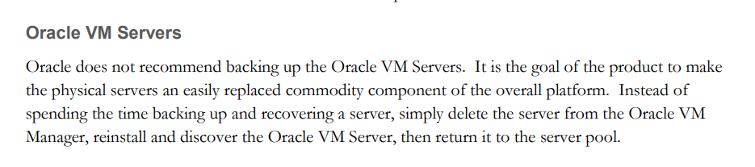
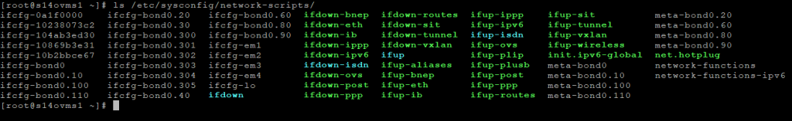

Salve Salve Pessoal!

Em um post anterior que fiz, falei que iria fazer uma serie de três posts sobre backup do Oracle VM, começando pelo Oracle VM Server.

[Oracle VM Server – Backup](https://rodrigolira.eti.br/oracle-vm-server-backup/)

Demorou um pouco, hehehe, mas vamos ao que interessa :D

Para começarmos a própria Oracle não recomenda o backup dos servidores Oracle VM, como ela mesmo diz: **simplesmente exclua o servidor do Oracle VM Manager, reinstale e descubra o Oracle VM Server**.

Realmente ela está correta quando a isso, quando perdemos um servidor, seja por qual motivo for, basta remover do Manager e depois colocar novamente.

Porém, quando passei por esse problema, vi que não é tão simples assim, porque tive que inserir o servidor manualmente em todos os repositórios e adicionar a todas as redes manualmente.

Quanto a parte de repositórios é mais tranquilo, normalmente temos poucos, mas dependendo da quantidade de redes isso pode demandar um pouco mais de trabalho, e foi ai que percebi que se eu tivesse salvo o conteúdo do diretório **/etc/sysconfig/network-scripts/** teria me poupado um trabalho grande.

Pois bem, apesar da Oracle não recomendar o backup do Oracle VM Server, eu recomendo o backup do diretório **/etc/sysconfig/network-scripts/**, vale lembrar que isso é uma opinião pessoal minha.

Porque em caso de você acabar perdendo o servidor, basta formatar e copiar todos os arquivos para o diretório :D

Vale lembrar que isso é para o mesmo servidor que você fez o backup, caso deseje colocar em outro servidor certamente vai dar erro por causa dos endereços mac.

Para facilitar a vida criei um script que faz esse processo de forma automática, acessem o link abaixo para baixa.

[https://gitlab.com/eurodrigolira/oracle-vm](https://gitlab.com/eurodrigolira/oracle-vm)

Até a próxima :D

Referência:

[http://www.oracle.com/technetwork/server-storage/vm/ovm3-backup-recovery-1997244.pdf](http://www.oracle.com/technetwork/server-storage/vm/ovm3-backup-recovery-1997244.pdf)
