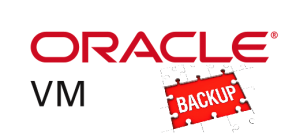
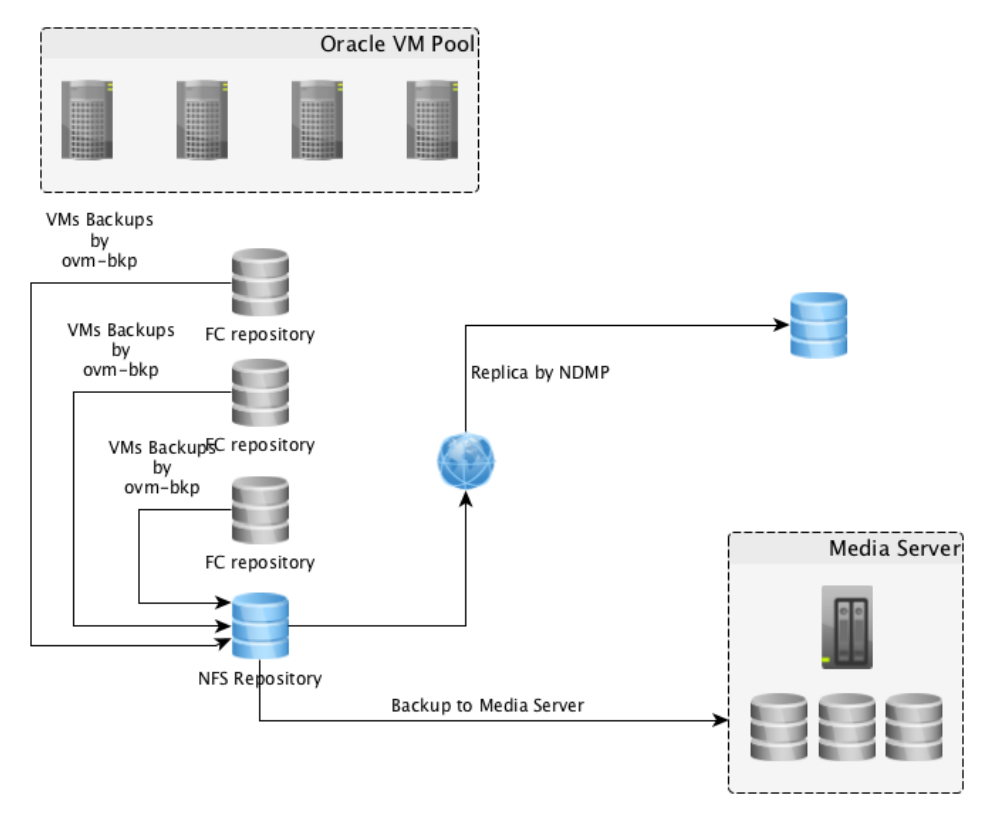
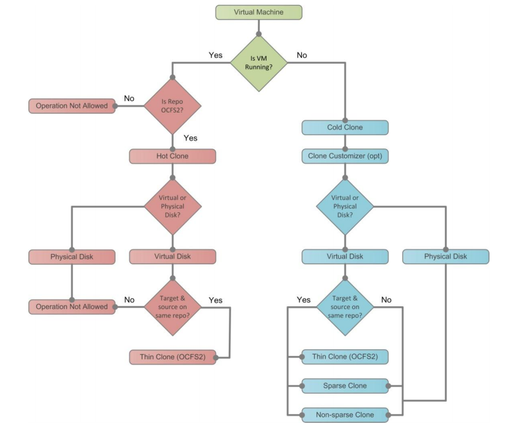
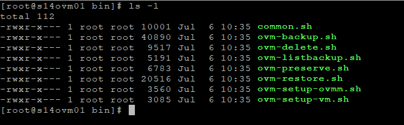
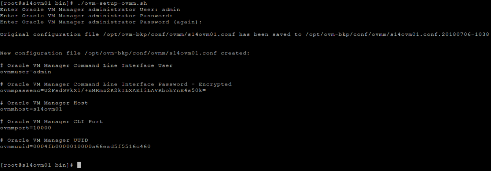

[](images/ovm_updated_logo.png)

Salve Salve Pessoal!

Dando seguimento aos posts sobre backup no Oracle VM, agora vamos ver a última parte, backup das máquinas virtuais, caso você não tenha lido os outros posts, segue os links para os outros posts:

[Oracle VM Server – Backup (Servers)](https://rodrigolira.eti.br/oracle-vm-server-backup-servers/)

[Oracle VM Server – Backup (Manager)](https://rodrigolira.eti.br/oracle-vm-server-backup-manager/)

Até algum tempo atrás nós só tínhamos soluções de backup para máquinas virtuais com soluções pagas de terceiros.

A Oracle desenvolveu um utilitário (**ovm-bkp v1.0**) que realizar esse procedimento para nós, e o melhor de tudo é que está disponível gratuitamente. :D

Vamos entender um pouco sobre os requerimentos desse utilitário antes de começarmos a utiliza-lo.

- Existem três dependências, para instalação do ovm-bkp, são:

expect.x86\_64 openssl.x86\_64 nmap-ncat.x86\_64

- O ovm-bkp tem que ser instalado na mesma máquina que o Oracle VM Manager estiver instalado.
- O ovm-bkp pode ser instalado tanto no Oracle Linux 6 quanto no Oracle Linux 7, não testei em outros sistemas, como o Red Hat, mas imagino que não haja problemas visto que é homologado para instalação do Oracle VM Manager.
- O ovm-bkp só tem compatibilidade com a versão 3.4 do Oracle VM.
- Não podemos conter nomes com espaços nos objetos do nosso pool, ou seja, uma máquina virtual não pode ter o nome dela com espaços, se você tiver algum objeto com espaço no seu pool renomei, exemplo:

**Red Hat 7** (errado) **Red\_Hat\_7** (correto)

- Os dados no /etc/hosts devem estar configurados corretamente para todo o ambiente.
- Backups com máquinas virtuais em execução só poderão ser realizados se estiverem em repositórios OCFS2, ou seja, repositórios que utilizam iSCSI ou Fibre Channel.
- Backup de máquinas virtuais em repositórios do tipo NFS só podem ser feitos se as máquinas virtuais estiverem desligadas.
- Backup de máquinas virtuais que contenham discos físicos e virtuais são realizados, porém só é realizado o backup do disco virtual.
- É recomendado o uso de um repositório NFS para o backup das máquinas virtuais.

A imagem abaixo ilustra uma arquitetura do **ambiente Oracle VM com backup**:

[](images/White-Paper-Google-Chrome-2018-07-06-09.48.40.png)

Já está outra imagem abaixo ilustra o **processo de backup das máquinas virtuais**:

[](images/Oracle-VM-3_-Backup-and-Recovery-Best-Practices-Guide-Google-Chrome-2018-07-06-10.14.25.png)

Vamos ao que interessa :D

Acesse o servidor onde está o **Oracle VM Manager** e instale o **ovm-bkp**.

```
# yum install http://download.oracle.com/otn-pub/otn_software/ovm/ovm-bkp-1.0-20180215.noarch.rpm
```

Após a instalação do ovm-bkp, os utilitários do mesmo estaram disponíveis dentro do diretório **/opt/ovm-bkp/bin**, acesse o mesmo com o comando abaixo:

```
# cd /opt/ovm-bkp/bin
```

Temos vários scripts dentro desse diretório, execute um **ls -l** para listar todos:

```
# ls -l
```

[](images/S14FW01-2018-07-06-10.35.56.png)

Agora vamos configurar o **ovm-bkp** executando o script **ovm-setup-ovmm.sh**:

```
# ./ovm-setup-ovmm.sh
```

Será solicitado o usuário e senha do seu Oracle VM Manager.

[](images/S14FW01-2018-07-06-10.40.35.png)

**OBS:** Este script irá configurar a troca de **chave ssh** para que todos os scripts trabalhem com o **Oracle VM CLI** sem a necessidade de fornecer senha, o script também criará um arquivo de configuração dedicado à instância do **Oracle VM Manager** em execução, este procedimento é necessário apenas uma vez.

Pronto, o **ovm-bkp** está instalado e configurado, no próximo post vou mostrar como utilizar o mesmo.

Até a próxima :D

Referências:

[http://www.oracle.com/technetwork/server-storage/vm/ovm3-backup-recovery-1997244.pdf](http://www.oracle.com/technetwork/server-storage/vm/ovm3-backup-recovery-1997244.pdf)

[http://www.oracle.com/technetwork/server-storage/vm/ovm-bkp-userguide-v1-4394642.pdf](http://www.oracle.com/technetwork/server-storage/vm/ovm-bkp-userguide-v1-4394642.pdf)
