[](images/ovm_updated_logo.png)

Salve Salve Pessoal!

No post anterior virmos um pouco do processo de backup de máquinas virtuais no Oracle VM e começamos a falar sobre o ovm-bkp e realizamos a sua instalação.

Nesse último post dessa serie de backup do Oracle VM, vamos ver como podemos utilizar o **ovm-bkp**.

Se não leu os posts anteriores da serie, sugiro que leia, links abaixo:

[Oracle VM Server – Backup (Servers)](https://rodrigolira.eti.br/oracle-vm-server-backup-servers/)

[Oracle VM Server – Backup (Manager)](https://rodrigolira.eti.br/oracle-vm-server-backup-manager/)

[Oracle VM Server – Backup (VMs) – Parte 01](https://rodrigolira.eti.br/oracle-vm-server-backup-vms-parte-01/)

Para começar vamos ver tudo que é possível fazer com o utilitário.

Entre na pasta **/opt/ovm-bkp/bin** e execute um **ls -l** para listar o conteúdo do diretório, o **ovm-bkp** é composto por vários scripts, cada um tem uma função diferente.

[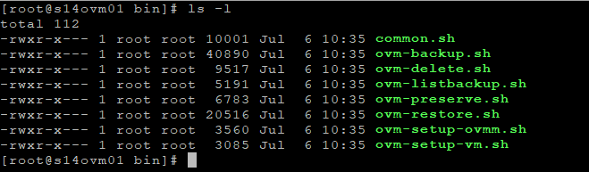](images/S14FW01-2018-07-08-19.08.23.png)

**common.sh** - não precisa ser executado, contém apenas funções para os demais scripts.

**ovm-backup.sh** - realiza o backup da máquina virtual.

**ovm-delete.sh** - deleta um backup especifico de uma máquina virtual.

**ovm-listbackup.sh** - lista os backups disponiveis de uma máquina virtual.

**ovm-preserve.sh** - alterar a opção "preserve" para um backup específico da máquina virtual.

**ovm-restore.sh** - restaura o backup de uma máquina virtual.

**ovm-setup-ovmm.sh** - configura o ambiente para backup, usado no post anterior.

**ovm-setup-vm.sh** - configura um arquivo de configuração de backup da máquina virtual.

Vamos entender e trabalhar com cada um dos scripts na seguinte ordem:

**1** - ovm-setup-vm.sh

**2** - ovm-backup.sh

**3** - ovm-listbackup.sh

**4** - ovm-delete.sh

**5** - ovm-restore.sh

**6** - ovm-preserve.sh

**OBS**: O script **ovm-setup-ovmm.sh** já falamos no post anterior e o **common.sh** não precisa ser executado, então não vamos falar deles.

### **ovm-setup-vm.sh**

Como falei anteriormente esse script vai criará um arquivo de configuração, esse arquivo é dedicado para cada máquina virtual com as seguintes informações:

**ovmpool:** Pool que hospeda a máquina virtual

**vmname:** nome da máquina virtual

**vmuuid:** ID da máquina virtual

**retenção:** retenção de backup para a máquina virtual

**d:** dias (ex. **8d** é para manter uma retenção de 8 dias)

**c:** count (ex. **4c** é para manter uma retenção de 4 cópias)

**targetrepo:** repositório onde o backup será salvo

O diretório onde esse arquivo ficará salvo é o **/opt/ovm-bkp/conf/vm**.

Se executarmos o script sem passar nenhum parâmetro será exibido um exemplo de uso do mesmo:

```
# ./ovm-setup-vm.sh
```

[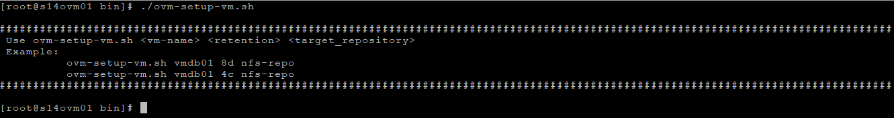](images/S14FW01-2018-07-08-19.45.21.png)

Então, no meu ambiente tenho uma máquina virtual com o nome **LINUX**, desejo manter uma **retenção** dos **últimos 4** backups e salvar ela no repositório **Backup**, executamos o comandos passando os seguintes parâmetros:

```
./ovm-setup-vm.sh LINUX 4c Backup
```

O arquivo **LINUX-0004fb000006000062597b8a057f5023.conf** foi criado no diretório **/opt/ovm-bkp/conf/vm/** com os parâmetros especificados, como mostra a imagem abaixo:

[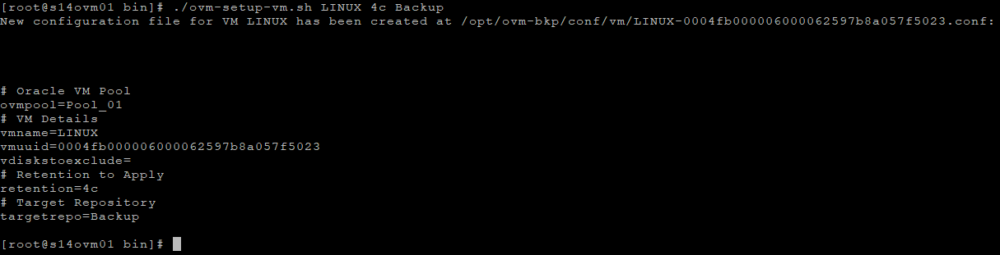](images/S14FW01-2018-07-08-20.18.41.png)

É necessário criar um arquivo de configuração para cada máquina virtual que você deseja realizar o backup.

### ovm-backup.sh

Como falei anteriormente este é o script que realiza o backup das máquinas virtuais, assim como no script anterior, podemos executa-lo sem passar nenhum parâmetro que será mostrado um exemplo de sua utilização, como mostra a imagem abaixo:

```
# ./ovm-backup.sh
```

[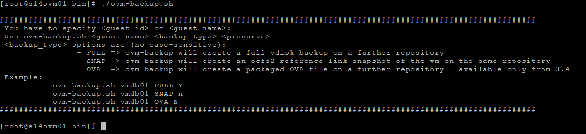](images/S14FW01-2018-07-08-20.27.32.png)

Existem três tipos de backups possíveis, são:

**FULL** - cria uma cópia completa e esparsa do arquivo de configuração da máquina virtual e todos os discos.

**SNAP** - o backup será uma cópia do arquivo de configuração da máquina virtual e um reflink do OCFS2 de todos os discos virtuais, o backup permanecerá no mesmo repositório da máquina virtual de origem.

**OVA** - o backup será um arquivo OVA criado a partir da máquina virtual.

O último parâmetro **\[Y/y,N/n\]** é o "**preserve**", permite declarar um backup como "preservado", ou seja, será ignorado por a política de retenção definida no arquivo de configuração, para deletar esse backup você terá que deletar ele manualmente.

Então para realizar o backup basta executar o script passando o nome da máquina virtual, o tipo de backup e se desejo ou não preservar esse backup, exemplo:

```
# ./ovm-backup.sh LINUX FULL N
ou
# ./ovm-backup.sh LINUX full n
```

**OBS:** Os parâmetros do script não são case sensitives, ou seja, tanto faz serem digitados em maiúsculo ou minúsculo, o nome da máquina virtual deve ser igual ao do ambiente.

Ao final da execução do script, é listados todos os backups realizados, como no nosso caso só fizemos um até o momento, só aparecera ele.

[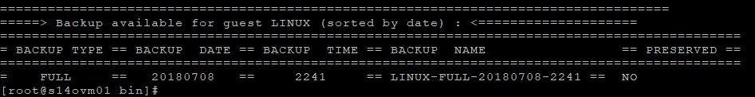](images/S14FW01-2018-07-08-22.49.39.png)

Será criada uma máquina virtual em **Unassigned Virtual Machines** com o mesmo nome do backup.

[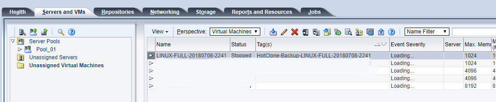](images/Oracle-VM-Home-Google-Chrome-2018-07-08-22.52.55.png)

Também é criado o arquivo de configuração da máquina virtual no repositório configurado.

[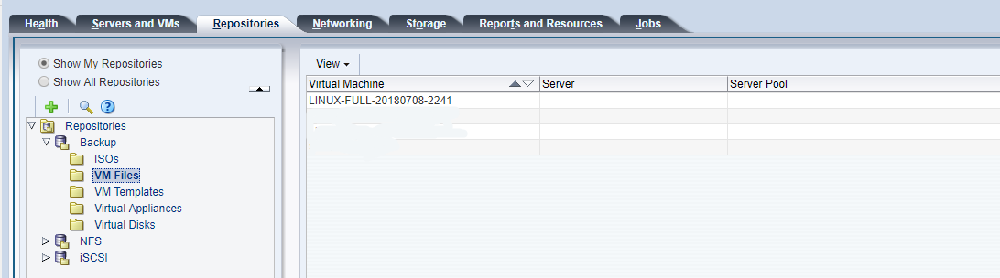](images/Oracle-VM-Home-Google-Chrome-2018-07-08-22.57.37.png)

E o clone do disco é criado também no repositório configurado.

[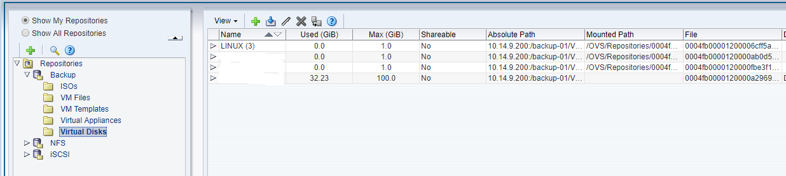](images/Oracle-VM-Home-Google-Chrome-2018-07-08-22.57.55.png)

Anteriormente configurei a minha politica de retenção para as quatro últimas copias, ou seja, sempre vou ter os últimos quatro backups.

A imagem abaixo mostra que temos quatro backups e que nenhum backup foi removido.

[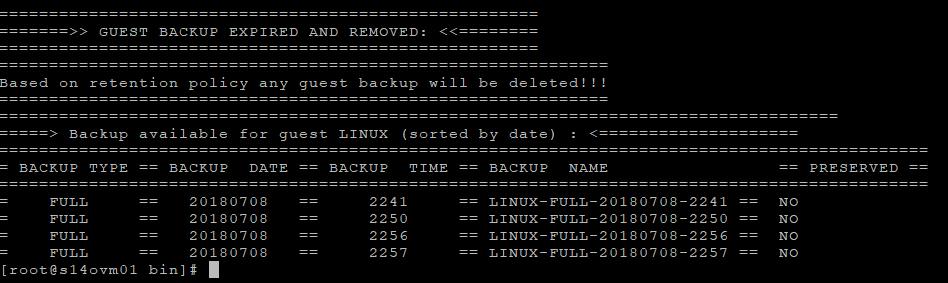](images/S14FW01-2018-07-08-23.06.37.png)

Quando executamos um novo backup, ele remove o backup mais antigo deixando apenas os quatro backups configurados no arquivo de configuração de backup, como mostra a imagem abaixo:

[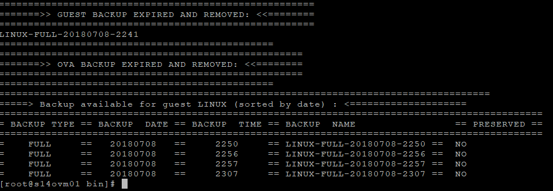](images/S14FW01-2018-07-08-23.08.11.png)

**OBS:** Independente do tipo de backup realizado, a politica de retenção de backup vai obedecer a quantidade estabelecida no arquivo de configuração, ou seja, podemos ter vários tipos de backup mas serão mantidos os quatro, outra coisa que devemos observar é que se um backup é marcado para ser preservado, esse backup não entrará na politica configurada no arquivo de backup, ou seja, sempre teremos mais backup do quê o configurado no arquivo.

Abaixo segue uma imagem que exemplifica tudo que falei:

[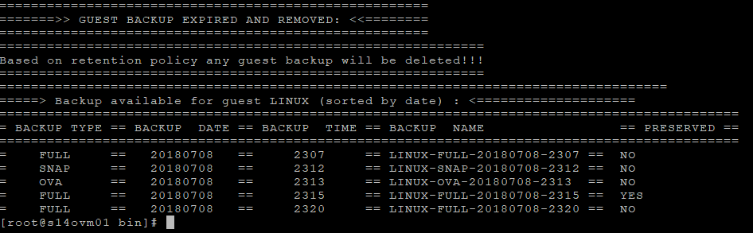](images/S14FW01-2018-07-08-23.23.50.png)

### ovm-listbackup.sh

Este script lista os backups disponíveis, basta passar o nome da máquina virtual como parâmetro.

```
# ./ovm-listbackup.sh LINUX
```

[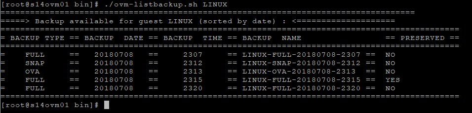](images/S14FW01-2018-07-08-23.26.39.png)

### ovm-delete.sh

Este script deleta um backup, você só precisa passar como parâmetro no nome do backup.

```
# ./ovm-delete.sh LINUX-FULL-20180708-2320
```

[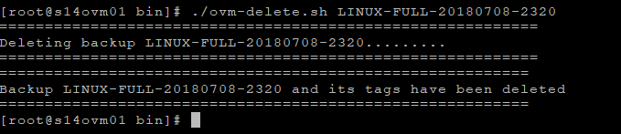](images/S14FW01-2018-07-09-09.03.03.png)

### ovm-restore.sh

O script restaura o backup de uma máquina virtual, quando executado precisamos passar o nome da máquina virtual como parâmetro.

```
# ./ovm-restore.sh LINUX
```

Será exibido um menu para escolhermos qual desejamos restaurar:

[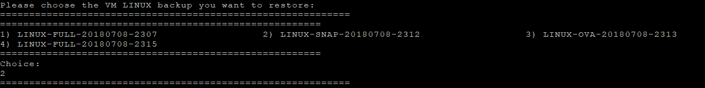](images/S14FW01-2018-07-09-09.07.20.png)

Também é exibido um menu perguntando em qual repositório você deseja restaurar:

[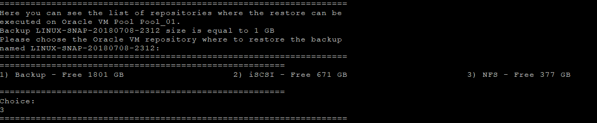](images/S14FW01-2018-07-09-09.08.41.png)

Depois a máquina virtual é restaurada e adicionado ao pool, como mostra a imagem abaixo:

[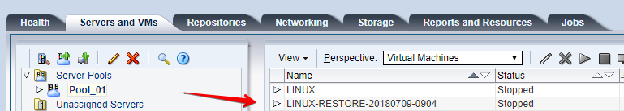](images/Oracle-VM-Home-Google-Chrome-2018-07-09-09.10.25.png)

### ovm-preserve.sh

Este script muda o status do "**preserve**" em uma backup realizado, exemplo, quando listamos os backups realizados, é exibido se esses backups estão ou não marcadas para serem preservados, como mostra a imagem abaixo:

[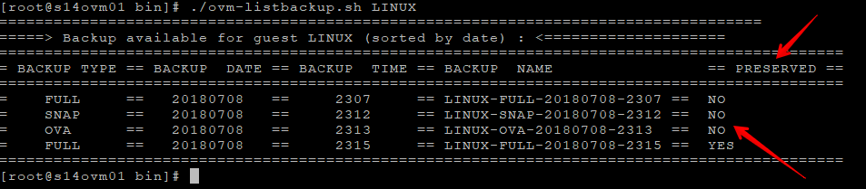](images/Acessos-S14FW01-Royal-TS-2018-07-09-09.18.41.png)

**OBS:** Como falei anteriormente, quando marcados como YES a política de retenção não se aplicará a ele.

Para mudar o status do **preserve**, basta executarmos o script passando como parâmetro o nome do backup e a opção desejada.

**y** - define como YES para preservar

**n** - denifne como NO para não preservar

```
# ./ovm-preserve.sh LINUX-FULL-20180708-2315 n
```

[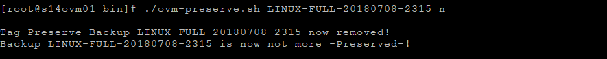](images/Acessos-S14FW01-Royal-TS-2018-07-09-09.24.49.png)

Agora basta listar novamente os backup e veremos que houve a mudança.

[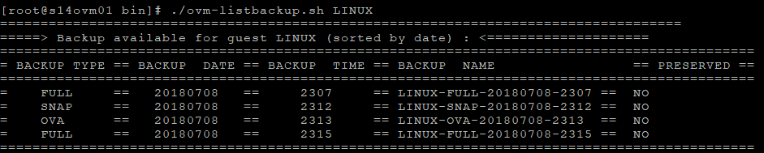](images/Acessos-S14FW01-Royal-TS-2018-07-09-09.26.17.png)

Para automatizar o processo de backup podemos usar o CRON. ;)

Pronto, chagamos ao fim dessa serie de post sobre backups do Oracle VM, espero que tenham gostado.

Até a próxima! :D

Referências

[http://www.oracle.com/technetwork/server-storage/vm/ovm-bkp-userguide-v1-4394642.pdf](http://www.oracle.com/technetwork/server-storage/vm/ovm-bkp-userguide-v1-4394642.pdf)

[http://www.oracle.com/technetwork/server-storage/vm/ovm3-backup-recovery-1997244.pdf](http://www.oracle.com/technetwork/server-storage/vm/ovm3-backup-recovery-1997244.pdf)
