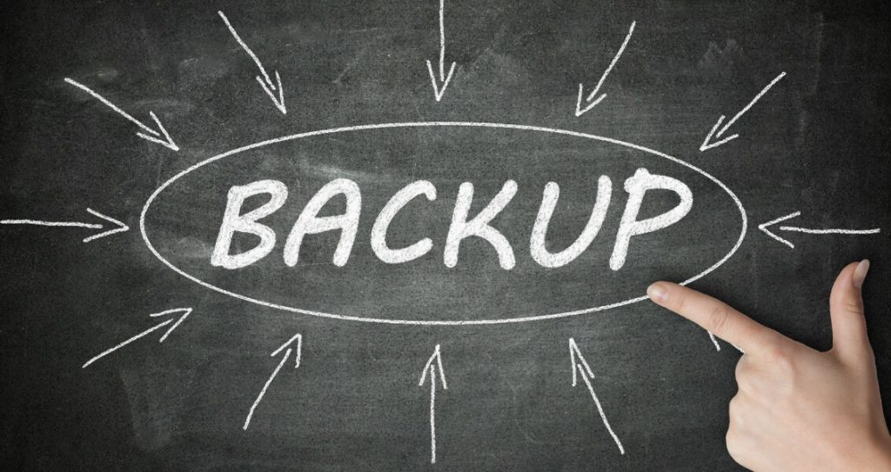

Salve Salve Pessoal!

Vou fazer três posts sobre soluções de backup do Oracle VM Server.

Vamos ver as recomendações de backup que a própria Oracle sugeri em cada um dos componentes do Oracle VM Server, vamos falar sobre as ferramentas disponíveis no marcado.

Vamos ver o procedimento de backup dos seguintes componentes:

1. Oracle VM Server x86
2. Oracle VM Manager
3. Máquinas Virtuais

Será um post dedicado para cada componente, espero fazer um post por semana, seguindo a mesma ordem acima, então se liga no blog e até a próxima . :D
