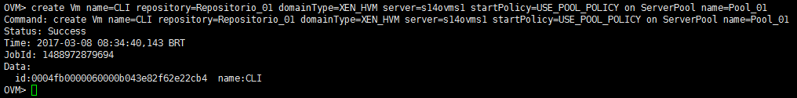
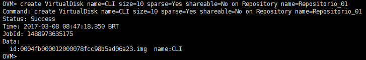
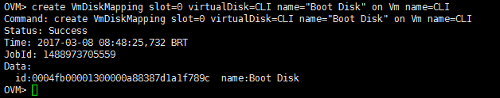
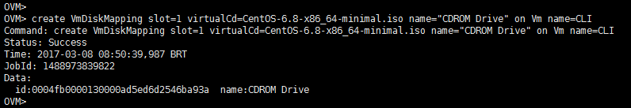
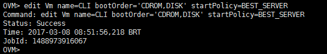
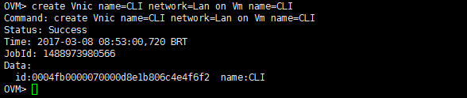
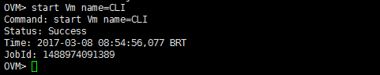
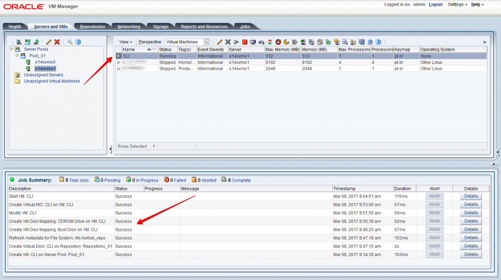

Salve Salve Pessoal!

Nesse post vou mostrar como criar uma maquina virtual via CLI no Oracle VM.

Apesar de termos o ambiente web para gerência, podemos realizar todas as tarefas via linha de comando, por exemplo, adicionar servidores, criar pool, criar novas redes e maquinas virtuais.

Para isso certifique-se que o serviço da CLI está rodando no Manager.

```
# systemctl status ovmcli (Oracle Linux 7)

# /etc/init.d/ovmcli status (Oracle Linux 6)
```

Vamos criar nossa VM :D

Acesse a CLI do Oracle VM Manager através de um cliente shell, putty por exemplo:

```
# ssh -l USUARIO -p 10000 IP_DO_MANAGER
```

**\-l USUARIO** (por padrão o usuário é admin, mas você pode usar outro usuário, caso tenha criado o mesmo)

**\-p 10000** (a CLI do Oracle VM Manager roda na porta 10000 por padrão)

Depois de logado siga os passos abaixo para criação da VM.

**1** – Criamos a máquina virtual.

```
create Vm name=CLI repository=Repositorio_01 domainType=XEN_HVM server=s14ovms1 startPolicy=USE_POOL_POLICY on ServerPool name=Pool_01
```

**Vm name=CLI** (Nome da VM que estamos criando)

**repository=Repositorio\_01** (Repositório onde vamos criar a VM)

**domainType=XEN\_HVM** (Tipo de domínio da VM)

**server=s14ovms1** (Servidor onde a VM será criada)

**startPolicy=USE\_POOL\_POLICY** (Politica apliacada a VM)

**ServerPool name=Pool\_01** (Pool de criação da VM)

[](http://rodrigolira.eti.br/wp-content/uploads/2017/03/cli-01.png)

**2** – Criamos um disco virtual.

```
create VirtualDisk name=CLI size=10 sparse=Yes shareable=No on Repository name=Repositorio_01
```

**VirtualDisk name=CLI** (Cria um disco virtual com o nome CLI)

**size=10** (Tamanos do disco virtual, em GigaBytes)

**sparse=Yes** (Tipo de disco)

**shareable=No** (Se o disco vai ser compartilhando)

**Repository name=Repositorio\_01** (Repositório onde o disco será criado)

[](http://rodrigolira.eti.br/wp-content/uploads/2017/03/cli-02.png)

**3** – Adicionamos o disco virtual ao slot 0 da máquina virtual.

```
create VmDiskMapping slot=0 virtualDisk=CLI name="Boot Disk" on Vm name=CLI
```

[](http://rodrigolira.eti.br/wp-content/uploads/2017/03/cli-03.png)

**4** – Adicionamos a ISO de instalação do sistema operacional ao slot 1 da máquina virtual.

```
create VmDiskMapping slot=1 virtualCd=CentOS-6.8-x86_64-minimal.iso name="CDROM Drive" on Vm name=CLI
```

**Obs**: O arquivo CentOS-6.8-x86\_64-minimal.iso já foi importado anteriormente para dentro do ambiente.

[](http://rodrigolira.eti.br/wp-content/uploads/2017/03/cli-04.png)

**5** – Definimos a ordem de boot.

```
edit Vm name=CLI bootOrder='CDROM,DISK' startPolicy=BEST_SERVER
```

[](http://rodrigolira.eti.br/wp-content/uploads/2017/03/cli-05.png)

**6** – Adicionamos uma interface virtual a máquina virtual.

```
create Vnic name=CLI network=Lan on Vm name=CLI
```

[](http://rodrigolira.eti.br/wp-content/uploads/2017/03/cli-06.png)

Pronto, nesse ponto a sua máquina virtual já está criada.

**7** - Inicie a VM.

```
start Vm name=CLI
```

[](http://rodrigolira.eti.br/wp-content/uploads/2017/03/cli-07.png)

Como podemos verificar na imagem abaixo, a vm é criada corretamente e todo o processo realizado via CLI é exibido no Job Summary da interface web.

[](http://rodrigolira.eti.br/wp-content/uploads/2017/03/cli-08.png)

Espero que tenham gostado!

Até a próxima :D
