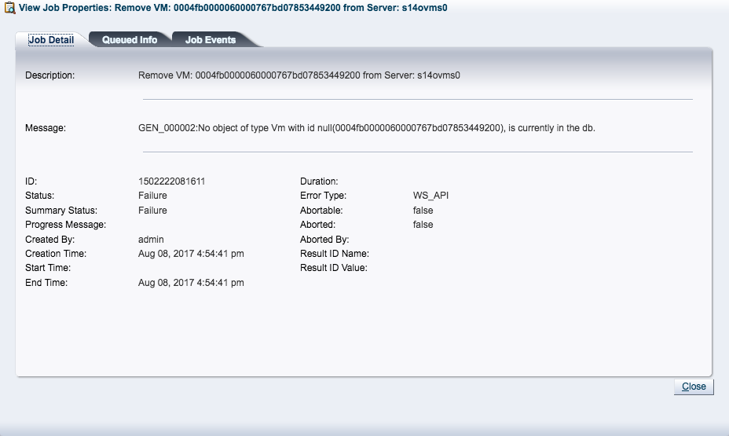

Salve Salve Pessoal!

Essa semana passei por um erro bem interessante com o Oracle VM, estava migrando uma vm (servidor de arquivos) de servidor, durante a migração tentei criar uma nova vm, porém o Manager entrou em loop e começou a criar várias vms ao mesmo tempo, para cessar esse loop reiniciei o serviço do Manager com o seguinte comando.

```
# /etc/init.d/ovmm restart
```

Até ai tudo bem, o Manager reiniciou e parou de criar as vms, porém para minha surpresa, quando tentava remover as vms que o Manager tinha criado sem necessidade, ele não deixava, apresentava sempre o mesmo erro.

[](http://rodrigolira.eti.br/wp-content/uploads/2017/08/Oracle-VM-Home-2017-08-08-16-54-59.png)

Tentei remover via CLI e o mesmo erro era apresentado.

Tentei mover todas as outras vms de servidor e reiniciar o servidor onde estavam as vms que foram criadas sem necessidade, reiniciei o ovs-agent, fiz tudo o quanto estava dentro do meu conhecimento, mas sempre sem sucesso.

Até que fui no fórum da Oracle e consegui achar a causa do erro e a solução.

O erro estava e acontecendo porque o manager não estava sincronizando com o banco de dados interno.

Dessa forma bastou seguir os passos informados no fórum para solucionar o problema, segue abaixo o que fiz.

```
# su - oracle

$ touch /tmp/.resyncUI

$ touch /tmp/.resyncU

$ chmod 666 /tmp/.resyncUI

# service ovmm restart
```

Pronto, todas as vms que não conseguia remover foram removidas automaticamente.

**Obs:** Imagino que se eu tivesse reiniciado o servidor do manager e não apenas o serviço, teria resolvido o problema também :D

Segue link da solução no fórum.

[https://community.oracle.com/thread/4013843](https://community.oracle.com/thread/4013843)

Até a próxima :D
