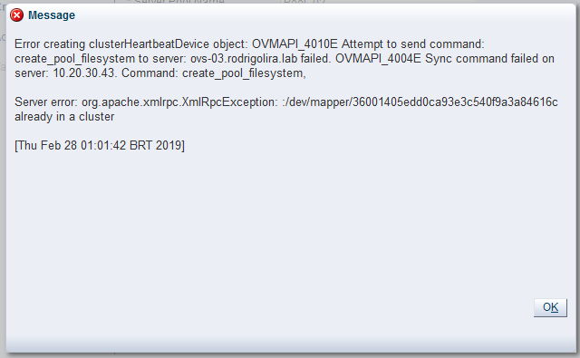
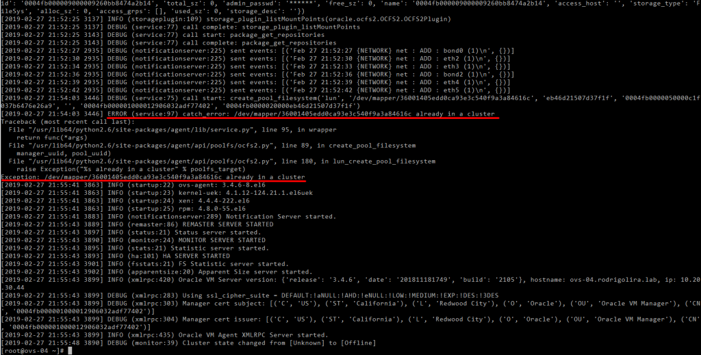
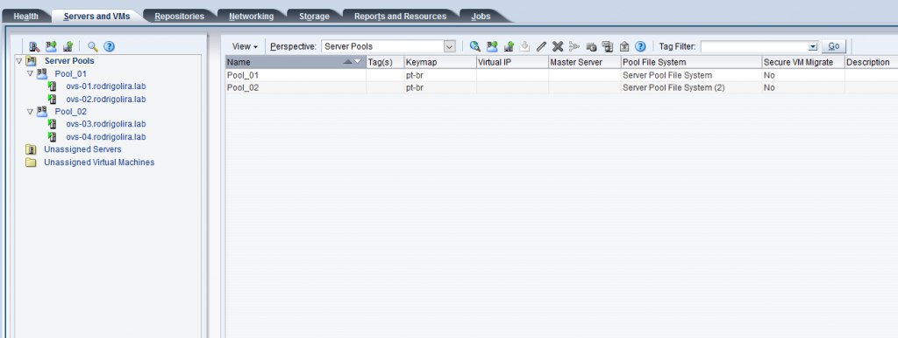

Salve Salve Pessoal!

Depois de um bom tempo sem fazer nenhum post sobre o Oracle VM, venho falar sobre um erro que aconteceu comigo.

Hoje quando estava criando meu novo ambiente de laboratório para testes do **Oracle VM Server 3.4.6** tive o seguinte problema:

[](images/Oracle-VM-Home-Mozilla-Firefox-2019-02-28-01.01.55.png)Podemos dar uma olhadinha no **/var/log/ovs-agent.log** do Oracle VM Server para termos um pouco mais de detalhes:

[](images/ovs-04.rodrigolira.lab-Royal-TS-2019-02-28-01.02.37.png)Mas porque ocorreu esse erro? Bem, vou dizer o que estava fazendo e acabou causando esse erro.

Neste meu novo ambiente, estou trabalhando com **2 Pools (Pool\_01 e Pool\_02)** e **4 Hosts**, sendo que cada **Pool** terá **02 Hosts**, o problema aconteceu quando mandei mandei criar o **Pool\_02**, não observei que o **Job** de criaçao do **Pool\_01** ainda estava sendo executado quando tentei criar o **Pool\_02**, como a minha máquina não é lá essas coisas, o processador foi para 100% e começou a demorar muito, não tive paciência com a demora e acabei reiniciando todo o ambiente, quando o ambiente iniciou novamente, o **Pool\_01** tinha sido criado com sucesso, porém o **Pool\_02** não foi criado.

Sendo que apesar do **Pool\_02** não ter sido criado o disco escolhido para o **cluster** tinha sido formatado com o **OCFS2**, então quando fui tentar criar novamente o **Pool\_02** usando o mesmo disco o erro apareceu.

O problema é o seguinte, quando tentamos criar um Pool com um disco que já contenha o sistema de arquivos **OCFS2**, o **Oracle VM Agent** no servidor irá detectar o sistema de arquivos OCFS2 e se recusará a substituir o mesmo, esse é o comportamento padrão e é uma forma de proteção contra acidentes, para não acabarmos formatando o disco errado.

Como já sabemos o erro, basta limparmos o disco para podermos utiliza-lo, execute o comando abaixo de um Oracle VM Server:

```
dd if=/dev/zero of=/dev/mapper/36001405edd0ca93e3c540f9a3a84616c bs=1M count=256
```

**OBS:** TENHA CERTEZA QUE É O DISCO CERTO

SUBSTITUA **/dev/mapper/36001405edd0ca93e3c540f9a3a84616c** PELO SEU DISCO

Pronto, depois disso você conseguirá criar o Pool utilizando o disco novamente.

[](images/Oracle-VM-Home-Mozilla-Firefox-2019-02-28-01.47.38.png)

Espero que tenha ajudado.

Até a próxima!

:D
